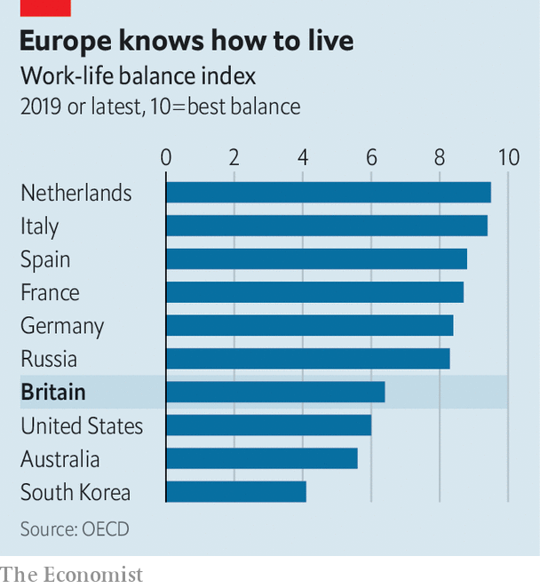

## Office culture

# Britons tip the work-life balance

> Working Britons have less time for leisure than other Europeans. Covid-19 is changing that

> Jul 18th 2020

FOR 23 YEARS, Richard Ramsey’s working life had the same essential rhythm, one that will be familiar to office workers everywhere. The hours changed, the pay changed, sometimes the job changed. But he always got into a car in the morning, spent 30-40 minutes crawling the four miles into the office, in central Belfast, and came back the same way each evening, ready to sleep and repeat. His colleagues at Ulster Bank had started to work more flexibly in recent years. But, as its chief economist, he assumed that the office was the only place he could work: he needed to be close to his beloved Bloomberg terminal.

It turns out he was wrong. In March, when covid-19 began to spread rapidly in Britain, everyone at the bank’s headquarters, like millions of other British office workers, was ordered home. Mr Ramsey experienced “teething problems” for a week, but he soon replicated his office set-up. When the office reopens, he will mostly stay at home, perhaps going in once or twice a week for meetings. He misses the camaraderie of the office, but that is outweighed by the time he saves on commuting and the flexibility to walk the dog at lunchtime. “It’s not going to go back to the way it was,” he says.

Workers everywhere find it tricky to juggle the competing demands of work, family and social life. But evidence suggests Britons find it trickier than most of their European counterparts (see chart). According to an index produced by the OECD, a typical Briton spends roughly an hour a day less sleeping or at leisure than workers in comparable European countries. And 12% of them work more than 50 hours a week—a larger proportion than in America and nearly three times as many as in Germany. Despite all this toil, Britain’s productivity lags behind its competitors.

The pandemic has upended these norms. Millions of staff have been furloughed; thousands of redundancies are being announced each week. But even the majority who have kept their jobs are doing them in different places and in different ways. On July 10th Boris Johnson began encouraging workers to return to their offices, in part to revive plummeting demand for firms that depend on old working habits, such as sandwich shops. That will be hard going since, on the whole, employees are keen on working from home. According to a YouGov poll published in May by Skillcast, a compliance-training firm, two-thirds of Britons would like to continue doing so, at least some of the time.

Until now, employers were the biggest obstacles to such flexibility. Research by the European Commission in 2018 found that while Britain has among the highest share in Europe of workers who want to work flexible hours or at home, a fifth of workers who had this option had never taken it up. Roughly a third of workers said doing so was discouraged by managers or would be viewed negatively by colleagues. In many cases they were right. “We did try to be flexible,” says Mark Read, chief executive of WPP, an advertising giant. “But there was a large feeling by senior executives that people weren’t really working when they were working from home.”

Lockdown quickly changed that. The majority of office workers have spent the past four months exclusively at home and, according to the YouGov poll, more than two-thirds of them think they can be at least as productive as in the office. Like many bosses, Mr Read eventually wants to introduce a hybrid model, with most staff working some days in the office for collaboration and camaraderie and some at home. But, he says, “the number one question I’m asked in all our town halls is can we work remotely or from home more in future. The answer is going to be ‘yes’.” That is partly to help retain and attract employees and partly because it could save the firm some of the £650m ($818m) or so it spends each year on office space.

If such a mixed model is widely adopted, workers will spend a lot less time in traffic jams or on crowded buses and trains. Britons spend longer commuting than people in any other European country. Londoners have it worst—on average they spend an hour and 20 minutes a day getting to and from work, eight minutes more than the average New Yorker. If they worked from home instead, they would save 297 hours a year, according to an analysis of official statistics by the Trades Union Congress, a labour-rights umbrella group. If they sleep for eight hours a day, that’s 19 days, or three and a half working weeks.

Whatever model emerges, it will not be a Utopia. Indeed, 38% of Britons reckon it is harder to strike a work-life balance when working remotely. Things will probably improve as children return to school, but a significant minority of workers are likely to struggle, especially graduates who want to learn on the job, those whose homes are not big enough to make work pleasant and people who live on their own. A 47-year-old market researcher, who lives alone, says he is “bored stupid” at home. He is desperate to go back to work for a “change of scenery”. A gender divide is emerging. Whereas 22% of British men find working from home difficult, according to official statistics, only 13% of women do so.

But workers are already voting with their feet. A recent survey by Unilever, an Anglo-Dutch consumer-goods group, found that half of staff in countries where offices were reopening did not yet want to return. Only 8% wanted to go back to the office full-time; the rest said they would like to come in for one or two days a week. “In five years’ time, if you’re an employer that tries to implement a strict office-based culture, you’re going to really struggle for talent,” predicts a work-policy wonk. Now they have tried flexible working, Britons seem unlikely to surrender it easily. ■

Editor’s note: Some of our covid-19 coverage is free for readers of The Economist Today, our daily [newsletter](https://www.economist.com/https://my.economist.com/user#newsletter). For more stories and our pandemic tracker, see our [hub](https://www.economist.com//news/2020/03/11/the-economists-coverage-of-the-coronavirus)

## URL

https://www.economist.com/britain/2020/07/18/britons-tip-the-work-life-balance
