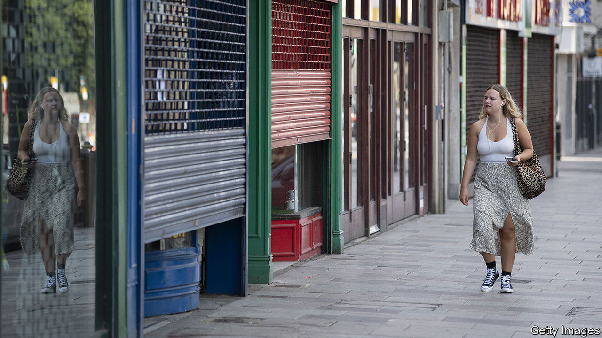
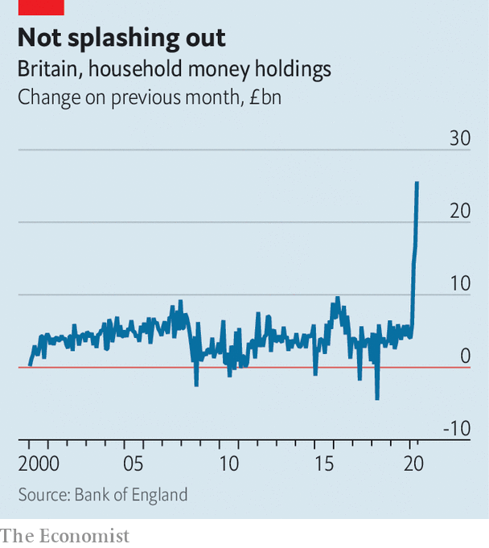

## The economy

# Household savings are up in Britain

> That’s bad for the economy

> Jul 18th 2020

ECONOMIC CRISES often involve runs on banks. This one is causing the opposite. The enforced shutdown of many shops, less commuting and a reluctance to return to pubs and restaurants, have left households, in aggregate, awash with cash. Household holdings of money, mainly in the form of bank deposits, rose by a record-breaking £25.6bn ($32bn) in May following sharp rises in March and April (see chart). This run to the banks has pushed household cash balances up by around £55bn, some 2.7% of pre-crisis GDP, in three months.

Alongside rising bank balances, net lending to consumers contracted by £15.8bn in the three months to the end of May. The Office for Budget Responsibility (OBR), the government’s fiscal watchdog, now thinks that the household savings ratio, the percentage of their income that households put aside rather than consume, jumped from about 5% in February to close to 30% at the height of the lockdown.

This big shift is the result not only of the closure of much of the economy by government fiat, but also the government’s initial response to the crisis. Despite a collapse in GDP, unemployment remains relatively low and household incomes have fallen only modestly. That’s because the government is taking a much bigger hit than is normal in recessions. Through the furlough scheme and support for the self-employed it is bankrolling more than 12m workers. Universal credit, the main out-of-work benefit, was increased by £20 a week at the budget in March. The OBR estimates that government borrowing will hit 16.4% of GDP this financial year, a peacetime record.

Not everybody is seeing their piggy-banks fatten. Analysis by the Resolution Foundation, a think-tank, points to a reasonably consistent fall in incomes across the earnings distribution for working age households but vastly different changes in spending. Households that had little discretionary spending in the first place have seen much more modest drops in expenditure, or even rises, as having the children out of school for weeks has increased their shopping bills. Prosperous commuters, by contrast, are saving a small fortune on train fares, coffees and lunches. Pensioners’ incomes have fallen by less, but their spending by more. Despite three months of falling consumer credit, gross repayments are actually down on pre-pandemic levels, but new gross lending is down by a lot more.

How households will react to the reopening of the economy is “one of the big questions that will determine the shape of the recovery”, says Paul Dales of Capital Economics, a consultancy. It seems likely that workers’ worries about rising unemployment will keep precautionary saving high. The OBR’s central scenario predicts that the household savings ratio will remain above 10% in the next few years. That’s bad news for the economic outlook.

## URL

https://www.economist.com/britain/2020/07/18/household-savings-are-up-in-britain
