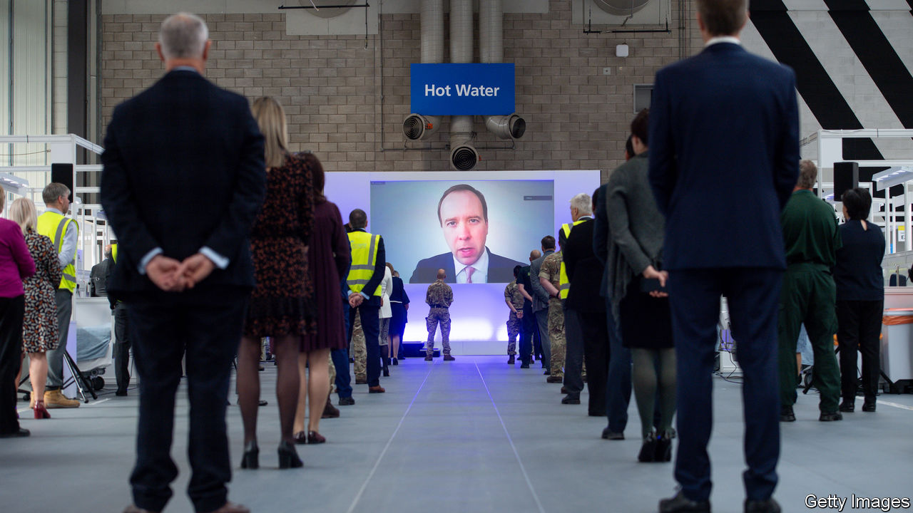
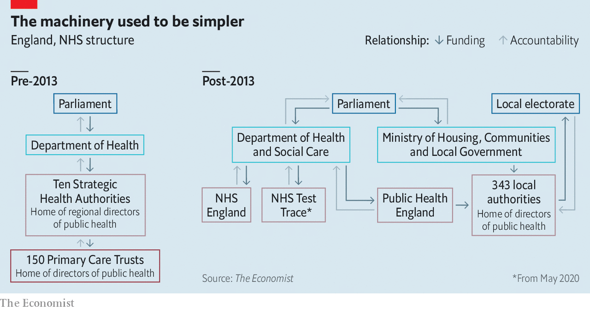

## How the levers came off

# How centralisation impeded Britain’s covid-19 response

> British politicians hoarded power, unlike their counterparts in Germany

> Jul 18th 2020

“I  DO NOT WANT to be sitting and talking about this in the aftermath of something that goes wrong,” Gabriel Scally, now president of the epidemiology and public health section of the Royal Society of Medicine, told a House of Commons committee in 2012. Working for the World Health Organisation at the time, he was worried that the big planned reform of the National Health Service (NHS) would impede the response to emergencies. “I have seen enough major incidents in my time to think that this is worrying.”

Dr Scally now finds himself in the position that he dreaded. He is one of the many public-health experts who believe that the failures in Britain’s response to the covid-19 pandemic have been the result not just of slow political decision-making, but also of the highly centralised nature of the British state.

Germany and South Korea, two of the countries that responded most successfully, both have public-health systems embedded in local government. In Germany, the federal government provided extra resources, but the response was run by 375 local authorities. In South Korea, the decision-making was mostly done by central government, but the implementation was local. In Britain, the response has been run and implemented from the centre.

Public health was a local matter in Britain for over a century. After a water pump in London’s Soho district was identified as the source of a cholera outbreak in 1854, councils began to build up the capacity to keep their communities clear of infectious diseases. But the centralised design of the NHS—“The sound of a dropped bedpan in Tredegar Hospital,” said its founder, Nye Bevan, “should reverberate in the Palace of Westminster”—shaped the way health provision developed.

In 1974, public health was detached from its local roots, as directors of public health (DPH) were taken out of local government and placed within the NHS. In 2013 a restructuring of the health service (see chart) under Andrew Lansley, the health secretary—the change that concerned Dr Scally—replaced a simple structure with a complex one. It split responsibility for public health between a national agency, Public Health England (PHE), which has responsibility for infectious diseases, and local authorities.

The reorganisation moved DPHs back into local authorities, but with fewer resources and less power. The timing—in the wake of the financial crisis—was bad, too. “We landed in local government just when it took a massive hit,” says a DPH in a London borough. According to the Health Foundation, a think-tank, the government grant to local authorities for public health fell by a fifth in real terms in the five years after 2014. A DPH in a county council says he has lost 30 of about 100 staff.

When covid-19 broke out, PHE was responsible for tracking the course of the epidemic, but had only 290 people nationally to do the job. By early March, it had been overwhelmed.

In Germany at that point, local authorities reallocated resources from functions that had been put on hold during lockdown—such as libraries or sexual health—and were given money by the federal government to hire medical students to help. Claudia Kaufhold of Germany’s Public Health Academy says that in the Charlottenburg-Wilmersdorf district of Berlin, where she used to be director of public health, the number of staff dedicated to track and trace rose from about 10 to roughly 130 at the beginning of March, for a population of 326,000. In Britain, the government instead created NHS Test and Trace, a national system directly answerable to Whitehall.

Andy Burnham, mayor of Greater Manchester, was arguing for a German-style response. “We would have had no problem scaling up,” he says. Local-area knowledge is essential to tracing infections, according to a director of public health. “Particularly with the vulnerability of ethnic minority people, it’s essential to know communities. You know where BME people are concentrated, you know community leaders.”

David Buck, of the King’s Fund, a think-tank, is sympathetic but points to the urgency and the scale required. “At that stage you probably needed a national response to ramp it up so quickly. But a lot of time had been wasted in not involving local government sooner.” He attributes that to policymakers’ centralising instinct. “The NHS is a command-and-control system. Local government is not a command-and-control system, so it feels distant to policymakers in Whitehall. When you have to do something quickly, you reach for the levers closest to you, and that you understand.”

Politicians have indeed struggled with the machinery of government. According to Bernard Jenkin, chair of the House of Commons Liaison Committee, there has been a constant refrain from Number 10 during the crisis that “the levers of power just came off”. That may be the result, in part, of the Lansley reforms: they replaced a clear chain of command with a fragmented system, which seems insufficiently joined-up. An email in mid-May from the office of the minister of state for care—who shares responsibility with local authorities for the care homes in which around half of British victims died—shows that her senior private secretary did not have an email distribution list for DPHs.

The instinct to centralise also frustrated the development of a contact-tracing app. At the beginning of the crisis, various apps on which people could log their symptoms were launched. Nearly a million people downloaded one created by Tim Spector of King’s College London and ZOE, a health startup, within 24 hours; it has now had 4m downloads. Soon after launch in March, the team asked for support from the government, NHS and charities, but was rejected on the grounds that the government was developing its own.

That effort, in the event, was also sunk by a desire to retain control. Faced with a choice between an app based on Google’s and Apple’s protocols under which data were decentralised, and one in which they were held by the NHS, the government went for the latter—and fell on its face, when the technology defeated the health service. The government is now going with the Google/Apple system, but has not said when the app will be ready.

To make matters worse, the development of testing capacity has also suffered from the urge to centralise. Christopher Stanley of MicrosensDx, a clinical-diagnostics company, had a covid-19 test ready in mid-March. He approached various parts of the government, to no avail. The testing regime was run by PHE, which was relying on its own capacity. Large-scale testing got off the ground only at the end of May, when the government started sourcing kits from companies like his.

Complaints about centralisation persist. Local authorities are struggling to get data from NHS Test and Trace. According to Leicester’s mayor, Sir Peter Soulsby, the city’s recent outbreak was exacerbated by poor-quality data and delays before they were provided. They are, he says, still too slow to arrive—the last batch came on July 4th—and they identify cases only at a postcode level, without addresses or workplaces, and with ethnicity for only a minority of cases.

Mr Burnham, in Manchester, concurs. “It’s like a local detective being asked to solve a crime without the names and addresses of witnesses or suspects,” he says. When he asked why more granular data were not provided, data-protection concerns were offered as the explanation. “It’s about as useful as a chocolate teapot,” says a DPH in southern England of the data—which is also a reasonable description of how parts of the machinery of government performed when the heat was on.■

Editor’s note: Some of our covid-19 coverage is free for readers of The Economist Today, our daily [newsletter](https://www.economist.com/https://my.economist.com/user#newsletter). For more stories and our pandemic tracker, see our [hub](https://www.economist.com//news/2020/03/11/the-economists-coverage-of-the-coronavirus)

## URL

https://www.economist.com/britain/2020/07/18/how-centralisation-impeded-britains-covid-19-response
