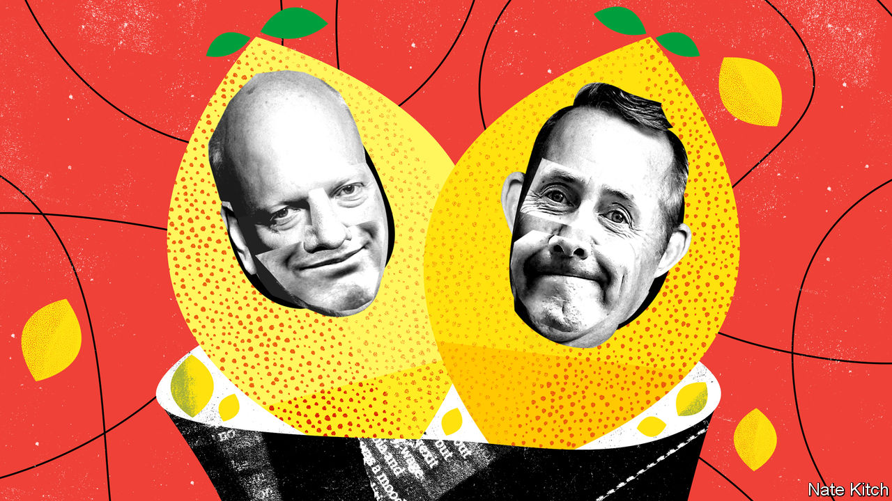

## Bagehot

# The talent dearth in Britain’s government

> Dance of the lemons

> Jul 18th 2020

AMERICA’S PUBLIC education system has given the world two pungent mismanagement phrases: the “dance of the lemons” and the “rubber room”. The power of teachers’ unions makes their members hard to sack, so school districts either shuffle bad teachers from one school to another (“the dance of the lemons”) or put them in a downtown office (“the rubber room”) where they twiddle their thumbs and draw their salaries.

The case of the four biggest lemons in British politics suggests that the government has adopted this approach. Priti Patel and Gavin Williamson were both sacked by Theresa May for bad behaviour. Chris Grayling failed so spectacularly in every job he undertook that the Labour Party calculated he had cost taxpayers £2.7bn. Liam Fox lost not one but two cabinet positions—first the secretaryship of defence in 2011 because he had allowed a friend to accompany him on official trips and then the job of trade secretary in 2019 because Boris Johnson no longer required his services.

All have spent time in the rubber room only to bounce back into front-line politics. Ms Patel and Mr Williamson are home secretary and education secretary respectively. Ms Patel has proved so inarticulate that she is rarely allowed on the media; Mr Williamson has become a patsy of teachers’ unions that seem determined to keep children out of classrooms. Mr Johnson recently nominated Mr Fox to run the World Trade Organisation (WTO) and Mr Grayling to chair the House of Commons Intelligence and Security Committee (ISC). Mr Fox’s nomination is dead on arrival: nobody (other than him) regards him as a serious candidate and his application consists mainly of quotations from his own speeches. “Failing Grayling” lived up to his nickname by getting pipped at the post for the committee chairmanship by his fellow Conservative MP, Julian Lewis. “Only Grayling could lose a rigged election,” sighed the pro-Brexit Guido Fawkes website.

Britain’s political system puts artificial constraints on the supply of talent. In many countries you can become a minister without being an MP. In Britain you have to get into Parliament. That means living in one of the world’s most expensive cities on a modest salary and putting up with being treated as a liar by regular voters and subjected to abuse by an ever larger unhinged fringe.

The government has exacerbated the problem by imposing a Brexit purity test on recruits, thereby turning Brexiteers into the country’s mightiest-ever trade union. There are certainly a few competent Brexiteers, most obviously the chancellor, Rishi Sunak. But the supply is necessarily limited. Lord Mandelson, who was rejected as Britain’s candidate for the WTO despite being far better qualified than Mr Fox, argues that “the Brexit gene pool” is not big enough to “produce all the people we need to work in public life”. The British establishment (including a majority of Tory MPs in 2016) was against leaving the EU. This was particularly true of people with expertise in Brexit-related areas such as trade policy.

When Mr Johnson opted for a hard line on Brexit, the Tory Party lost first-class people such as David Gauke and Rory Stewart. By requiring cabinet ministers to support a “do or die” Brexit, the prime minister denied himself the service of able pragmatists who opposed Brexit but accepted the result of the referendum, such as Jeremy Hunt and Tom Tugendhat. True believers, meanwhile, are getting preferment, irrespective of their abilities or qualifications: Mr Fox is a long-standing booster of the Anglosphere while the hapless Mr Grayling was one of the first six cabinet ministers to announce that they intended to campaign to leave the EU.

This talent shortage is proving more damaging by the day. The entire Brexit project increasingly rests on the shoulders of just three people, Mr Johnson, Michael Gove, the Cabinet Office minister, and Dominic Cummings, the prime minister’s chief adviser—“two journalists and a maniac” in the words of a former MP—who have to deal with covid-19 as well as forging a new relationship with Europe. Britain has long prided itself on its ability to punch above its weight in international institutions. Mr Fox’s WTO application was treated with incredulity in the organisation’s Geneva headquarters, and alarm in Britain’s foreign-policy establishment, which worries that the government is either indifferent or blind to global opinion. “What’s next?”, asks a mandarin, “IDS (Iain Duncan Smith) for the IMF or JRM (Jacob Rees-Mogg) for the UN?”

The ISC debacle shows how counterproductive Mr Johnson’s personnel-management can be. The committee’s job is to bring democratic oversight to the secret world—or not. It has been sitting for months on a report on Russian interference in British politics that may prove inconvenient to the government. It is widely assumed that Mr Grayling was chosen for the job because he would be pliant. The day after the committee got its new chairman—who was instantly thrown out of the Tory party for conspiring with Labour MPs to get the job—it announced that it would publish the report before July 29th, when Parliament packs up for summer. Westminster waits with bated breath, and the prime minister finds himself undermined by his lemon-promotion.

Populist revolutions are always in danger of falling into a familiar trap. Their leaders mobilise outsiders against insiders and neophytes against old hands. But those who win find themselves running the country, which requires the services of clever, competent types. Recruiting and retaining such people does not come naturally to populists. Donald Trump has included a former contestant on his game show (Omarosa Manigault Newman), a far-right activist (Steve Bannon) and law-breakers (Michael Flynn and Roger Stone) in his entourage, while sneering at those who know their stuff, such as Dr Anthony Fauci, his covid-19 adviser.

Mr Johnson has shown that he’s wilier than Mr Trump by listening to scientists during this crisis. He still has a chance to redeem his premiership by restocking his government with talent from across the party. But his enthusiasm for rubber-room residents such as Messrs Fox and Grayling does not bode well. ■

## URL

https://www.economist.com/britain/2020/07/18/the-talent-dearth-in-britains-government
