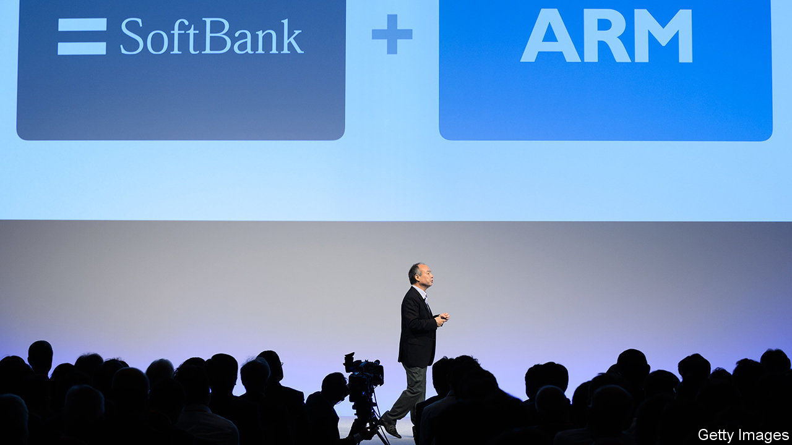
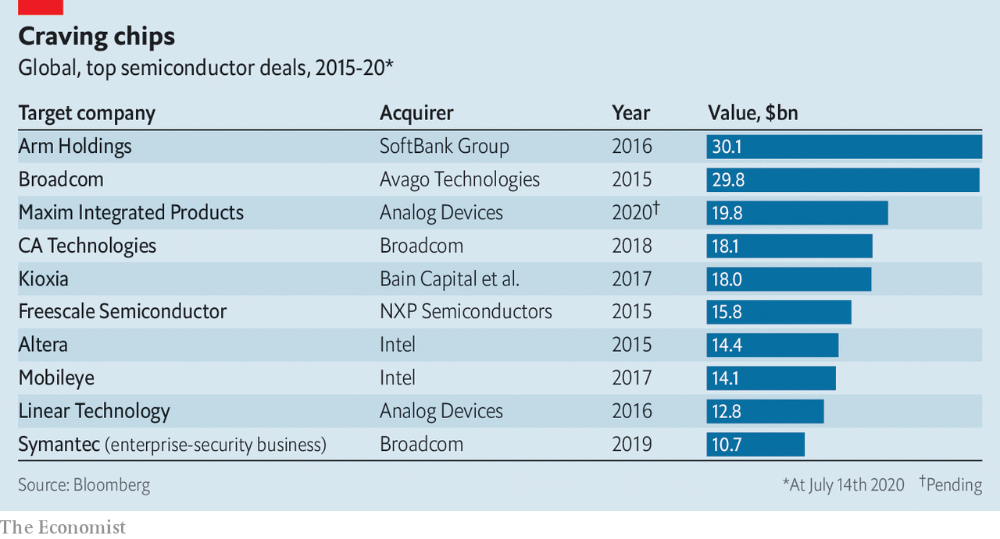

## I’ll have semiconductors with that

# Analog devices buys Maxim Integrated for $20bn

> Appetite for chips—and chipmakers—is strong

> Jul 18th 2020

SOFTBANK IS reportedly mulling the sale or flotation of Arm, a chip designer it bought for $30bn in 2016. Luckily for the tech group, appetite for chips—and chipmakers—remains strong. On July 13th Analog Devices bid $20bn for Maxim Integrated, an American rival.