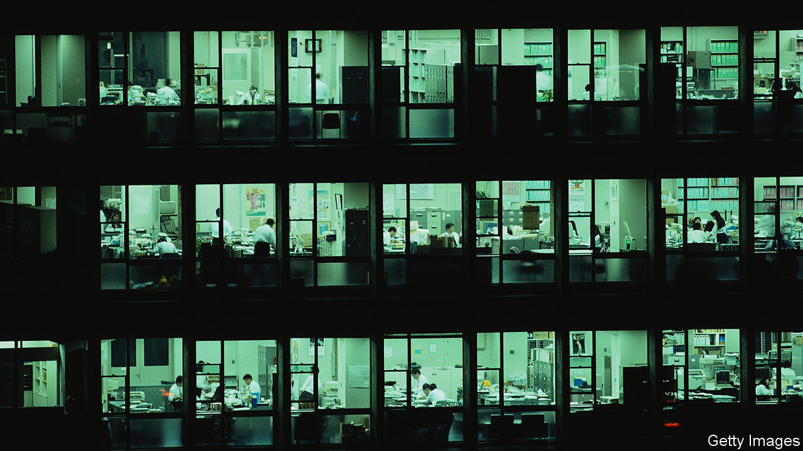

## The other virus threat

# Japan Inc’s IT needs a security patch

> Japanese firms are more vulnerable to cyber-attacks than Western peers

> Jul 18th 2020TOKYO

JAPAN HAS a reputation for technophilia. Robots have even been enlisted to cheer players at professional baseball games while covid-19 keeps fans away from stadiums. Yet when it comes to more humdrum information technology (IT), the country lags behind other advanced economies—nowhere more so than in cyber-security. Nearly 14m people were still using Windows 7 when Microsoft stopped providing security patches in January, including 7.5m at work. This, the American software giant warned, could make Japan “susceptible to cyber-attacks”.

In January Mitsubishi Electric and NEC, two electronics giants, admitted to data breaches. Last month a virus infiltrated Honda’s internal servers and disrupted the carmaker’s factories in several countries. With more employees teleworking on unsecured devices and networks during the pandemic, cyber-security experts have noticed a spike in cyber-attacks since March.

Businesses everywhere contend with cyber-criminals. On July 15th scammers hacked the Twitter accounts of public figures including Joe Biden and Elon Musk. Many big Japanese firms, including Mitsubishi, NEC and Honda, are bolstering their defences. But many small and medium-sized ones, which make up 99% of Japanese companies, have little or no security systems in place. Hackers can use such weak links in the supply chain to infiltrate larger corporate targets.

In 2017 only 55% of firms of all sizes conducted cyber-security risk assessments, compared with 81% in America and 66% in Europe, according to a government agency tasked with promoting IT. Another study last year revealed that whereas nearly 90% of American and Singaporean firms appoint a chief information-security officer, barely half of Japanese ones do.

An executive of a big shipping company acknowledges the need for better cyber-protection but grumbles that “it is a cost”. That echoes the sentiment of 64% of companies, big and small, surveyed in 2017 that viewed cyber-security as an expense, not an investment. Japanese firms spend 2.4% of their revenues on IT, a third less than in America. A smaller share of the lower spending goes to cyber-defences: whereas 85% of American firms devote at least a tenth of their IT budgets to security, in Japan 62% spend less than a tenth. And, as with Windows 7, a portion of that goes on preserving outdated technology.

“Executives must stop thinking of network security as an IT problem and start seeing it as a business challenge,” says Kajiura Toshinori of the Japan Cyber-security Innovation Committee, a think-tank, who advises Keidanren, Japan’s main business lobby. That is easier said than done. Nine in ten firms say they have trouble recruiting cyber-security personnel—another sharp contrast with America, where fewer than one in five report such problems. Japan’s shrinking labour force doesn’t help, especially outside big cities. Even in Tokyo many IT analysts lament low pay and a lack of career paths. Plenty leave the profession entirely. Unlike baseball fans, there are no robots to make up the shortfall.■

## URL

https://www.economist.com/business/2020/07/18/japan-incs-it-needs-a-security-patch
