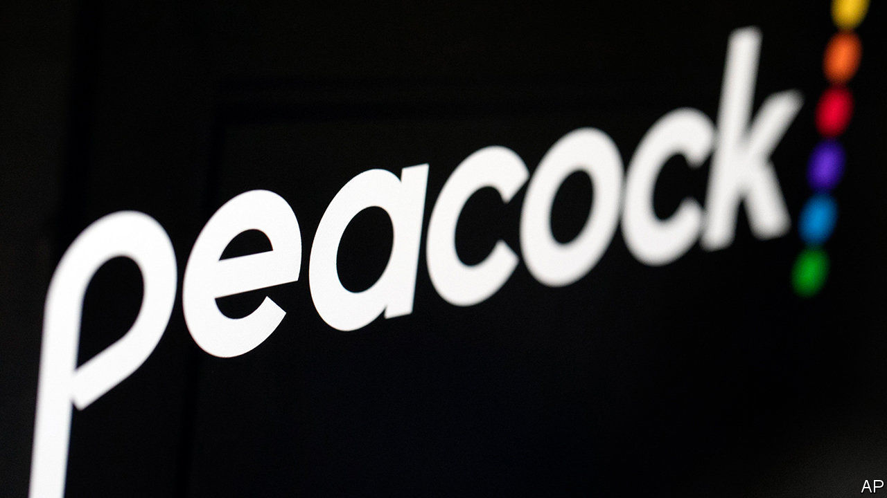
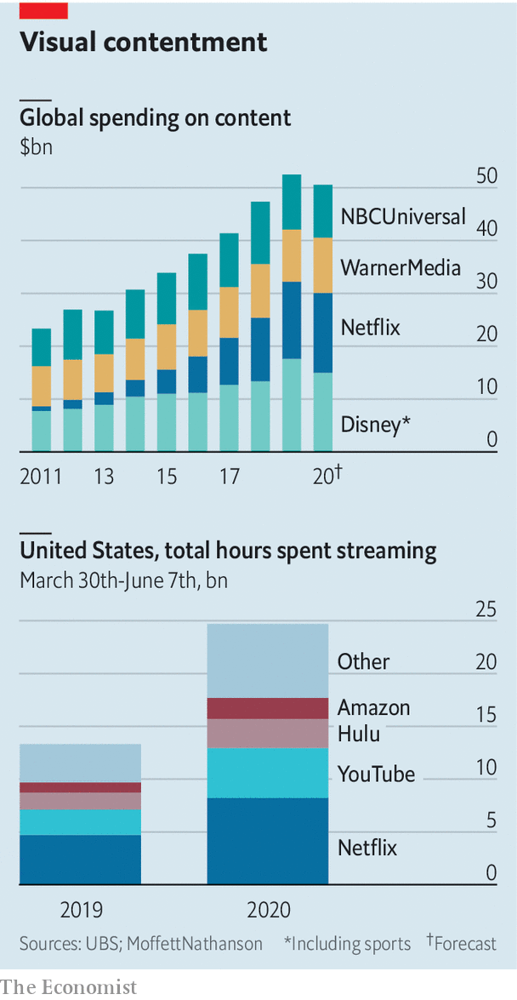

## Now a message from our sponsors

# NBC turns to ads to fund its streaming wars

> As the cost of content rises, more video companies consider running commercials

> Jul 18th 2020

EVEN AS LOCKDOWNS confine Americans to their homes, no one is in danger of running out of things to watch on television. Netflix, the leading video-streamer, offers more than 36,000 hours of programming. If that is not enough, viewers can tune in to new offerings from tech firms, such as Amazon and Apple, and old media companies, from Disney+ to HBO Max, owned by AT&T. So viewers may barely blink their square eyes at the news that yet another streamer, Peacock, hatched on July 15th. And unlike its rivals, this bird is free.

It needs to be, for it is late to the party. The average American household paid for three streaming services last year and has taken on a fourth since the pandemic hit, reckons Deloitte, a consultancy. In a recession few want a fifth. So Peacock, launched by NBCUniversal, part of Comcast, a cable provider, is letting them pay not with money but with their time, by watching ads.

NBCUniversal’s back-catalogue is certainly deep—13,000 hours of TV and film, from “Psycho” to “30 Rock”, or 20,000 on a paid, “premium” plan. But, says Peter Supino of Bernstein, a research firm, it is designed for the old days of linear television and the cinema. Online, with near-infinite choice and personalised recommendations, niche is king. Comcast is not putting much money into Peacock originals: the service currently has nine shows (covid-19 delayed a few others) to Netflix’s 1,600.

Yet advertising-supported streaming may be worth pursuing. Two-thirds of Americans say they would prefer a wholly or partly ad-supported service to a subscription one, finds Deloitte. Seven out of ten customers of Hulu, owned by Disney, opt for its cheaper, ad-supported plan. Advertisers are also keen, as cable TV bleeds viewers, and appearing next to user-generated content on sites like YouTube poses a reputational risk. Peacock promises no more than five minutes of commercials per hour, against the American-TV standard of 18. In future it hopes to target these ads, using Comcast’s data on subscribers.

Ad-supported video is already the main model in Asia. Disney’s Hotstar has more than 300m monthly users in India. In China services owned by tech giants—Baidu’s iQiyi, Alibaba’s Youku and Tencent Video—all carry ads, and have around half a billion users each. As the cost of content rises, American firms’ interest is growing. Comcast bought Xumo, a free streamer, earlier this year and is in the process of buying Vudu, another ad-supported service, from Walmart. ViacomCBS and Fox Corporation have also acquired ad-carrying streamers. AT&T plans an ad-supported tier of HBO Max next year. And Amazon may one day use detailed data on its online shoppers to run targeted ads on its Prime Video service. American viewers, spoilt for choice about what to watch, will increasingly be able to choose if and how they pay for it. ■

## URL

https://www.economist.com/business/2020/07/18/nbc-turns-to-ads-to-fund-its-streaming-wars
