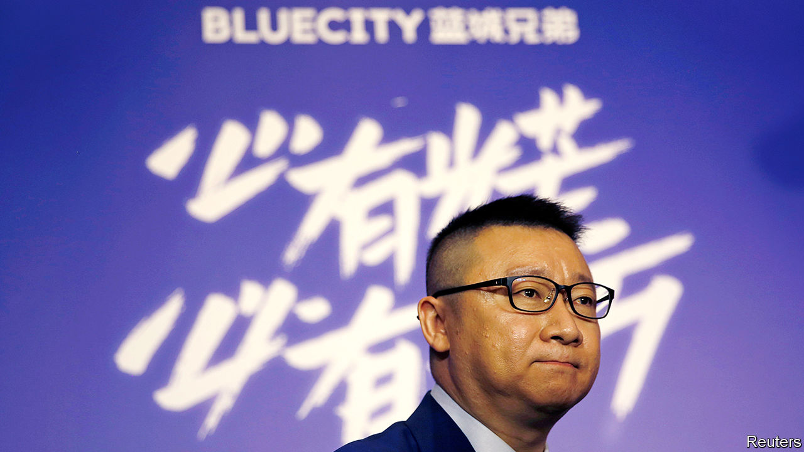

## At the end of a rainbow

# The varying American fortunes of Grindr and Blued

> America’s government viewed one gay-dating app with Chinese ties as a national-security concern. Can another that has just listed in New York expect similar treatment?

> Jul 18th 2020

“I  USED TO think that I was the only person in the world attracted to people of the same gender.” So begins Ma Baoli’s letter to investors. The 43-year-old Mr Ma spent nearly two decades as a closeted policeman in small-town China before founding a gay-dating app called Blued. Today it is China’s most popular social network for homosexual men. On July 8th its parent company, BlueCity, listed on New York’s Nasdaq exchange, at a market value of over $600m.

Blued launched in China in 2012, 11 years after homosexuality was removed from the country’s list of mental disorders and as social attitudes towards same-sex relations were liberalising (though too many government officials and businesses still harbour hidebound views). An international edition of the app was released in 2015. Just over half of Blued’s 6m active monthly users are in China. The rest are mainly in other parts of Asia. It is the market leader in India, South Korea, Thailand and Vietnam.

Growth has been brisk. BlueCity’s revenues reached 207m yuan ($30m) in the first quarter, up by 43% year on year. These come mainly from sales of in-app virtual gifts, advertising and membership fees (which let users skip ads, for example). Blued is still loss-making. But that is not holding back ambitions. Mr Ma vows in his shareholder letter to “continue expanding our brand globally” and build “a beautiful rainbow over the capital markets”. America, where gay dating is more mainstream than in most of Asia, is the big pot of gold.

 Is it attainable? Blued has so far avoided the sort of scrutiny from American regulators that befell another gay-dating app with Chinese ties: Grindr. Until last month Grindr was owned by Beijing Kunlun, a private Chinese gaming firm which acquired the American app in two separate deals between 2016 and 2018 for a total of $245m. Beijing Kunlun was ultimately forced to divest itself of Grindr on the orders of the Committee on Foreign Investment in the United States (CFIUS), a federal body which reviews deals for national-security concerns.

CFIUS did not disclose the reason for its decision. One obvious worry relates to the potential for blackmail. Reports surfaced last year that some of Beijing Kunlun’s engineers in China had access to the personal data of Grindr’s millions of American users. The fear is that the private messages of certain users, such as closeted politicians, could be turned over to China’s government. (No evidence of foul play was ever made public by CFIUS.)

 Unlike Grindr, which was popular in America before Kunlun bought it, Blued is a minnow outside Asia. Its relative obscurity may shield it from examination for a while. If it starts to gain a foothold in America, which is tussling with China over technology and trade, regulators are likely to take a closer look. Anticipating this, Blued insisted in its prospectus that “data related to users in and outside of China are strictly stored on servers in and outside of China, respectively.” Investors seemed reassured at first; BlueCity’s share price soared by 63% on the first two days of trading. That it has since lost a chunk of those gains suggests that Mr Ma has his work cut out. ■