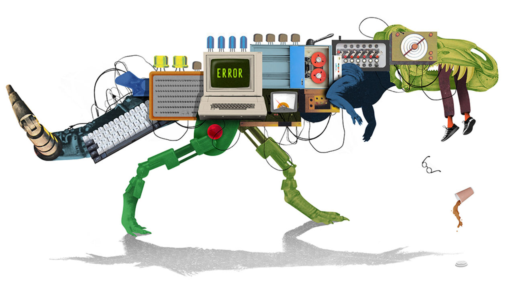

## Schumpeter

# Why companies struggle with recalcitrant IT

> As software eats the world, more firms are being nibbled at by their computer systems

> Jul 18th 2020

IT IS SUPPOSED to be the “Tesla killer”. Volkswagen’s new ID.3 is the firm’s first mass-produced all-electric car—and the first step in the German carmaker’s attempts to reinvent itself for an electrified world. That makes it perhaps the most important model since the original Golf, launched in 1976. The ID.3 is also late. Mechanically, the car is hunky-dory. But some software widgets that are a big selling point these days—rumoured to include smartphone connectivity and augmented-reality parking assistance—may be missing at first, only to be added later. Originally set for this summer, the launch has been pushed back until at least September.

VW is not the only big company struggling to make its computers work. Last year British banks were hauled over the coals by regulators for online outages and botched IT upgrades that left millions of customers unable to make or receive payments. Some problems are much more serious. Boeing’s 737 MAX aircraft were grounded in 2019 after two fatal crashes caused partly by a software flaw. Investigators have since found lesser bugs. Airlines are, for instance, now advised to turn the plane off and on again every 51 days, to stop its computers displaying false data in mid-flight. A similar problem found in 2017 in some aeroplanes made by Airbus, Boeing’s European rival, prompted the European Union Aviation Safety Agency to require that such aircraft be rebooted at least every 149 hours.

Blame for companies’ IT woes often ends up in the boardroom. Sometimes that is fair; Dennis Muilenberg was rightly forced to resign as Boeing’s CEO after the tragic 737 MAX disasters. But not always. For software is hard—and hard to keep up with. And the employees expected to produce it are often the products of a discipline that is in many ways oddly premodern. When software is “eating the world”—Silicon Valley speak for a situation where most firms are to a greater or lesser extent software companies—that matters.

Start with the computer code itself. Programming requires a mix of hyper-literalness and creativity. Tiny errors, like a misplaced punctuation mark, can completely change how a system behaves. An industry rule of thumb is that, depending on how carefully they work, programmers make between 0.5 and 50 errors in every 1,000 lines of code they write. Because cars and aircraft contain tens of millions of lines, the chances of an error-free system are in effect zero. Even when bugs do not lead to catastrophe, they put a constant drag on a firm’s productivity. A survey commissioned by Stripe, a digital-payments processor, suggested the average developer spends 21 hours a week fixing old or bad code.

The inherent difficulty of programming is made worse by the shortcomings of software engineering as a profession. These are laid out in a book, “The Problem With Software: Why Smart Engineers Write Bad Code”. The author, Adam Barr, spent 20 years as a developer for Microsoft, a software giant. Many coders, he notes, are at least partly self-taught. That leads to bad habits, which software-engineering courses fail to correct. There is too little communication between academia and industry, and no real agreement on what to teach or what habits to instil. The result, argues Mr Barr, is a field in which folklore and fads too often take the place of professional standards.

To illustrate the field’s shaky foundations, Mr Barr points to the practice, popular with technology firms like Google or Apple, of giving job candidates a programming problem to solve on a whiteboard. Few other fields behave that way, because they assume that, by dint of having graduated, applicants have already achieved a basic level of competence. Doctors do not expect anatomy quizzes before being hired. Mechanical engineers are not required to jot down Newton’s laws of motion to prove their bona fides.

All those problems are compounded by software engineering’s breathless rate of change. Even when a system works, it rapidly becomes obsolete. The woes of British banks are largely the result of trying to maintain such “legacy” systems, written by long-departed programmers (often outsourced) in half-forgotten computer languages to satisfy criteria no one can quite remember. Coders under pressure to add nifty new features often cut corners, storing up problems for the (ever less distant) future.

The result, says one expert with decades of experience, is that shiny new IT systems can rapidly devolve into rickety, half-understood contraptions held together with gaffer tape and a prayer. Eventually the costs become too great to ignore, and companies must upgrade their systems. But that is the moment of maximum danger, for the new software must do everything that the half-understood old one does, and more. It is, to repeat a common but apposite analogy, like rebuilding an aircraft in flight.

VW is doing its best to iron out the kinks with the ID.3’s snazzy features. The firm wants to bring most software development back in-house, and has spent €7bn ($8bn) on a shiny new “digital unit”. That is probably a good idea. However, as Mr Barr argues, the structural problems with writing software mean that spending money on it does not, by itself, guarantee success. One great advantage possessed by startups like Tesla or Monzo, a newish online bank in Britain, is that their programmers are handed a blank sheet of paper. With no legacy systems to maintain, and fewer old bugs to root out, their software is more robust and developers can spend more time on features that customers want.

If that is cold comfort for older companies that have no easy way of starting afresh, computing greybeards offer reassurance—after a fashion. The startups’ advantages will, they predict, prove temporary. Bugs will creep in. Bodge jobs will go unfixed. Developers will leave, taking knowledge with them. Today’s feisty usurpers will become tomorrow’s clumsy incumbents, held back by their antiquated, unreliable IT—and ripe for disruption in turn. ■

## URL

https://www.economist.com/business/2020/07/18/why-companies-struggle-with-recalcitrant-it
