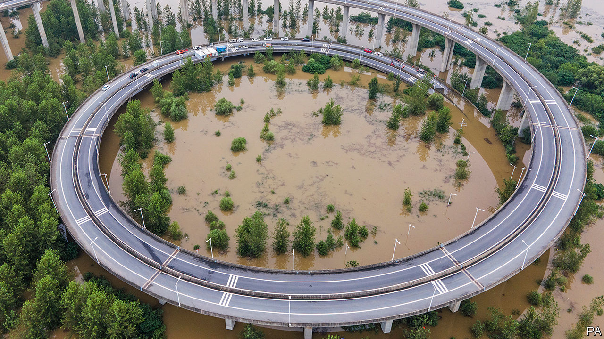

## A deluge of doubts

# Central and southern China are being ravaged by floods

> The massive Three Gorges Dam is no cure for the woes of people further down the Yangzi

> Jul 18th 2020KAISHA ISLAND, NANTONG

ON A RECENT rainy afternoon the owner of a small riverfront fish restaurant on sleepy Kaisha island, in the middle of the Yangzi river, was worried and bemused by the steadily rising waters. On a spit of land near the riverbank stood a cluster of trees, their trunks half-submerged. A wooden boardwalk leading out to a fishing pier remained only just above the murky water. “There is usually a metre of clearance under the walkway,” she said. “Yes, I have seen the water this high before, but never this early in the rainy season.”

Residents of the island, 160km upstream from Shanghai, where the river pours into the sea, worry about possible disaster. Upstream and along dozens of other river systems across central and southern China trouble has already come. In the face of the worst flooding in decades, China raised the national-emergency response to its second-highest level on July 12th. Two days it later issued an alert after forecasts of 200mm of rainfall a day (nearly eight inches) in many areas and, in some spots, as much as 60mm an hour.

Flooding in dozens of provinces has already caused the death or disappearance of 141 people, the displacement of millions, the loss of 28,000 homes and 82bn yuan ($11.7bn) in damage. Soldiers have been dispatched to help with relief. President Xi Jinping said China had entered “a crucial period of flood control”.

Kaisha island sits in the shadow of the Yangzi’s latest engineering marvel, a gleaming new rail-and-road suspension bridge linking the cities of Suzhou, Nantong and other parts of Greater Shanghai. There are no reports of risk to it, but six days after it came into service on July 1st, an ancient bridge 300km away was washed away by a roaring river flood. The seven-arched structure was a cherished landmark in the city of Huangshan.

But the fate of the nearly 500m people of the Yangzi basin ultimately depends on another engineering marvel far upstream, the massive Three Gorges Dam. Completed in 2006 at vast expense (and in the face of fervid opposition), it was touted as a multi-function boon. It would generate power, boost irrigation, improve river navigability and, perhaps most important, give China the upper hand in its millennia-old struggle against devastating floods. But its failure to do so this year is proof, say the dam’s critics, that its merits were oversold. Some even question the dam’s durability, and warn of a possible calamity—a risk that Chinese officials angrily dismiss.

Climate change may have caused extreme weather unusually early in the year, producing more rain than hydro-engineering can handle. Zhang Junjie of Duke Kunshan University says most Chinese experts agree that climate change is making the region’s weather more volatile and will reduce farming and industrial output. “In the past, China focused on the engineering approach, building more dams, more dykes and higher banks. But the government has realised this is like an arms race with nature that we can’t really win,” he says. In December, legislators began deliberating a new draft law on protecting the entire Yangzi river basin, including the restoration of riverside ecosystems that may help to reduce flooding. This, says Mr Zhang hopefully, is “giant progress”. ■

For more coverage of climate change, register for The Climate Issue, our fortnightly [newsletter](https://www.economist.com//theclimateissue/), or visit our [climate-change hub](https://www.economist.com//news/2020/04/24/the-economists-coverage-of-climate-change)