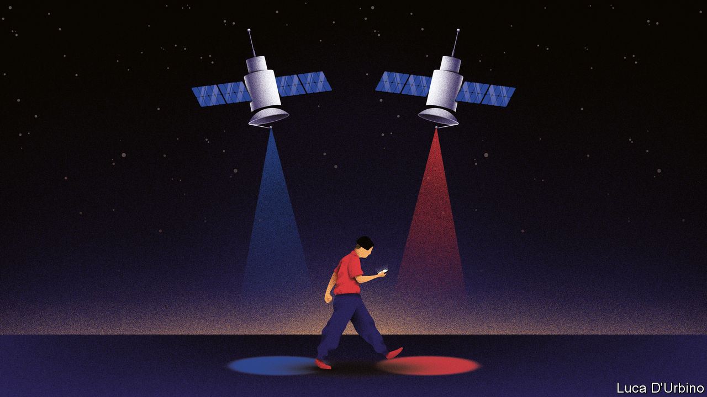

## BeiDou begins

# China’s home-grown satnav system will soon be fully functional

> Will the West shun a system so closely linked with China’s military power?

> Jul 18th 2020

THIRTY-FIVE THOUSAND kilometres above the island of Borneo, the final piece of a Chinese infrastructure project is floating into place. The satellite is the last to join the BeiDou navigation system, which has taken nearly 30 years to develop and build. The state-owned firm that launched it from Sichuan province on June 23rd says the network of BeiDou satellites will function fully around the end of July. China sees this as a moment of triumph. It marks the end of the country’s dependence on America for provision of a vital service: location data.

Satellite-navigation systems work on a simple principle. Each spacecraft uses radio waves to beam the time and its position to Earth. Devices that receive simultaneous transmissions from three or more satellites can use tiny differences in these signals to work out where the user is. All location satellites broadcast timing data on the same frequencies, so that a location device could, in theory, lock on to whichever satellites provide the best signal, regardless of whether they belong to America’s Global Positioning System (GPS), Russia’s GLONASS, Europe’s Galileo or China’s BeiDou.

But depending on foreigners for a technology so critical to national security has long worried the Communist Party. Having to rely on America has caused particular anxiety. GPS was the earliest network to provide global coverage, so GPS-enabled devices became the norm for use by Chinese companies, citizens and soldiers. The system is owned by America’s government and operated by its air force, which means American officials could decide—say, in a conflict with China—to switch off or degrade the signals coming from GPS satellites. The main purpose of building BeiDou, which is operated by China’s space administration, is to give China full control over a navigation system it can rely on.

The placement of the final satellite (55 have been deployed, though some are no longer in use) is symbolic of a widening rift between China and the West in many technological domains. This trend was highlighted on July 14th by Britain’s decision to ban the use of products made by Huawei, a Chinese tech firm, in the country’s 5G telecommunications networks (see [article](https://www.economist.com//briefing/2020/07/16/americas-war-on-huawei-nears-its-endgame)).

Work on BeiDou began in 1993 and has involved three phases. The first two provided coverage in China and then across the rest of the Asia-Pacific region. As was the case with GPS, building it has focused on military applications. When the second phase was being tested in 2013, the Chinese navy relied on BeiDou data during exercises in the South China Sea, according to state media. The third phase provides global coverage. It also affords more accuracy, and allows users to send short text messages and distress signals.

China prefers to publicise BeiDou’s commercial applications. On the day of the final satellite’s launch, state television trumpeted an array of uses, from precision crop-planting and freight tracking to the guiding of autonomous taxis (when they eventually come into service). Since 2013 the government has required heavy goods vehicles and fishing ships to be equipped with BeiDou devices. Most smartphones sold in China, except Apple’s, can receive signals from BeiDou’s satellites.

The completion of BeiDou not only eliminates dependency on America. It also puts China ahead technologically. BeiDou’s satellites are more advanced than those of GPS. In the Asia-Pacific, BeiDou claims accuracy to 10cm, compared with 30cm offered by GPS. America began upgrading its system in 1997 with the deployment of a new generation of satellites known as GPS-3 in 1997. It may take another 15 years to complete this roll-out. China took just five years to finish installing its latest batch of 30 BeiDou satellites, which use technology as advanced as GPS-3.

China hopes to cash in on BeiDou globally. In December officials said China had exported BeiDou-enabled products to 120 countries and regions worldwide. Pakistan’s armed forces have started using the system. BeiDou receivers may eventually be installed in all phones, in addition to GPS. It would add little cost and give devices access to more satellites when pinpointing a location. Or perhaps Sino-American rivalry will make American and other Western manufacturers eschew the use of a system so closely linked with the military power of a potential enemy. BeiDou may yet struggle to find its place in the world. ■