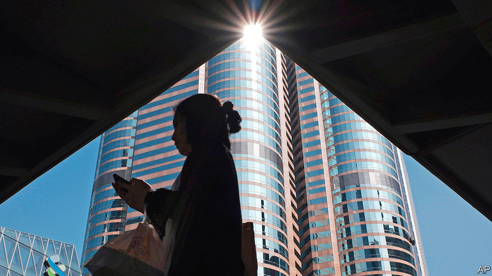

## The darkness behind

# Why business in Hong Kong should be worried

> A new national-security law is not the only threat

> Jul 18th 2020HONG KONG

JUST OVER two weeks after its enactment, Hong Kong’s national-security law—a Leninist set of measures designed in Beijing and clamped on top of a legal system hitherto admired for its respect for individual rights—looms ever larger over the territory. In response, on July 14th, President Donald Trump signed the Hong Kong Autonomy Act. This authorises sanctions on those involved in “extinguishing Hong Kong’s freedom”, as well as on financial firms that knowingly do business with them. He also ruled that Hong Kong was no longer a separate economic entity justifying different treatment from the rest of China.

The act will sharpen differences between America and China, and give Hong Kong’s Communist Party overlords an excuse to divine foreign meddling in every corner of the territory’s life. They already spy enemies in many places. They have denounced the recent holding of informal primary elections, in which 610,000 Hong Kongers helped choose candidates fielded by anti-establishment parties for polls for the Legislative Council, or Legco, in September. They accused those who conducted the unprecedented exercise of harbouring “evil intentions”, including the use of Hong Kong as a base for “subversion” and foreign “infiltration”. These relate to crimes that, along with sedition and terrorism, are covered by the security law.

The mantra of establishment types is that this law is working to “stabilise” Hong Kong. They mean that, by constraining political and civil strife, the city is now reverting to its age-old role as a business hub. Officials point out how the Hang Seng index surged after the law’s promulgation on June 30th. Since then, they note, daily stockmarket turnover has been the highest in more than two years.

It is not surprising that they use such indicators. Business interests are deeply enmeshed in Hong Kong’s political structures—even more so now than in British colonial days. The Basic Law, the mini-constitution that Hong Kong adopted at the time of its handover to China in 1997, gives companies a big share of the vote in the 1,200-strong committee that chooses the chief executive. Nearly half of Legco’s seats are “functional” constituencies set aside for commercial and other special interests. The chief executive’s advisory body, the Executive Council, is stuffed with representatives from business and finance.

Since China took control of the city, businesspeople have had good reason to talk up its prospects. The territory has continued to be a vital intermediary between China and the world. In Hong Kong, mainland companies enjoy access to hard currency, free of the capital controls that shackle them at home. International investors have benefited from Hong Kong’s sound legal, monetary and regulatory systems. Hong Kong’s position as Asia’s pre-eminent international financial powerhouse has remained nearly unassailable. Its abundance of financial, legal, accounting and other professional expertise has encouraged more than 1,500 companies to put their regional headquarters in the city.

Strikingly, neither last year’s turmoil nor this year’s pandemic dented Hong Kong’s pre-eminence. In November Alibaba raised nearly $13bn in a secondary listing in Hong Kong. JD.com, another e-commerce giant, followed last month, raising $3.9bn. Officials and financial executives talk of a coming listings bonanza. Hong Kong is even a beneficiary in this regard of Sino-American tensions. Among other things, American moves to tighten auditing procedures make listings in New York harder for Chinese firms.

Yet business is also a source of social tension. Yes, finance and related services remain globally competitive, accounting for about a quarter of the economy. But finance employs relatively few people compared with less competitive services, and pushes up prices for everyone in the territory. In the absence of other vibrant sectors, property prices have grown out of kilter with most Hong Kongers’ incomes. Government efforts to foster high tech, the arts, medical tourism and even wine trading have produced little. In the time it took Alibaba, JD.com and a dozen other Chinese startups to emerge as giants, no new Hong Kong company has achieved the same.

This is a consequence of the government’s close ties with business. Nearly every major business sector is in the hands of one or another of the city’s handful of established property conglomerates. These stifle competition and keep the cost of property (the world’s most expensive) and other basic services prohibitively high.

The government should years ago have broken the dominance of such family-owned groups. And it should have done much more to build new public housing. Instead, writes Simon Cartledge for Gavekal Dragonomics, a consultancy, because these firms are over-represented in government, “Hong Kong’s single biggest disincentive to risk-taking and entrepreneurship—its high costs, especially for property—cannot be tackled.” That is why the back-to-business message is unlikely to resonate with ordinary Hong Kongers.

The security law, meanwhile, may generate problems for business. Admittedly, many executives say they are confident that street turmoil on last year’s scale is unlikely to erupt again, and that the stockmarket will keep booming. Many local firms say they support the new law. But some dare not voice their anxiety. A new survey of members of the American Chamber of Commerce is revealing: 76% of respondents said they were somewhat or extremely worried about the legislation.

In private, concerns are more fully aired. Hong Kong is a world leader in commercial arbitration, a niche the government has actively promoted. Yet leading experts in this field fear that clients with mainland counterparties will, however irrationally, think that the law undermines Hong Kong’s impartiality and will stipulate a seat for possible disputes other than Hong Kong. Singapore is vigorously recruiting Hong Kong arbitration lawyers.

Foreign media companies are also alarmed. The law requires tightened management of them and allows their communications to be seized or intercepted. This week the New York Times said it would move its digital operations, about a third of its Hong Kong staff, to South Korea.

Tech and social-media companies have the biggest worries. The law demands they take down material in breach of national security, or provide user information demanded by police investigating national-security cases. Alarm at having to do this has led Facebook, Twitter and others to pause all consideration of all requests from the government. Providers of cloud services, including Amazon, Google and Microsoft, are also under pressure to agree to demands from regulators for customers’ banking records. They too are stalling, but that can only be a stopgap. If executives are not to face fines or prison, firms must either comply or leave. The Hong Kong Autonomy Act only sharpens their dilemma. Helping America to enforce sanctions would violate the security law. Not doing so would incur American penalties.

Much as it would like to reassure firms, the government is failing to do so. The Economist asked the commerce secretary, Edward Yau, what measures would be taken against the media under the security law. He offered no details. Perhaps local officials are as much in the dark about the central government’s specific intentions as anyone. Asked whether the departure of Google, Facebook and Twitter would count as a bad day in the office for him, Mr Yau said that over time the picture would become clearer for tech companies when courts give rulings related to the security law. He added that it was not the job of a light-touch government to pick which business sectors should prosper and which should fail. Yet fostering tech is one of the government’s priorities, while the threat to the sector is the opposite of light-handed.

For the long term, the security law introduces a new and potentially ominous dimension into the business-political nexus. Under it, Luo Huining, the head of the central government’s liaison office in Hong Kong has been appointed as commissar to “advise” on national security. But he also oversees a secretive portfolio of investments in Hong Kong encompassing over 300 properties and the largest bookseller and publisher. If you think that Hong Kong’s anti-corruption body, which reports to the chief executive, would have no qualms about going hard after irregularities within that Communist Party-controlled empire, think again. Mr Luo is one of China’s most powerful men. Carrie Lam, the chief executive, is fast becoming just another small-town mayor. ■

## URL

https://www.economist.com/china/2020/07/18/why-business-in-hong-kong-should-be-worried
