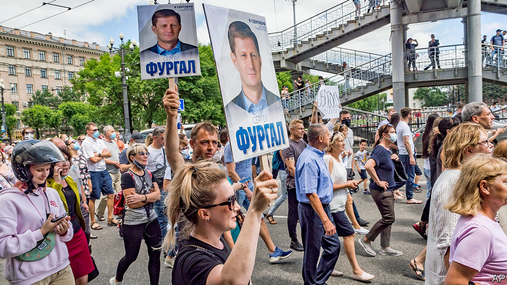

## A popular governor grabbed

# An unlikely local hero in Russia’s Far East

> Mass protests in Khabarovsk may stir distant regions against Vladimir Putin

> Jul 18th 2020KHABAROVSK

MOSCOW WAS fast asleep when, seven time zones to the east, tens of thousands of people took to the streets chanting “We are the authority here!” and “Moscow, listen to us!” Some 30,000 people marched through Khabarovsk, a city of 600,000 people, waving regional flags and cheering drivers who hooted their horns in solidarity. It was the largest protest the region has ever seen.

It broke out on July 11th, triggered by the arrest of a popular governor, Sergei Furgal, who was elected in 2018 on a wave of protest votes that swept through several regions against the Kremlin’s United Russia candidates. Grievances against Moscow have been building up for years. Russia’s Far East, a frontier land that borders China, has always displayed a sense of pride and self-reliance. This has been disrespected by President Vladimir Putin’s regime, which has rolled back federalism, depriving regions of control over their financial and natural resources, and curbing their power to take their own decisions.

The people of Khabarovsk were enraged by video images of camouflaged and masked security men from Moscow dragging their elected governor from the back seat of his black Lexus SUV, handcuffing him and packing him off to Moscow. Few believed Mr Furgal’s arrest was because of his alleged involvement in a murder 15 years ago when he traded in timber and scrap metal. True, links between crime and business in the 1990s were common, especially in the Far East. But why would the security service take 15 years to act on Mr Furgal’s alleged crime? And even if he were guilty, why should he not be tried in Khabarovsk? As far as people there are concerned, they elected him and only they are entitled to bring him to book.

Many suspect that the Kremlin was simply taking its revenge on the governor for his election victory and for becoming more popular, in the region, than Mr Putin is. An added irony is that Mr Furgal is not a rabble-rouser, nor an opposition activist, nor even a critic of the president.

As a member of the misnamed far-right Liberal Democratic Party, licensed by the Kremlin to play the role of tame opposition, Mr Furgal has served both in the local legislature and in the Duma, Russia’s parliament, since 2005. In the regional poll in 2018 he was meant to be a sparring partner for the Kremlin’s man. Mr Furgal barely campaigned. But local anger against Moscow’s colonial attitude swept him in.

A few simple populist steps, such as slimming down local government, cutting his own salary and putting up for sale a yacht used by his predecessors to entertain guests, quickly turned him into a local hero. A year later, in 2019, he refused to rig the elections to the local parliament. As a result, the Kremlin’s United Russia suffered a humiliating defeat, winning only two seats. Then, on July 1st, when Khabarovsk had one of the lowest turnouts in a farcical vote on constitutional changes that could make Mr Putin a supreme leader for life, the Kremlin snapped.

Mr Furgal is not the only recent target. On July 7th, in Moscow, plain-clothed officers of the FSB, the KGB’s successor, arrested Ivan Safronov, a former military journalist who had recently been a spokesman for Russia’s space agency, and charged him with espionage and treason. Dozens of prominent Russian journalists protested—and were also promptly detained. Russia’s elite has been warned, again.

The protests in Khabarovsk show that among many ordinary Russians Mr Putin arouses anger rather than admiration. They also show that feelings of regional identity can bring local bigwigs and the opposition together. One of the driving forces behind the protests in favour of the governor was the local branch of the movement led by Alexei Navalny, Russia’s national opposition leader. The event also exposes the limitations of the Kremlin’s security apparatus when dealing with mass protests. The police in Khabarovsk did nothing to stop the protest, lest it escalate and spread.

The Kremlin hopes that the protest, which has been ignored by national state television, will now fizzle out. Maybe so. But it will be harder to cover up the cracks in Mr Putin’s regime. ■

## URL

https://www.economist.com/europe/2020/07/18/an-unlikely-local-hero-in-russias-far-east
