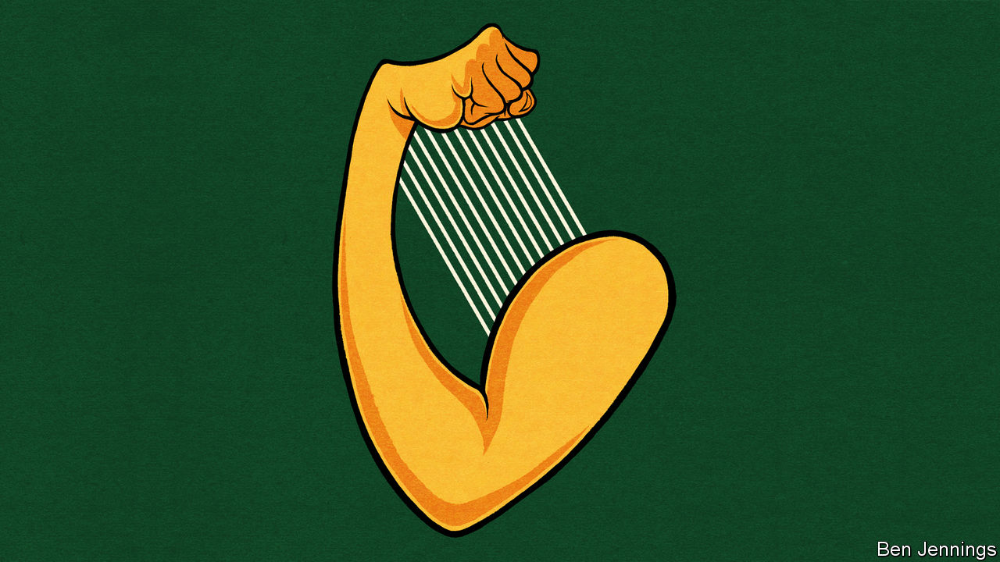

## Charlemagne

# How Ireland gets its way

> An unlikely diplomatic superpower

> Jul 18th 2020

EVERY ST PATRICK’S DAY, Ireland’s ministers partake in a long-held Irish custom: they leave the country. Ministers are packed off to far-flung destinations to preach the virtues of the homeland. The prime minister always heads to America, but other bigwigs find themselves farther afield. In 2018 the housing minister was sent to South Korea, while the minister for higher education ended up in Oman. This year, as covid-19 raged through Europe and Irish politics stood still during coalition negotiations, things were scaled back. Only the trip to Washington went ahead. Ireland, a country of 5m people, had to settle for an audience with the president, a breakfast with the vice-president and a lunch with practically every senior member of Congress.

On a per-head basis, Ireland has a good claim to be the world’s most diplomatically powerful country. Its finance minister, Paschal Donohoe, last week won the race to become president of the Eurogroup, the influential club of euro-zone finance ministers, despite the French and German governments backing another candidate. In June Ireland won a seat on the UN Security Council, fending off Canada, another country often flattered by comparison with a bigger, sometimes boorish, neighbour. Barely a decade after a financial crisis saw Ireland bailed out, Philip Lane, the former head of Ireland’s central bank, is the main thinker at the European Central Bank. In Brussels, Ireland’s commissioner Philip Hogan is in charge of trade, one of the few briefs where the European Commission, rather than EU governments, is supreme. And the EU’s position on Brexit was shaped by Irish diplomats.

Ireland has some natural advantages. A history of emigration blessed it with a huge diaspora in America, which unlike say the German diaspora, is vocal about its heritage. That ensures an audience in the White House and sway on Capitol Hill. It is a small, English-speaking country with diplomats able to focus on a few clear aims. A policy of neutrality helps it avoid unpopular military entanglement. Unlike most rich European countries, it carries no imperial baggage. Indeed, Ireland’s history as a victim of colonialism still provides a useful icebreaker with countries once coloured pink on Victorian maps. Nor is Ireland shy about using its cultural clout. Alongside more subtle overtures, the push for the Security Council seat involved free tickets to Riverdance and a U2 gig. The best that Canada could muster was Celine Dion.

It is in the EU where Ireland shows true diplomatic dexterity. It avoids easy classification. Ireland shares a lust for balanced budgets with frugal northern states, yet it endured a banking crash and the ignominy of a bail-out programme like Spain and Portugal. Though it is now among the richest countries in the bloc, it started life as the poorest, relying on EU funding to spur growth—a similar path to the one countries in Europe’s east hope to take. It is a member of the New Hanseatic League, a club of northern, liberal countries, yet it was among the first to back a demand from southern Europe for common debt to be issued by the EU and granted to struggling governments. Ireland can fairly be labelled as a northern, southern, eastern or western European country.

Ireland’s membership of a more informal, yet powerful, grouping is also key. Of the EU’s 27 members, only five have populations of more than 20m. The small countries have different agendas, but they share a similar goal: not being trampled by bigger neighbours. These relationships are cherished by Ireland, which has an embassy in every EU country—a rarity for a country of its size. For big countries used to having their own way through history, the EU is a way of maintaining power even as they shrink as individual actors on the world stage. For smaller countries, however, the EU magnifies their power beyond their wildest dreams. During last year’s Brexit negotiations, Irish diplomats were well aware of this fact, which took longer to be appreciated in London. The EU was never likely to side against a current member in favour of a departing one. However, it was thanks to Dublin’s patient, energetic lobbying that the border on the island of Ireland became the defining issue during talks.

Ireland was not always so influential. At the start of the decade, the country’s reputation was shot. A banking crisis led to an embarrassing €85bn bail-out. Rebuilding that reputation has been a decade-long task. Among the bail-out countries, Ireland became a star pupil, enacting reforms with almost masochistic relish, while other countries in a similar position complained. For a country whose prosperity is based on economic openness, foreign policy starts with economic policy.

There are still plenty of reasons for Ireland to be disliked. It hosts the European operations of many of the world’s largest tech companies, and its data-protection regime is lenient. For a while, the likes of Google and Facebook were watched over by a regulator whose office was above a convenience store in a small town 50 miles (80km) from Dublin. Although now a more professional operation, it is still seen as weak. When it comes to tax, kind words about the Irish disappear. At 12.5%, its corporation tax is the second-lowest in the EU. Often companies do not pay even that. In 2016 the European Commission demanded that the Irish government collect €13bn in back-taxes from Apple. On July 15th the European Court of Justice annulled the decision. Ireland’s tax policy was legally vindicated (although its coffers were less full).

A crackdown on Ireland and her fellow low-tax states is still brewing. But here Ireland has real power: each EU country wields a veto on the topic. There is less need for crafty diplomacy if Dublin has as much power to block as Paris. Now plans are afoot to clamp down on unpopular tax policies using methods that would bypass this veto. The only way of stopping such proposals would be via an alliance of countries able to amass a blocking minority. It is lucky Ireland has skilled diplomats. It will need them. ■

## URL

https://www.economist.com/europe/2020/07/18/how-ireland-gets-its-way
