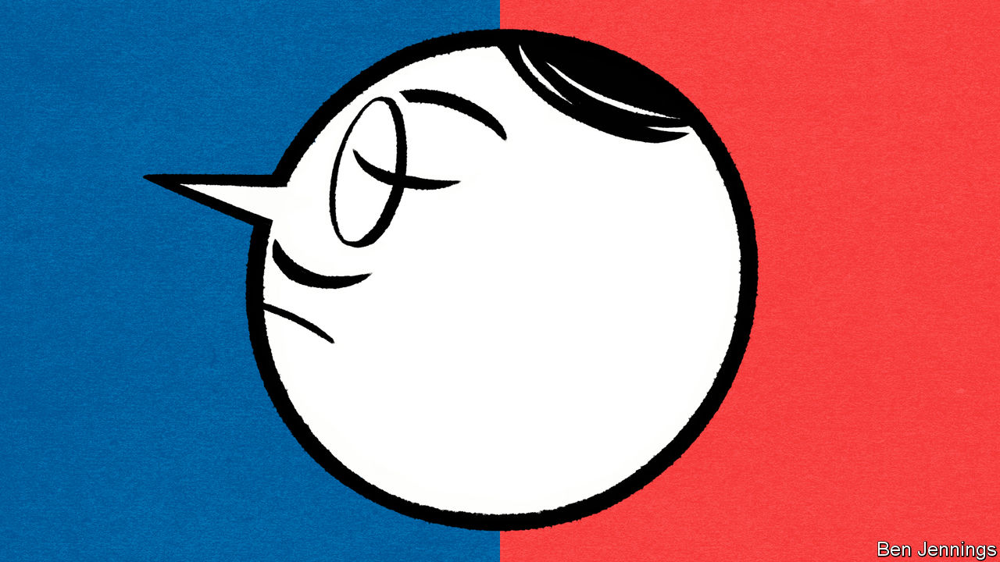

## Accent grave

# Parisian snobbery towards regional French accents persists

> But the new prime minister may challenge that

> Jul 18th 2020PARIS

NO SOONER HAD Jean Castex been appointed than Parisians seized upon their new prime minister’s most distinctive feature: his regional accent. Born in the Gascon town of Vic-Fezensac, Mr Castex speaks with a south-western twang. Locals take pride in the “accent that sings”, which stems from Occitan, the local language. Yet Parisian mockery was thinly disguised. A Paris-Match journalist called it a “gravelly post-match rugby accent”. A broadcaster said that his accent was more commonly reserved for rugby commentators or weathermen.

Few members of the Parisian elite hang on to their regional accents, if they once had one. When Jules Ferry, a Third Republic education minister, imposed French as the sole language in schools in the 1880s, nursery teachers were told to “correct the flaws in pronunciation or local accent”. Dropping a northern ch’ti accent, or a southern drawl, is often a prerequisite for survival under Paris’s unforgiving social codes. French broadcasters, unlike those in Britain, still speak in identical metropolitan tones.

There are exceptions. Charles Pasqua, interior minister under President François Mitterrand, kept his Provençal accent. François Bayrou, a centrist politician from the south-west, occasionally lets his filter through. Jean-Michel Aphatie, a broadcaster originally from the Pyrenees, is well-known for retaining his. Given the backlash against the globalising elite, an accent can in fact hint at a precious link to le terrain, or local region, which may have helped Mr Castex—a high-flying technocrat—get the job.

Parisians may now have to overcome their glottophobie, or snobbery against regional accents. A law professor in Toulouse called the fuss about Mr Castex’s “irritating condescending Parisianism”. As for Mr Castex, when asked, as he inevitably was, he feigned surprise. “I’ve got an accent?” he asked, adding: “I’m proud of my accent, I am what I am.”