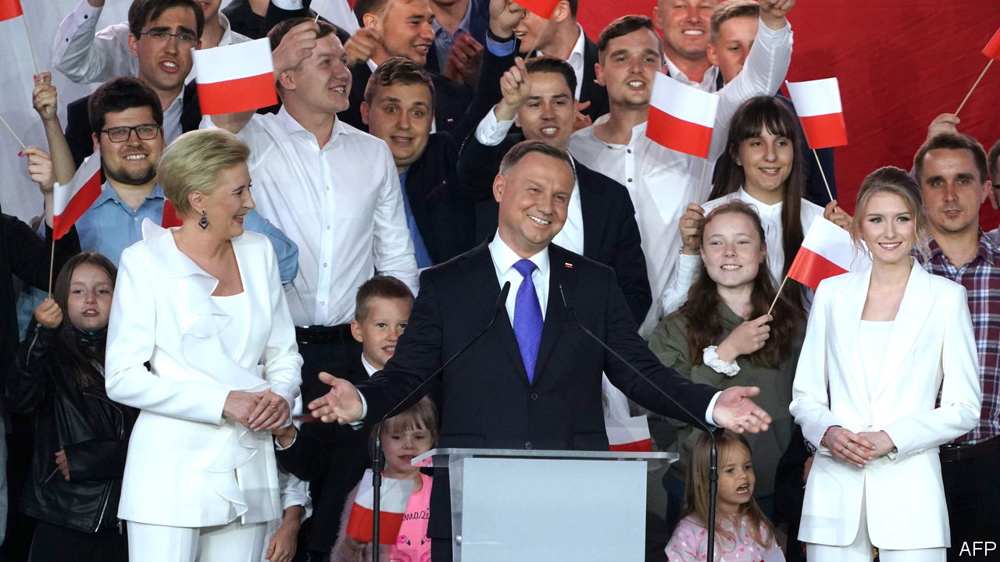

## Narrow minds, narrow win

# Poland’s populist ruling party clings to the presidency

> The campaign involved gay-bashing and anti-Semitism

> Jul 16th 2020WARSAW

INCUMBENT PRESIDENTS will often go to great lengths to be re-elected. In the case of Andrzej Duda, Poland’s president, who hails from the ruling Law and Justice (PiS) party (though he formally left it after being elected president in 2015), this includes denouncing gay people, attacking the independent media and accusing Germany of meddling in the election.

It worked, but only just. He won the election run-off on July 12th, beating Rafal Trzaskowski, Warsaw’s liberal mayor, by 51% to 49%. The president has little executive power, but can veto laws, which would matter a lot if the opposition had won. Mr Duda’s win means further entrenching PiS’s brand of nationalist, socially conservative populism in Poland.

Mr Duda and Mr Trzaskowski are of the same generation. Both were born in 1972, both worked in academia and both served as members of the European Parliament. Yet their politics have placed them on opposite sides of the epic struggle between PiS and the centrist opposition led by the Civic Platform party, which has dominated Polish politics since the mid-2000s. Mr Trzaskowski joined the race at the last minute, after the election scheduled for May was postponed because of the coronavirus. The election went to a run-off after no candidate received over 50% of the vote in the first round on June 28th.

Mr Duda rallied socially conservative voters by championing the traditional family. LGBT (lesbian, gay, bisexual and transgender) rights are an “ideology” worse than communism, he told supporters on June 13th. This was a direct attack on Mr Trzaskowski, who as mayor signed a declaration in favour of those rights in Warsaw. However, in conservative Poland, he has been careful not to go too far; he said on the campaign that as president he would favour civil partnerships, but avoided making any commitment to legalising gay marriage, as is true of his party in general.

PIS took control of the public-television broadcaster, TVP, shortly after coming to power in 2015. It supported Mr Duda’s election campaign strongly, unfairly and with a dash of anti-Semitic conspiracy theory. “Trzaskowski will fulfil Jewish demands?” said the caption on its main evening news programme on July 9th. Mr Trzaskowski responded by putting openness right at the centre of his campaign, calling for a Poland in which “an open hand wins against a clenched fist”.

The turnout in the election was 68%, one of the highest in Poland since the fall of communism in 1989. Mr Trzaskowski came a strong first in the country’s western regions, which are the most closely integrated with other EU countries. Mr Duda won in the more rural, socially conservative east, which borders Ukraine and Belarus, and in the south. Mr Trzaskowski performed extremely well among the young, winning almost two-thirds of the under-30 vote, according to an exit poll published after voting closed. In the over-60 age group the proportions were reversed, with more than 60% backing Mr Duda.

The opposition is filing complaints about the election and encouraging citizens to do so, too. Many are likely to concern how the vote was conducted among Poles living abroad, among whom Mr Trzaskowski crushed Mr Duda, with 74% of the vote. Others may focus on the egregious bias of the state broadcaster. Yet Mr Duda’s victory seems unlikely to be overturned, or even vigorously contested.

With Mr Duda now re-elected, and no more elections scheduled until 2022, PiS can focus on its agenda to reshape the country. Recent comments by the party’s politicians indicate that the private media, including foreign-owned outlets (mostly in German hands), could be the next independent institution to feel the cosh. Some suggest that they should be “re-polonised”—a term used by the party in the past in relation to foreign-owned banks. “The media in Poland should be Polish,” said Jaroslaw Kaczynski, the party’s chairman, who is widely seen as steering politics from the back seat, in an interview with the Polish press agency published after the election. Liberals fear this could be a way to stifle criticism of the ruling party. Moderates in the party would favour concentrating on the economy.

In the opposition, eyes are on Mr Trzaskowski, who won over 10m votes. Some politicians in Civic Platform suggest that he could lead a new movement that could unite the fragmented opposition, which includes moderate conservatives, liberals, agrarians and the centre-left. In an interview with a privately owned television broadcaster on July 14th, he announced plans to “rebuild political parties” and use the “civic energy” of the election to build a modern, European Poland. He said he also intended to stay on as mayor of Warsaw. After years of a conspicuous lack of leadership and vision within the opposition, Mr Trzaskowski is offering his liberal compatriots a dash of that elusive quality: hope. ■

## URL

https://www.economist.com/europe/2020/07/16/polands-populist-ruling-party-clings-to-the-presidency
