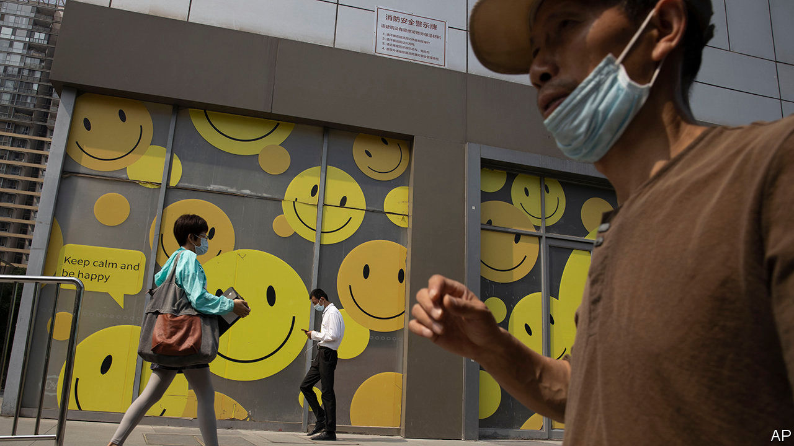
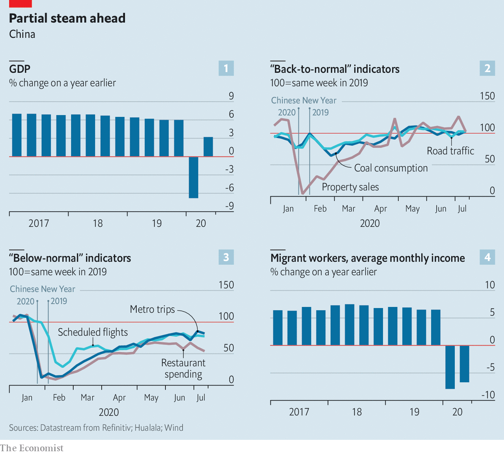

## Low and mighty

# China’s world-beating growth rate of...3.2%

> Its economic rebound is impressive but uneven

> Jul 18th 2020SHANGHAI

AT THE START of the year no one would have predicted that China would crow about such slow growth by its lofty standards. Yet on July 16th it proudly reported that GDP grew by 3.2% in the second quarter compared with a year ago, rebounding from its coronavirus lockdown (see chart 1). This makes it, by far, the best-performing big economy.

Sceptics question the data. But alternative indicators confirm that the recovery is real, albeit highly uneven. During February the government prioritised the reopening of factories, as shown by coal consumption (see chart 2). Traffic congestion returned as people went back to work, partly because, wary of public transport, more commuted by car. Banks ramped up their lending to keep businesses afloat. Some credit flowed into the property market.

Yet flights are still down as few people go on trips. They also avoid crowds, taking the subway less often (see chart 3). Spending on restaurants, including takeaways, is weak, which in turn points to the soft labour market (see chart 4). That is all to say: China’s rebound from the coronavirus crisis is impressive, but it is not yet back to normal.

## URL

https://www.economist.com/finance-and-economics/2020/07/18/chinas-world-beating-growth-rate-of32
