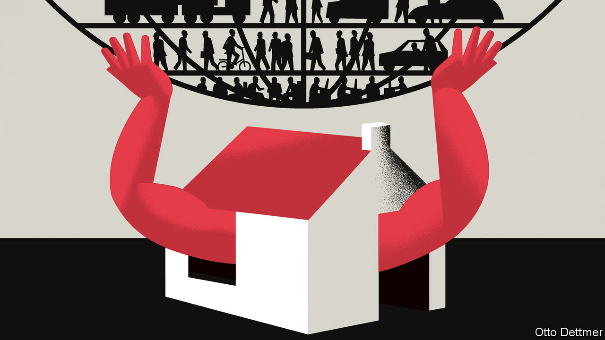

## Free exchange

# Housing was the business cycle

> Residential investment is not the macroeconomic force it used to be

> Jul 18th 2020

AMERICANS HAVE long understood the link between the state of the housing market and the health of the wider economy. When Paul Volcker, then the chairman of the Federal Reserve, raised interest rates to eye-watering levels in the early 1980s, furious builders sent him lumber in protest, and the unemployment rate soon rose to nearly 11%. In 2007 Edward Leamer of the University of California, Los Angeles, wrote that “housing IS the business cycle.” The Great Recession soon seemed to prove his point. The trauma of the global financial crisis has left Americans overly sensitive to wobbles in the housing sector. But in fact its role as the engine of economic fluctuations has diminished. Though the covid-19 recession will bring pain for many renters and homeowners, it may also demonstrate that housing woes are not the harbinger of doom that they once were.

Mr Leamer’s description of the importance of housing for past economic ups and downs is no exaggeration. Residential investment represents a small slice of GDP—about 4.6%, on average, over the post-war era. But it has typically varied more wildly, and consequentially, than other sectors. Between 2007 and 2009, for example, real output in America shrank by about 2.5%. Over the same period, however, residential investment tumbled by 41%. In his study of America’s post-war recessions, Mr Leamer finds that GDP starts to deviate from its trend even before a recession begins in earnest and output starts to fall. Slumping residential investment typically acts as an early-warning indicator, accounting for about a quarter of output shortfalls on the eve of a recession, on average. By contrast, the consumption of durable goods is responsible for about a fifth, and the consumption of services contributes only a tenth or so to economic weakness. The housing market has generally been both a reliable predictor of downturns and, frequently, a proximate cause. Serious housing troubles preceded nine of the 11 recessions between the end of the second world war and the start of 2020. One exception is the dotcom bust, which was preceded by only a modest housing slump. The other is the recession of 1953, which was triggered by demobilisation after the Korean war. Here housing was a completely innocent bystander.

Still, over the period housing’s economic role has gradually weakened. Residential investment (ie, spending on new housing capacity) as a share of GDP, which peaked at 6.9% in 1950, has since drifted downwards (see chart). The surge in construction in the early 2000s broke with that trend, only for the downward slide to resume thereafter. Investment in housing as a share of GDP was just 3.9% in 2017, the lowest cyclical peak since 1945. As the share of residential investment in GDP has fallen, its contribution to recession-inducing economic weakness has also declined: from 32% before the downturn in 1980, to 21% ahead of that in 1991, to only 12% by the eve of that in 2001.

The Great Recession might seem a staggering exception. In fact, it proves the rule. A massive 22% decline in residential investment in 2009 subtracted 0.74 percentage points from real GDP growth that year, which is nothing to sneeze at. A comparable drop in 1980, though, cut growth by much more—1.2 percentage points. The role of housing in the Great Recession is less straightforward than commonly understood. Its contribution to growth began to fall in the fourth quarter of 2005—fully two years before the recession began, and three before the steepest falls in output. The large declines in GDP in late 2008 and early 2009, furthermore, were the result of the financial-sector knock-on effects of the house-price collapse, not the contraction in investment itself.

The property boom and bust of the 2000s were also products of economic circumstances that are unlikely to recur in the near future. Residential investment is highly sensitive to changes in interest rates and house prices. Prices themselves are strongly influenced by interest rates. Research published by the Bank for International Settlements, a club of central banks, in 2017 found that a one percentage-point decline in short-term interest rates in America in 1970-2015 was associated with a 5% rise in house prices over the subsequent three years. From 2000 to 2002, the Fed cut interest rates by more than five percentage points, stoking a surge in prices and construction, and helping revive the economy.

Fed officials will not find that trick easy to repeat. Interest rates at all durations have collapsed over the past decade, giving central bankers far less room to influence the timing of housing investment by adjusting policy rates. When the covid-19 crisis began, the Fed could cut its policy rate by only 1.5 percentage points before it hit the zero lower bound. Meanwhile, other factors are depressing the demand for homes. Net migration to America has historically had a profound influence on residential investment, but fell by more than 40% between 2016 and 2019. Indeed, in 2019 America’s population grew at its slowest pace in a century. Lower immigration and birth rates associated with the pandemic could reinforce the trend, leading to a secular decline in housebuilding.

Housing’s shrunken stature as a business-cycle villain does not mean its effects can be ignored entirely. New home sales in April were 13% below their level in April 2019; new residential construction fell by 26% over that period. When the figures are eventually published, they may show that the drop in residential investment in the first half of 2020 was the largest on record (though its contribution to the fall in GDP will almost certainly be swamped by contraction in other sectors). If generous aid to unemployed workers and relief programmes for struggling renters and borrowers are allowed to lapse, then the woes of the housing market could worsen.

The sector’s diminished share of GDP, though, limits its ability to amplify contractionary forces. And post-crisis changes in lending standards have reduced the threat that mortgage defaults trigger financial contagion. The biggest reason to worry about housing troubles now is the suffering that evictions and foreclosures stand to inflict on households and neighbourhoods. Time, then, for policy to treat housing less like an abstract macroeconomic football, and more like the essential service that it is. ■

## URL

https://www.economist.com/finance-and-economics/2020/07/18/housing-was-the-business-cycle
