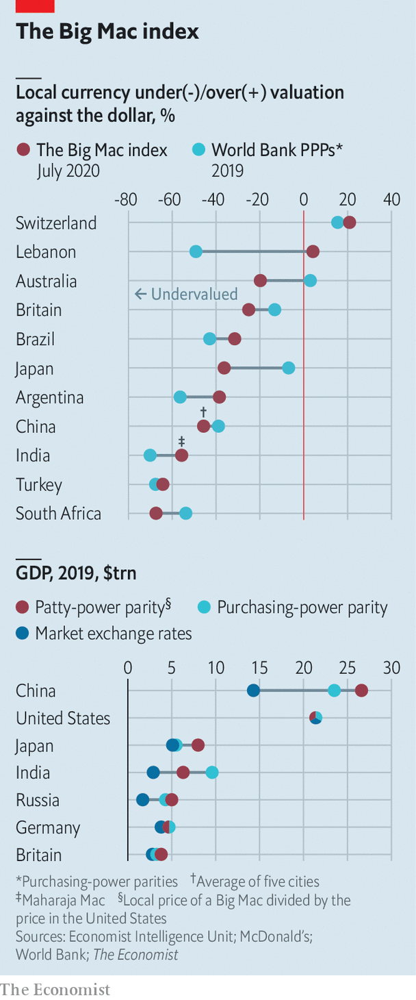

## Patty power

# How big is China’s economy? Let the Big Mac decide

> Our index reckons China’s GDP is bigger than the World Bank thinks

> Jul 18th 2020

AMERICA’S ECONOMY did not exceed China’s in size until the 1880s, according to the Maddison Project at the University of Groningen. The two now rival each other again. Because China’s workers are 4.7 times as numerous as America’s, they need be only a fraction as productive to surpass America’s output. No fewer than 53 countries would already have a bigger GDP than America if they were as populous as China.

In 2019 China’s workers produced over 99trn yuan-worth of goods and services. America’s produced $21.4trn-worth. Since it took about 6.9 yuan to buy a dollar last year, China’s GDP was worth only $14trn when converted into dollars at market rates. That was still well short of America’s.

But 6.9 yuan stretches further in China than a dollar goes in America. One example is the McDonald’s Big Mac. It costs about 21.70 yuan in China and $5.71 in America, according to prices collected by The Economist. By that measure, it takes only 3.8 yuan to buy as much as a dollar. But if that is the case, then 99trn yuan can buy as much as $26trn, and China’s economy is already considerably bigger than America’s.

Motivated by this logic, The Economist has compared the price of Big Macs around the world since 1986. The result is a rough gauge of the purchasing power of currencies. It suggests that many currencies are undervalued, relative to the dollar, on the foreign-exchange markets (see chart). The Swiss franc and the Lebanese pound are overvalued. Lebanon’s currency was undervalued until inflation took off late last year, raising local prices even as the pound remained pegged to the dollar. The Big Mac alone jumped 38% in price.

Every few years the World Bank embarks on a vastly more systematic effort to gauge purchasing power by comparing thousands of prices across the world. The results can be startling. Its survey of prices in 2011, released six years ago, showed that China was cheaper than previously thought and its economy was therefore much larger. Based on these estimates, the IMF calculated that its GDP overtook America’s in 2014 and was 27% bigger in 2019.

Many observers, however, greeted these estimates with scepticism. In 2010 an informal survey by a reporter at Caixin, a financial magazine, noted that a number of items were dearer in Hangzhou than in its sister city Boston. (It compared apples to apples, and found that the Golden Delicious variety was 37% pricier in the Chinese city.)

The sceptics won some vindication in May when the World Bank released its latest price-comparison exercise. It discovered that things were about 17% more expensive in China, relative to America, than previously thought. At a stroke, China’s GDP fell by over $3.2trn. The estimates suggest China did not overtake America’s economy until 2016.

But are these new estimates any more robust than earlier efforts? Comparing prices across the world is fraught with difficulties. An item may be a staple in one place and a delicacy in another. The World Bank must also decide how much weight to give each item. That depends on shopping habits, which differ—partly because prices differ. It is easy to go around in circles.

So it might help to check the World Bank’s results against a cruder yardstick—like the price of a Big Mac. Our index suggests that the bank now, if anything, underestimates the buying power of China’s currency, and therefore its economic size. McDonald’s was once a symbol of America’s economic might. Now the Big Mac shows how its might is being surpassed. ■

## URL

https://www.economist.com/finance-and-economics/2020/07/18/how-big-is-chinas-economy-let-the-big-mac-decide
