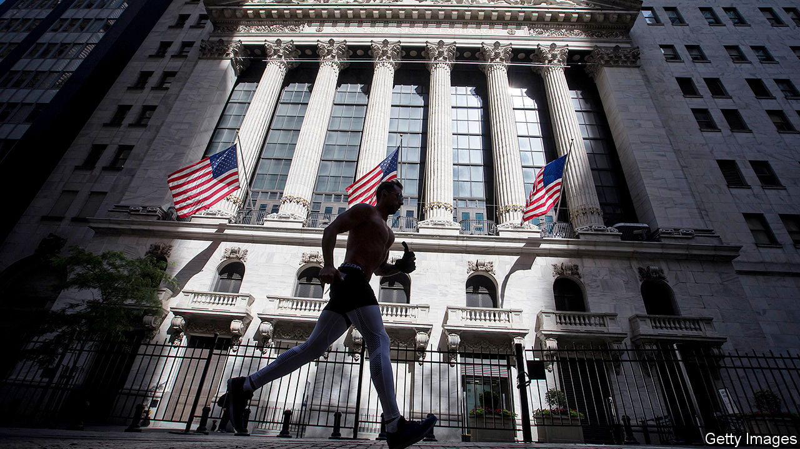
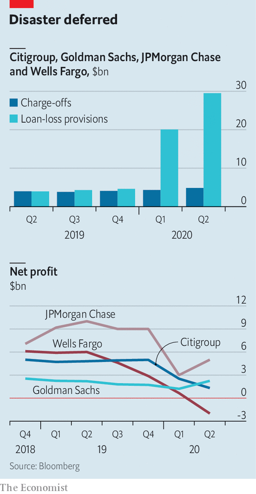

## A banking drama, in three acts

# What Wall Street’s results tell you about America’s economy

> The panic has been calmed, and the economic pain deferred. But uncertainty still abounds

> Jul 18th 2020NEW YORK

THE FIRST act of the impact of the coronavirus on America’s financial markets and banking system was characterised by panic. As firms scrambled to amass the cash they needed to survive shutdowns, they rushed to sell their holdings of securities and draw down their revolving credit lines. Traders attempting to make markets from their sofas were overwhelmed with record volumes. Banks’ loan books and deposit accounts swelled. Risk managers frantically tried to compute potential loan losses. All this was reflected in the big banks’ first-quarter earnings, reported in the middle of April. Trading profits were sky high, lifting investment-banking revenues. But bottom lines suffered as commercial banks set aside reserves to prepare for likely credit losses (see chart).

The second act was less turbulent, as government support quelled the panic. Legislation passed in March bolstered unemployment benefits, set up a lending scheme for small businesses and provided a backstop for the Federal Reserve to buy up corporate debt. This seems to have insulated firms and households from much of the damage, and has restored order to financial markets. But unease about the future remains. These dynamics were evident in the second-quarter earnings put out by Citigroup, Goldman Sachs, JPMorgan Chase and Wells Fargo, four of America’s largest banks, on July 14th and 15th. (Bank of America and Morgan Stanley, America’s other big lenders, were due to report on July 16th, as The Economist went to press.)

As bond markets began to function again, firms rushed to sell securities. In America companies have issued more than $2trn in equity and debt, equivalent to 5% of the entire value of outstanding corporate bonds and public equity, and an increase of almost 50% on the year. Accordingly, primary-issuance revenues at the four big banks rose by 56%, year over year, to $7.8bn. Traders stayed busy: trading revenues rose by 70% on the year to an all-time high of $26.9bn. That reflected stronger client activity, as well as wider trading spreads, said Stephen Scherr, the chief financial officer of Goldman Sachs.

More company bosses are now telling investors that they hold enough cash to cover two or three years’ worth of outgoings. Newly recapitalised companies are paying back revolving loans. Of the $55bn drawn down from JPMorgan in March $39bn has since been repaid.

Commercial banks are bracing for the impact of the crisis, but it has yet to come. Although 17.8m Americans were unemployed at the end of June, few have defaulted so far, thanks to stimulus cheques and meaty unemployment benefits, and banks’ willingness to defer mortgage and credit-card payments. The four banks’ charge-offs—ie, their write-offs for loans in default—rose by just 22% to $4.9bn in the second quarter, up from $3.9bn during the same period in 2019. By contrast, $29.5bn was set aside for provisions for expected losses, compared with just $3.9bn in the same quarter in 2019. This stockpile comes on top of the $20bn the lenders set aside in the first quarter. The way to think about these provisions, said Jennifer Piepszak, JPMorgan’s chief financial officer, is that “it is all in the outlook, because we are not seeing it today”.

Will the third act of the crisis see banks making big losses? A simple way of thinking about what will happen next is to split the institutions into three parts: the investment bank, which has performed exceptionally well so far; loan provisions, which have been exceptionally costly; and “everything else”, which includes wealth and asset management. The residual bit of large banks’ business has, overall, been remarkably steady. If provisions for loan losses and revenues from investment banking had both been flat on the year, net income would have fallen by an average of just 1% across Citi, JPMorgan and Wells.

The fate of banks’ profitability seems likely therefore to depend on the fate of the investment-banking business, and of provisions for loan losses. Investment-banking revenues seem set to slow, if they have not already done so. Trading volumes have eased in June and early July from their highs in March and April. Jamie Dimon, JPMorgan’s chief executive, reckoned that trading revenues would “normalise” or even drop below normal later in the year.

Whether provisions prove sufficient or not is far from clear. They are based on a number of assumptions that are layered on top of each other. One is about the path the virus takes. Another is how that evolution affects unemployment and economic growth. Yet another concerns the size of any further fiscal stimulus, and how consumers and firms respond to it.

Banks’ base case seems to be broadly in line with that of the Federal Reserve. The economy is expected to be smaller by the end of 2021 than it was at the end of 2019. The unemployment rate is expected to remain in double digits until the end of this year, before falling gradually. But bank bosses emphasised the fog of uncertainty shrouding it all. “We are in a completely unpredictable environment,” said Michael Corbat, Citi’s chief executive. “In a normal recession unemployment goes up, delinquencies go up, charge-offs go up, home prices go down, incomes go down, savings go down,” said Mr Dimon. This time the usual relationships do not hold. Even as unemployment has jumped, for instance, incomes have risen.

If investment-banking revenues subside and banks keep having to add to provisions, losses may be on the cards in the third quarter. Wells Fargo was the only bank to make a loss in the second. That reflects its relatively small investment bank, as well as its special situation—it still operates under an asset cap imposed by regulators that has constrained its growth, even as other lenders have ballooned. But another, rosier scenario is possible: that government stimulus continues to keep delinquencies down, and banks end up with mountains of spare capital. That would be welcome news for shareholders. Even as the s&P 500 benchmark index has recovered, bank shares are a third lower than at the start of the year. But the happy scenario also relies on the third act being the final one. With covid-19 cases rising, that is looking increasingly unlikely. ■

## URL

https://www.economist.com/finance-and-economics/2020/07/18/what-wall-streets-results-tell-you-about-americas-economy
