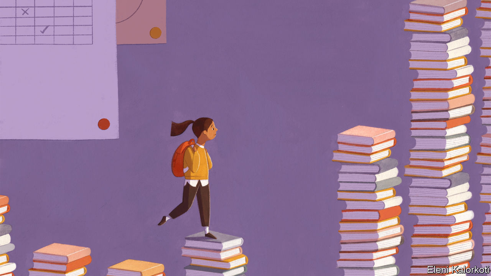

## A class apart

# As schools reopen, how can pupils make up for lost time?

> The hard-up find it hardest

> Jul 18th 2020

Editor’s note: Some of our covid-19 coverage is free for readers of The Economist Today, our daily [newsletter](https://www.economist.com/https://my.economist.com/user#newsletter). For more stories and our pandemic tracker, see our [hub](https://www.economist.com//news/2020/03/11/the-economists-coverage-of-the-coronavirus)

LAST YEAR Kiana Jones took a summer job at a trampoline park, supervising birthday parties and keeping an eye out for overzealous bouncers. This season Ms Jones, an undergraduate in Tennessee, is spending seven weeks in a community centre drilling children in reading and maths. She is one of around 600 locals swiftly assembled by the Tennessee Tutoring Corps, a charity set up in May by a former state governor to help children who have missed months of school. It will pay each tutor $1,000, more than many had expected to make during a summer overshadowed by the pandemic.

The efforts of those such as Ms Jones are a rare bright spot in America’s scholastic landscape. The government has largely failed to control the pandemic. Schools have largely stayed closed. President Donald Trump and Betsy DeVos, the education secretary, have threatened to defund schools that refuse to reopen. Those that do welcome back children in the autumn may have to rely on rota systems that allow pupils to attend in person only part-time.

In other parts of the rich world, however, children are already coming back. In countries such as France, Denmark and New Zealand social-distancing rules have been relaxed to allow most children to return to classes every day. Schoolchildren in England will return full-time from September, the British government says. But getting children back into classrooms is only the first step in repairing the damage the pandemic has done to their learning. Educators must now work out how to make up for lost time.

The challenge is huge. Lessons from the year now ending remain untaught. When children spend any significant time out of school (including normal summer holidays), they tend to forget some of what they have already learnt. Analysts at NWEA, an American test-provider, reckon that by autumn some children will be a year behind in maths.

Poor children will suffer most. Many were some way behind their peers before the pandemic. Some American classrooms included pupils whose true learning levels spanned seven grades, according to NWEA. This gap has only widened as children have missed months of school, making teachers’ jobs even harder.

Guidance produced by UNESCO and McKinsey, a consultancy, identifies three types of catch-up strategies. Schools can give children more time. They can adjust their curriculums. Or they can try to improve the quality of their instruction. The greatest success will probably come from a combination of all three.

Some countries have already tinkered with timetables. Singapore pulled forward its month-long annual recess—usually in June—to May, when the country’s lockdown was already keeping schools shut. In some parts of Vietnam schools have crunched the usual three-month break down to a few weeks.

Others are expanding existing summer programmes. New York City is requiring about 100,000 students to enroll in online summer schools, twice as many as last year. The difficulty is that children often fail to turn up to real summer schools frequently enough to benefit from them. It is even harder to ensure they attend lessons conducted online.

Squeezing curriculums to create more time for the most important subjects is less painful than it sounds. Andreas Schleicher of the OECD, a club of mostly rich countries, says that politicians have long found it easy to add fashionable new topics but more difficult to take things away. As a result, he continues, syllabuses have become “a mile wide but only an inch deep”. David Steiner of Johns Hopkins University says much of American pupils’ time is wasted on material that is less challenging than it should be.

Experts are most enthusiastic about using tutors to help children catch up. The British government has put aside £350m ($439m) to launch a national tutoring programme in September. Schools can use existing organisations or hire graduates who would work full time. They can top this up with money from another pot of £650m that schools can use for any remediation strategies they deem helpful. The Dutch government has earmarked €244m ($277m) for a similar programme. It plans to enlist trainee teachers to help bring struggling learners up to scratch.

Robert Slavin, director of the Centre for Research and Reform in Education at Johns Hopkins University, would like America to mount a federally funded tutoring programme. Trained graduates could be deployed in teams to each American school, beginning with those whose students have been worst affected by the closures. They could teach pupils one-to-one or in small groups. A few American politicians like the idea but the government has shown no interest in doing anything on this scale. Tutoring jobs would be welcomed by graduates entering a terrible market, reckons Matthew Kraft of Brown University. Getting large numbers of graduates to work as tutors might help to reduce teacher shortages by encouraging more youngsters to consider teaching as a career.

Schools will have to work hard to ensure that everyone gets the help they need. A survey carried out in early May by the Institute for Fiscal Studies, a British think-tank, found that poorer parents were less inclined than rich ones to send their children back to school as soon as it is allowed. An American poll found that black and Hispanic parents are much less likely than white ones to consider classrooms safe.

Ultimately no child will learn anything “unless they feel psychologically and emotionally safe”, says Pasi Sahlberg of the University of New South Wales in Australia. When schools reopen, he reckons, they will need to provide children with counselling and time to play as they adjust to their return. Tute Porter-Samuels, a primary-school teacher in New Zealand, says that when her school in Wellington reopened it devoted two weeks to music and art.

Still, there are grounds for optimism. Home schooling has introduced parents to the horrors of trying to educate their children while holding down a job. But it has also made parents more sympathetic to teachers, says Odile Cordelier, a teacher in the French city of Dijon.

Distance-learning, despite its glitches, has made teachers more familiar with technology. Recessions may force governments to trim school budgets but they may also get some new blood into the teaching profession. In Britain applications to teacher-training programmes surged in May and June. A recent study found that teachers in Florida who started their careers in downturns were better at raising test scores than those who did not. Schools will need all the help they can get. ■

## URL

https://www.economist.com/international/2020/07/18/as-schools-reopen-how-can-pupils-make-up-for-lost-time
