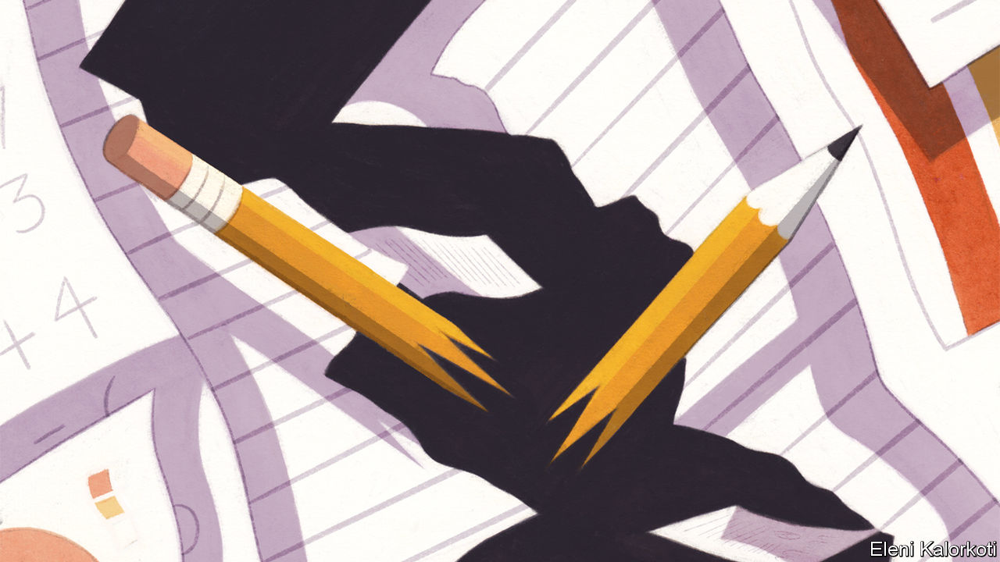
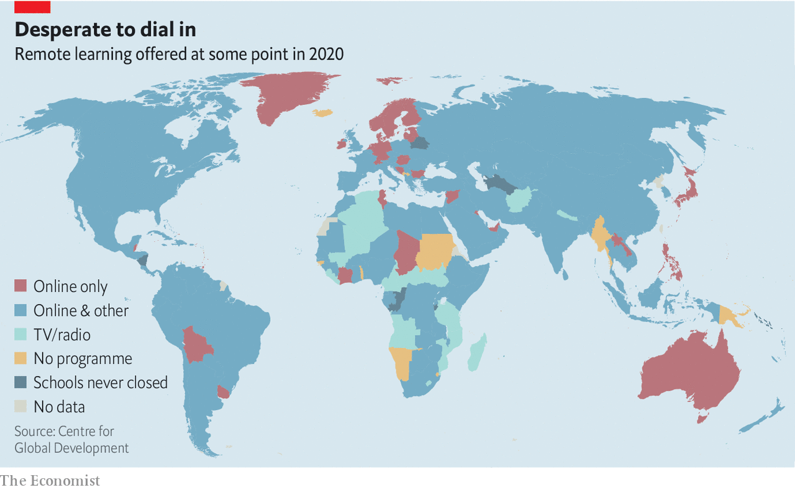

## Learn today, earn tomorrow

# School closures in poor countries could be devastating

> And governments are bungling their response

> Jul 18th 2020JOHANNESBURG, PARIS AND SÃO PAULO

Editor’s note: Some of our covid-19 coverage is free for readers of The Economist Today, our daily [newsletter](https://www.economist.com/https://my.economist.com/user#newsletter). For more stories and our pandemic tracker, see our [hub](https://www.economist.com//news/2020/03/11/the-economists-coverage-of-the-coronavirus)

SUHANI, WHO is nine years old, wakes each day before dawn. She collects flowers to weave into necklaces which she flogs to drivers stuck in Dhaka’s endless traffic jams. Until recently Suhani and her sister spent their days in a crowded classroom in Nimtoli, a slum in Bangladesh’s capital. When the country locked down to stop the spread of covid-19 their mother, a single parent, lost her job as a maid. She has been out of work since. Schools remain closed. Even if they were open, Suhani could not go. She is the breadwinner now.

Of the 1.5bn children forced out of school by lockdowns around the globe, 700m are in developing countries. Like pupils in rich countries, their education is suffering. But the consequences in poor places will be far worse. Before the pandemic, more children were in school than ever before, according to Robert Jenkins, head of education at of Unicef, the United Nations’ children’s fund. In its aftermath nearly 10m children in 40 countries might never return to formal education, estimates Save the Children, a charity.

The economic impact of the pandemic has forced many to abandon their studies in favour of work. Between 2000 and 2020 the number of children in work around the world fell by 40%, mostly because more were going to school. Covid-19 is undoing that progress. In the Democratic Republic of Congo growing numbers are helping their parents in mines, says Stephanie Shumsky of Pact, an aid group. Others are being recruited into militias. In Jordan young Syrian refugees are toiling on farms.

Experts are most worried about the effect on girls. In the handful of places that have reopened schools, such as Vietnam and the Ivory Coast, teachers say girls are notably absent. Some are getting married—or being married off. Snehalaya, an Indian NGO, says its emergency hotline has been inundated with reports of this since schools closed in March. Handing a daughter over to a new husband means one fewer mouth to feed. With schools closed, idle daughters may strike up a romance or fall prey to sexual assault. Working parents forced to leave their daughters at home all day alone would rather marry them off than risk the shame of premarital sex, says Girish Kulkarni, Snehalaya’s founder.

Others are falling pregnant, some after being raped by relatives or neighbours while quarantined at home, says Alice Albright of the Global Partnership for Education, an umbrella group based in Washington, DC. While schools are closed girls are no longer in touch with teachers who might help them in such circumstances. During the Ebola crisis in Sierra Leone in 2014, when schools were also closed, teenage pregnancies rose by between 11% and 65%, according to a variety of studies. Extrapolating from these data, researchers at Save the Children think they could rise by 25% as a result of covid-19.

The economic damage from children dropping out of school will be vast. The World Bank estimates that, if schools remain closed for five months, pupils will forgo $10trn of future earnings in today’s money. That could rise if covid-19 is not curbed and schools stay closed for longer.

Many governments are finding it hard to get children learning again. Poorer countries face obvious disadvantages in teaching lessons remotely. In some places access to the internet is patchy. In the Indonesian capital, Jakarta, 87% of children can get online, says Nadia Fairuza of the Centre for Indonesian Policy Studies, a think-tank, but in Papua, Indonesia’s biggest province, the figure is less than 30%.

Thus the pandemic is widening the pre-existing gap between how much rich and poor children learn. A survey last month by Datafolha, a pollster, revealed that while 74% of pupils in Brazil are participating in some kind of distance learning, often over WhatsApp, that drops to just 52% in the poor Amazonian north. There is a similar disparity between the (poor) north and (richer) south in Nigeria, says Emeka Nwajiuba, the country’s education minister. Families sometimes respond to scarcity in ways that disadvantage girls. Parents often give the family’s only phone to their son, not their daughter, he points out.

Many parents and students are being asked to do the impossible. Francis Aruo, a 32-year-old father of five from Rumuruti, a small town in central Kenya, was told to buy a computer by his children’s headmaster. It would cost more than three times his savings. Even if he could afford the computer, a reliable internet connection is not readily accessible in Rumuruti. Mr Aruo can just about afford enough data to run WhatsApp on his phone; he cannot afford enough to download lessons. Femi Odunsi, a secondary-school teacher in Lagos, Nigeria’s largest city, was trained by the state government to teach online. But few of his students have computers and those who have smartphones cannot afford data. In Bangladesh the main remote learning is through programmes broadcast on state-run television. But only 44% of children have access to a television, according to BRAC, a big charity.

Some governments have failed even to try to help children learn from home (see map). Others have been slow to get going. Ghana’s government only launched its distance learning radio programme on June 15th, three months after schools closed.

Reopening schools is hard, too. In June only about half of poor countries said they had a plan for doing so, according to a survey by the UN and World Bank. Social distancing is tricky where 50 or 60 pupils are often packed into a single classroom. In sub-Saharan Africa less than 30% of schools have handwashing facilities.

Governments are opening many other things before schools. In Kenya revellers can hit the pub for a beer and some nyama choma (grilled meat), but the government says schools will stay closed until 2021. In Pakistan the government has allowed madrassas, run by powerful religious groups, to open, but not mainstream institutions. Garment factories opened in Bangladesh more than two months ago, but schools remain closed. Schoolchildren and their parents lack the political clout of factory owners—or indeed, teachers’ unions, which typically resist a return to work. They cite the health risks, which are real. Since South Africa’s schools opened partially on June 8th, nearly 800 schools have had cases of covid-19. But teachers’ unions have also made unreasonable demands. SADTU, the biggest, opposes some provinces opening schools before others: ie, it wants all to hang back with the slowest.

Getting schools up and running will require money, which is tight. Just 8% of the poorest countries report that they are recruiting new teachers to help with reopening, compared with almost 40% of rich ones, according to the same survey by the UN and World Bank. Cash-strapped governments are more worried about boosting their already overstretched health systems. In Bangladesh’s new budget, announced last month, the amount allocated to education was unchanged as a share of GDP.

Still, some governments are making progress. Education ministries in Dominica, Grenada, St Lucia and St Vincent and Grenadines in the eastern Caribbean are working with private telecoms providers to roll out free internet for students and distribute mobile devices to the poorest. Rwanda hopes that an offer of free lunches will get children back to school. Mozambique is giving girls sanitary products. Even handing out snacks or pencils can make a difference.

Experience helps. Sierra Leone used radio programming during the country’s Ebola outbreak in 2014. It was easy to reboot it, says David Moinina Sengeh, the country’s education minister. Preparation for schools to reopen started before they even shut. Mr Sengeh enlisted an army of bus drivers to ferry children, whose families had moved during lockdown, back to the villages and towns their schools were in.

He also rushed to overturn a law banning pregnant girls from going to school, offering incentives to teenage mothers to return to their studies and adding sex education classes to lessons broadcast by radio to reduce the likelihood of girls getting pregnant. Mr Sengeh sees the pandemic as an opportunity to ensure that everyone, everywhere, gets a good education. Covid-19 has given the government the “oomph” it needs to make it happen, he says. Others could learn from him. ■

## URL

https://www.economist.com/international/2020/07/18/school-closures-in-poor-countries-could-be-devastating
