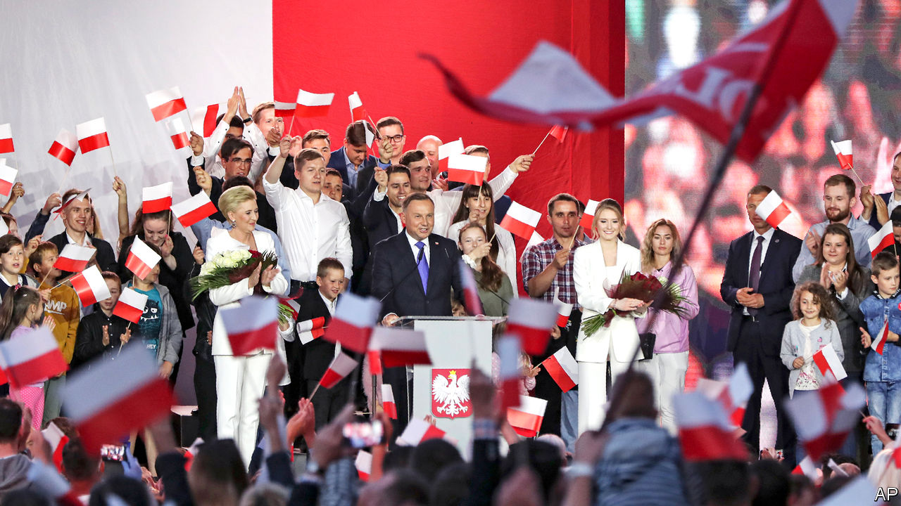

## A win for intolerance

# A nasty election in Poland

> The government should move to the centre

> Jul 18th 2020

IT WAS A good week for eastern Europe’s populists. In Poland the nationalist Law and Justice party (PiS) fought off a determined challenge for the presidency from the moderate mayor of Warsaw. The ruling party’s favoured candidate clung on partly because Poland’s economy has continued to grow healthily under PiS, and because the government has lavished popular cash subsidies on families with children. But there was also a darker reason for President Andrzej Duda’s narrow victory: he stirred up hatred of gay people, Jews and the liberals who supposedly conspire with foreigners to undermine Polish traditions.

Meanwhile Viktor Orban, the populist prime minister of Hungary, looked set to get one over on the bien pensants of Brussels. They wanted to make the disbursement of a €750bn ($857bn) European Union recovery fund conditional on recipient countries abiding by the rule of law. Mr Orban did not like the sound of that, and threatened to veto the whole package. Other European leaders are likely to back down, since their voters care more about economic pain at home than court-nobbling in Hungary.

Mr Duda’s success leaves Poland divided (see [article](https://www.economist.com//europe/2020/07/16/polands-populist-ruling-party-clings-to-the-presidency)). He won solidly in the conservative, rural east of the country, and among older voters; he was trounced in the big cities, in the west of the country generally and in particular among the young. The result was 51% to 49% after a second round of voting that saw liberals rally around Rafal Trzaskowski, the mayor of the capital. That was a blow to liberal hopes, because the president, while having no executive power, can veto new laws. PiS, which last year lost control of Poland’s Senate, had already been weakened. A veto-wielding Mr Trzaskowski would have frustrated its attempts to steer a populist course.

Mr Trzaskowski was hardly someone to horrify elderly Catholics, much though PiS tried to portray him as such. Like Barack Obama before 2012, he declined to endorse gay marriage, while supporting civil partnerships. (His party, Civic Platform, is similarly reluctant to get too far ahead of public opinion.) Also like his party, he does not favour widening the availability of abortion, which is allowed only in cases of serious congenital defects, to protect the life of the mother or in cases of rape or incest. Still, he represents a different direction of travel from the one favoured by many PiS politicians and by Mr Duda, who talk of tightening the abortion rules still further. On the campaign trail, Mr Duda described gay and transgender rights as an ideology that is worse than communism. He also benefited from unremittingly positive coverage from the state broadcaster, which may have tipped a close contest. In parts of the country, people rely heavily on state television.

In the wake of Mr Duda’s victory, the ruling party must decide how to govern. Should it double down on a winning strategy, further limiting abortion for instance, and continuing its efforts to bend what is left of Poland’s independent judiciary to its will? Brussels will not stop it. If Europeans cannot summon the will to punish the blatant violations of democratic norms in Hungary, they are unlikely to punish Poland’s lesser sins.

The alternative is to tack to the centre. That would be the wiser course of action—for both Poland and PiS. Poland remains a conservative country, but it is steadily becoming less so. Economic growth is gradually transforming the countryside. Unlike Hungary, Poland is still a pluralist and vibrant place, with strong institutions and a fearless press, though PiS is trying to muzzle it. If it knows what is good for it, the ruling party will dial down the hate mongering, and shift to where more voters are, as some of its moderates want. The opposition, meanwhile, should keep trying to hold it to account, and prepare for the next election. ■

## URL

https://www.economist.com/leaders/2020/07/18/a-nasty-election-in-poland
