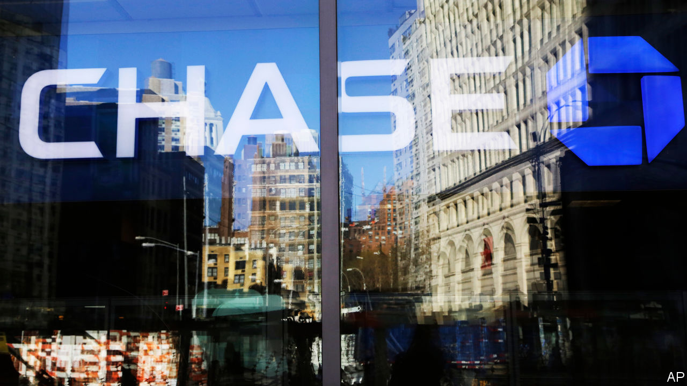
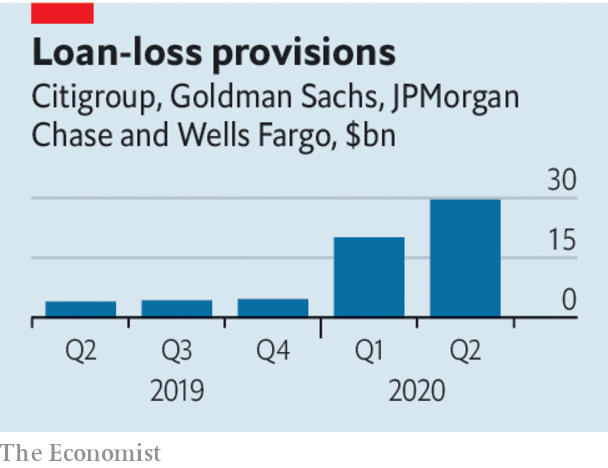

## America’s economy and the banks

# Banks are a window into the economy

> Wall Street banks book giant trading profits and giant bad-debt charges

> Jul 18th 2020

IF YOU WANT a sense of what is happening to America’s economy during one of the most unusual periods in its modern history, a decent place to start is its banks. Several of the very largest firms, including JPMorgan Chase, Citigroup, Wells Fargo and Goldman Sachs, have just updated investors. Together they have trillions of dollars of assets and dealings with many of the households and firms hit by the pandemic. The message is that Wall Street is booming even as Main Street is suffering.

When the pandemic struck, markets collapsed but the Federal Reserve started buying up government debt and promised to purchase all sorts of private assets, including corporate debt. Shares and bond prices soared and many companies, facing a shortfall in revenue because of the lockdowns, rushed to raise capital, mainly by issuing new bonds to investors but also by selling shares. In total some $5.4trn has been raised worldwide so far this year.

This has created a windfall on Wall Street (see [article](https://www.economist.com//finance-and-economics/2020/07/18/what-wall-streets-results-tell-you-about-americas-economy)). In the second quarter markets revenues at Citibank, Goldman Sachs and JPMorgan were higher than at any time since the global financial crisis, almost doubling over the same period in 2019. Goldman Sachs, one of the two remaining big stand-alone investment banks, saw revenues jump by 41%. True to form, it wasted no time in handing over more to its staff. Their 35% pay increase meant that its indulgent and long-suffering shareholders saw profits rise by only 2%.

The real world is less reassuring. Under accounting and supervisory rules, bankers have to prepare for expected losses on loans that go sour, by making provisions now. The sums involved are staggering. The four big banks that have reported set aside $30bn, on top of the $20bn they earmarked in the first quarter. In total the bad-debt reserves they hold are equivalent to 2-4% of their consumer and corporate loan books. Provisions for bad loans now exceed those set aside at the height of the financial crisis. This dragged overall profits down by 50-70% year on year at the big banking conglomerates. Wells Fargo, which does not have a large Wall Street operation to offset charges for dud loans, recorded its first loss since 2008.

What about the outlook? Few investment-bank bosses expect Wall Street to see such stellar results in the second half of the year. Trading volumes have already fallen back and, now that big businesses have their war chest, they will not need to raise so much new money. But the most striking signal from the banks is just how much depends on whether the virus can be controlled—and what the government does. Asset prices have been lifted because of the extraordinary, and necessary, interventions made by the Fed to restart activity. Main Street is staying afloat thanks to generous government handouts. It is unprecedented that unemployment has jumped to post-war highs while income and savings are rising. Half of the consumers who requested deferrals for credit-card and mortgage payments from JPMorgan have kept paying their bills. Whether they will still do so when the government stimulus tapers is another matter. Ominously, Michael Corbat, the boss of Citigroup, admitted that “We are in a completely unpredictable environment.”

That the banks are not sharing the pain in a time of hardship may stick in the craw. But it is better than weak lenders dragging down the rest of the economy, as in the financial crisis. The idea of letting lenders run investment banks no longer looks as risky as it did, given that Wall Street revenues generate profits which can offset Main Street losses. And America’s banking system sits on a vast capital buffer worth a total of $1.2trn. The message from banks is not reassuring. The state of banks is more so.■

## URL

https://www.economist.com/leaders/2020/07/18/banks-are-a-window-into-the-economy
