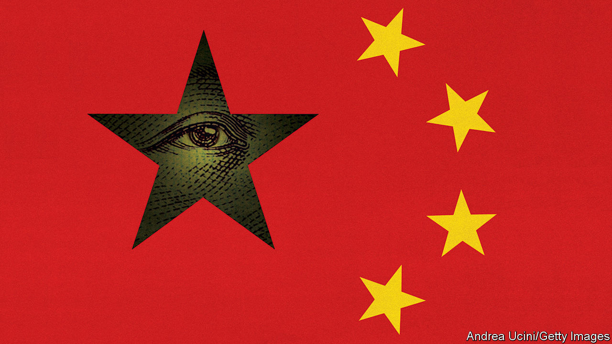

## Huawei and the tech cold war

# China v America

> Trade without trust

> Jul 18th 2020

NINETEEN YEARS ago an unknown Chinese company set up its first European sales offices, in a suburb of Frankfurt and an English commuter town, and started bidding to build telecoms networks. Today Huawei symbolises the daunting rise of China Inc—and a global trading system in which trust has collapsed. With sales of $123bn, it is known for its razor-sharp prices and dedication to the industrial goals of China’s rulers. Since 2018 America has subjected it to a legal assault, making it a flashpoint in the trade war. Now Britain has said that it will block Huawei from its 5G networks (see [article](https://www.economist.com//briefing/2020/07/16/americas-war-on-huawei-nears-its-endgame)). Other European countries may follow. But far from showing the West’s resolve, the saga reveals its lack of a coherent strategy. If open societies and authoritarian China are to keep their economic links and avoid a descent into anarchy, a new trade architecture is needed.

America’s security chiefs have always worried that Huawei’s equipment was designed to aid spying and would make its customers dependent on subsidised Chinese technology. But over 170 other countries decided the risks were manageable. Britain, which works closely with America on intelligence, created a “cell” of cyber-experts to monitor Huawei’s gear in 2010 and, later, confined it to less sensitive parts of the network. Other countries mirrored this approach. It offered a middle way between a naive embrace of Chinese state capitalism and a cold war.

Such a finely balanced judgment has proved untenable. The Trump administration has urged the world to ditch Huawei and enforced a unilateral embargo on its suppliers, preventing sales of some components as well as chips made abroad using American tools. Forced to choose between an ally and a supplier, Britain was inevitably drawn to this week’s decision. It has become riskier for anyone to do business with a firm Uncle Sam wants to cripple. Huawei, for its part, has failed to reassure Britain’s cyber-experts, who have complained that its buggy software is getting harder to monitor, or to reform its opaque governance and ownership. Any remaining illusions that China’s leaders respect the rule of law when it really matters have been shattered by events in Hong Kong.

The direct cost of ripping Huawei out of European networks is tolerable—adding less than 1% to Europeans’ phone bills if amortised over 20 years. Ericsson and Nokia, two Western suppliers, can ramp up production and new competition may emerge as networks come to depend more on software and open standards.

The true burden has nothing to do with antennae but stems from the decay of the world’s trading system. Perhaps a dozen countries might end up banning Huawei—Germany is sitting on the fence (see [article](https://www.economist.com//europe/2020/07/16/angela-merkels-soft-china-stance-is-challenged-at-home)). But it will still be used in much of the emerging world, hastening the splintering of the tech industry. Trade relies on common rules but Britain’s decision has been made amid a swirl of lobbying and threats. It is hard to elicit a principle behind it that can be usefully applied more broadly. If the problem is gear made in China, then Ericsson and Nokia do that, too. If it is Chinese firms building systems which connect devices (in the case of 5G, robots and machines), then a similar logic could be applied across a digitising world economy. German cars and Apple phones sold in China are packed with software, data and sensors. Is China entitled to ban them, too?

This feeds a spiralling sense of lawlessness. The average tariff on Sino-American trade is 20%. Direct investment flows from China to Europe have dropped by 69% from the peak in 2016, according to Rhodium, a research firm. Other firms are caught in the crossfire. TikTok faces a ban in India and, perhaps, America. China plans to impose sanctions on Lockheed Martin for selling arms to Taiwan. Now that President Donald Trump has ended Hong Kong’s special status, HSBC, a bank with huge interests there, could be subject to punishment by both China and America. Some Chinese lenders may be banned from dealing in dollars.

The logic of the Huawei ban is one of disengagement and containment. But this will not work if it is applied across the entire economic relationship. The West’s last great authoritarian rival, the Soviet Union, was a trade minnow. China accounts for 13% of world exports and 18% of world market capitalisation, and is the dominant economic force in Asia.

Instead a new trade regime is needed that acknowledges China’s nature. That is not easy. The World Trade Organisation (WTO), which aims to set universal rules, has failed to evolve with the digital economy. Nor was it prepared for President Xi Jinping’s drive to increase state and Communist Party influence over private Chinese firms and those, like Huawei, which say they are mutually owned by workers. Disillusioned with the WTO, the Trump administration’s negotiators unilaterally tried to wrestle China into liberalising its economy and cutting subsidies, using the threat of tariffs and embargoes. That has been a fiasco.

So how should the trade architecture work in an age of mistrust? The goal should be to maximise trade consistent with both sides’ strategic security. That means fencing off flashpoints, such as tech, that generate lots of tension but a minority of trade: perhaps a third of Western firms’ sales to China based on our analysis of Morgan Stanley’s data, for example. These sectors will require scrutiny and international security certification of the kind Britain tried with Huawei. It may not work. But at least commerce in other areas can flourish.

Chinese firms should also be required to accept open governance of their big subsidiaries in the West, including local shareholders, foreign directors and managers with real autonomy, and disclosures that all help create a degree of independence from the state. This is not hard: multinationals such as Unilever have been doing it for decades. TikTok could be a pioneer.

Open societies are stronger when they act in unison. Europe may be tempted to go it alone, ending decades of transatlantic co-operation. Yet at some point, soon if Mr Trump fails to win a second term, America will reinvigorate its alliances because it has been less effective without them. The West cannot fundamentally change China or ignore it. But by acting together, it can find a way to do business with an authoritarian state it mistrusts. Huawei marked a failure to do this. Time to start again.■