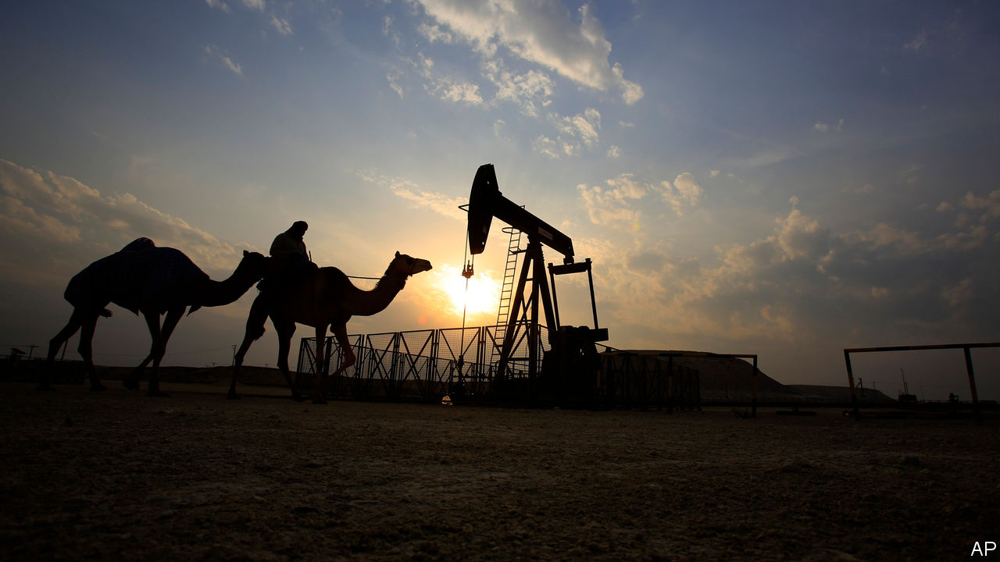

## There will be pain

# With oil cheap, Arab states cannot balance their books

> The crisis is an opportunity to move beyond hydrocarbons

> Jul 18th 2020

AMID WARLORDS and bandits, as smallpox spread around him, George Bernard Reynolds searched the sands of Persia (now Iran) for oil. The British geologist drilled for seven years—and found little. Finally his financiers said enough was enough: it was time to dismiss the staff, dismantle the equipment and come home. Instead Reynolds kept drilling. And in the early morning hours of May 26th 1908, he struck a gusher. It was the first big petroleum find in the Middle East, but certainly not the last. Oil would soon transform the region’s economies, enrich its ruling families and attract more foreign influence.

A century later another big change is coming, as countries around the world adopt cleaner sources of energy. Peak demand for oil may still be years away, but covid-19 has given the Middle East and north Africa a taste of the future. Prices of the black stuff plummeted as countries went into lockdown. The region’s energy exporters are expected to earn about half as much oil revenue this year as they did in 2019; the IMF reckons their economies will shrink by 7.3%. Even when the virus recedes, a glut of supply will probably keep prices down. Faced with budgets that no longer add up, Arab states must adapt.

The challenge they face is daunting (see [article](https://www.economist.com//middle-east-and-africa/2020/07/18/the-end-of-the-arab-worlds-oil-age-is-nigh)). Take Algeria, which needs the price of oil to be over $100 a barrel for its government’s books to balance. The price of Brent crude, a benchmark, is just over $40. So in May the Algerian government said it would cut its budget by half. Things are no better in Iraq, a big oil exporter, which is nearly broke. Even stable producers such as Oman and Kuwait are living beyond their means. Saudi Arabia, the world’s biggest oil exporter, has been burning through its cash reserves for months. Money that was meant to smooth the kingdom’s transition to a less oily economy is now propping up the old petrostate.

The effects will be felt across the region. Egypt exports little oil, but over 2.5m of its citizens work in oil-rich countries. Remittances are worth 9% of its GDP. As oil revenues fall and some of those jobs disappear, Egypt will suffer, too. The same is true of Jordan, Lebanon and the Palestinian territories, which have long relied on the Gulf to absorb their jobless masses. These countries also count on oil producers as customers. Around a third of exports from Jordan and Lebanon go to oil-rich states, which send back wealthy tourists. Kuwaitis, Saudis and Emiratis account for about a third of tourist spending in Lebanon.

The good news is that many Arab countries have plans to wean their economies off oil. Reform programmes with fancy names like “Vision 2030” aim to unleash the private sector, employ more women, cut subsidies and invest in non-oil industries. The bad news is that these states are moving too slowly. Some have cut their bloated bureaucracies and pared back subsidies. Saudi Arabia recently tripled its value-added tax. But the public sector is still the region’s main employer. Despite talk of diversification, the Gulf’s economies continue to revolve around oil. Now Arab leaders speak of a wave of privatisations to bring in new revenue. What have they been waiting for?

Part of the answer is that these reforms will be painful and are harder in bad times. But today’s crisis also provides a chance to build vibrant, sustainable economies and representative governments. Rulers can no longer afford to buy loyalty with do-nothing public-sector jobs and free services. The plans put forward by leaders like Saudi Arabia’s Muhammad bin Salman are tearing up the social contract. Saudis wonder why he doesn’t sell his $550m yacht instead of raising taxes. Anger is growing across the region. For the past century Arabs have been ruled by abusive leaders who hoarded their country’s wealth. Now these leaders are asking their people to make sacrifices and giving them little say in the matter. That is a recipe for continuing unrest and brutal suppression. If Arab rulers want citizens to pay their way, they will need to start earning their consent. ■