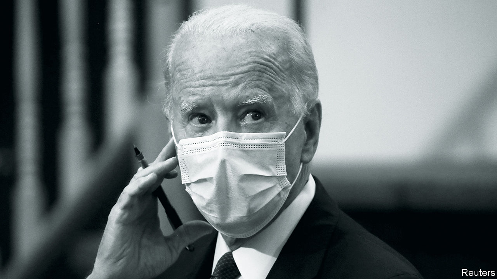
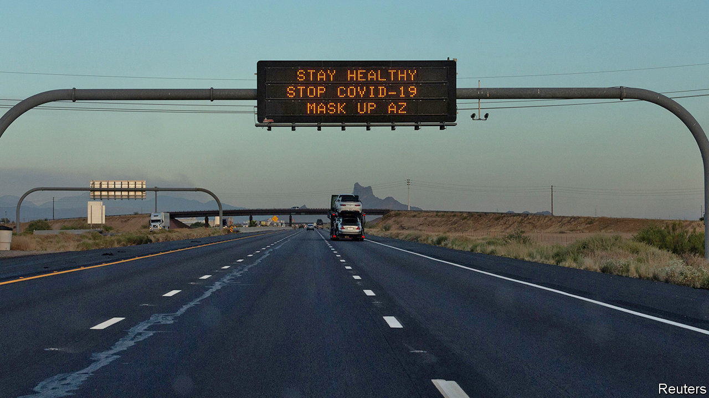

## On resilience, advertising, maritime quarantine, Joe Biden, zoonotics, covid-19, deforestation, Boris Johnson, bubbles, the Stone Roses

# Letters to the editor

> A selection of correspondence

> Jul 18th 2020

Letters are welcome via e-mail to [letters@economist.com](https://www.economist.com/mailto:letters@economist.com)

Your briefing on catastrophic risks highlighted the necessary role of governments in preparing for low-probability, high-consequence events (“[What’s the worst that could happen?](https://www.economist.com//briefing/2020/06/25/the-world-should-think-better-about-catastrophic-and-existential-risks)”, June 27th). It summed up my personal experience with a software startup, based on an algorithm to detect infrequent, but potentially catastrophic power-plant failures. Our algorithm worked really well at detecting their precursors and successfully prevented them. We quickly learned, however, that it is tough to build a business model around resilience.

From a societal point of view, it makes good sense to invest in preventing low-probability, high-consequence events. But for a single asset owner, the low probability of occurrence simply didn’t pencil out. We learned that devising innovative products that could reduce near term costs or increase efficiency was a much better business, and adjusted accordingly. In other words, we got out of the business of selling resiliency products. Resilience is something that the market won’t support, but yet is clearly in society’s interest. Preparedness is something that governments are for.

TIM LIEUWENExecutive directorStrategic Energy InstituteGeorgia Institute of TechnologyAtlanta

I would urge any chief marketing officer who has read “[The new admen](https://www.economist.com//business/2020/06/27/the-advertising-business-is-becoming-less-cyclical-and-more-concentrated)” (June 27th) to think twice about sacking their advertising agency. Digital advertising is alluring as it is cheap, shiny and easy to measure, and therefore easy to justify on a balance-sheet. However, it is substantially less effective than traditional advertising: TV campaigns have a considerably higher return on investment than online displays. It would seem that the case for good, old-fashioned creativity is not as outdated as one might think. Though the use of the term “admen” might be.

ALICE WALKERStrategist and adwomanBBHLondon

* Your recent article laments the plight of seafarers being stranded aboard ships during the covid-19 crisis (“[Invisible hands](https://www.economist.com//leaders/2020/06/20/cargo-ship-crews-are-stuck-at-sea)”, June 20th). As an international maritime centre, Hong Kong is always mindful of the need to support the global and local shipping community. We recognise the significance of cargo operations and have exempted crew members of vessels entering Hong Kong to load and unload goods from compulsory quarantine since the requirement was imposed in February. This was extended in June to cover all cargo vessels and passenger ships, including cruise ships, even when entering Hong Kong purely for crew change.The latest initiative further aids the shipping sector by allowing crew changes for more vessels, which provides relief for seafarers who have remained on board vessels for an excessively long time. These measures, which address industry requests, are the outcome of our close communication with the maritime industry. They also reflect Hong Kong’s prompt and positive response to calls from the International Maritime Organisation, International Chamber of Shipping, seafarers’ trade unions and other industry bodies. As a global shipping centre, Hong Kong will continue to explore and devise ways to facilitate maritime trade operations and assist seafarers not just for Hong Kong but for the whole of the shipping world.

FRANK CHANSecretary for Transport and HousingHong Kong Special Administrative Region Government

Assessing Joe Biden’s candidacy, you concluded that some consequential presidents have been accidental radicals, using the example of Lyndon Johnson and the passage of the Civil Rights Act in 1964 (“[Retro or radical?](https://www.economist.com//leaders/2020/07/02/why-joe-bidens-instinctive-caution-makes-real-change-possible)”, July 4th). Although Johnson strongly supported the civil-rights bill, had it not been for Hubert Humphrey, the Democratic whip in the Senate at the time, the obstacles to its passage would not have been overcome, including a 54-day filibuster. Bill Moyers, a political journalist, described Humphrey as a great orator, but also a great plumber, because he not only spoke eloquently as an indefatigable defender of human rights, he also worked assiduously on a bipartisan basis to draft and pass progressive legislation.

The skill of crafting legislative compromises must be recovered in Congress. Mr Biden will require similar talents in the Senate whether or not there is a Democratic majority come November if he wants his presidency to be transformative.

ED GIERALondon

A greater understanding of the zoonotic-disease risk from wildlife is critical to mitigating future risks of a global disease outbreak (“[Pandemic-proofing the planet](https://www.economist.com//science-and-technology/2020/06/25/pandemic-proofing-the-planet)”, June 25th). Fieldwork by our staff and others has documented the threats from the increasing human interaction with wildlife, particularly mammals and birds, across the world. This has come about by the continued degradation of intact ecosystems and the increase in wild animals being removed from their natural habitats and transported for sale and consumption in urban centres.

The most simple, most cost-effective action governments can take with immediate effect is to ban the commercial trade of wild birds and mammals for consumption. This would significantly reduce the risk of future zoonotic transmission; safeguard resources for indigenous peoples and local communities who rely on the animals; and protect biodiversity. It would not cost billions of dollars. The Chinese and Vietnamese governments are currently leading the way in this direction, others should follow.

CHRIS WALZERJOE WALSTONWildlife Conservation SocietyNew York

“[Unhappy medium](https://www.economist.com//united-states/2020/06/27/decoding-the-confusing-messages-of-the-coronavirus-epidemic-in-america)” (June 27th) looked at the confusion in the American government’s communications on covid-19. America has a high level of preparedness for health hazards. The United States had the best overall score in the Global Health Security Index of 2019, which ranked 195 countries on disease prevention, detection, rapid response, health systems, compliance with norms and the risk environment. And yet infections are soaring. Despite the institutional strengths, the crisis was poorly managed from the top. The Trump administration has misled the public on the seriousness of the outbreak and given contradictory messages about wearing face masks and observing social distancing. The divergence between America’s strength on paper and its performance failure deserves to be quantified.

VINOD THOMASFormer senior vice-president for independent evaluation at the World BankSingapore

* I was encouraged to see your image of cattle on a burned forest rather than the customary photos of trucks loaded with logs and that your piece focused on land clearing for agriculture and cattle farming as main drivers of the Amazon's deforestation (“[Of chainsaws and supply chains](https://www.economist.com//the-americas/2020/06/11/how-big-beef-and-soya-firms-can-stop-deforestation)”, June 13th). Over the past few decades much has been learned about landscape approaches, land titling and how to use land taxes, economic incentives and sustainable certification schemes in production forestry worldwide. Where appropriate, production forestry should also be part of the solution so forested land becomes more valuable than cleared land. Given the global need to create rural incomes and jobs, relying on subsidies for rural landowners and land settlers to maintain forest cover will fail.The current backlash from nativist politicians, however misguided, should be seen as a call for rich countries and their global agencies to re-think their approaches to deal with deforestation and global warming through the lens of sustainable job creation and economic growth and where sustainable forestry and agriculture are parts of the solution.

VICENTE MOLINOSKelso, Washington

[Bagehot ](https://www.economist.com//britain/2020/06/20/boris-johnson-loses-his-grip)missed a trick when likening Boris Johnson to a Roman emperor (June 20th). Who can forget the awful fate meted out by the mob to Sejanus, whose relationship to the Emperor Tiberius is not unlike that of Dominic Cummings to the prime minister?

MIKE LUNANThurso, Scottish Highlands

I wish everyone would stop calling the proposed plan to open borders between some countries a “travel bubble” (“[Peak plane](https://www.economist.com//the-world-if/2020/07/04/what-if-aviation-doesnt-recover-from-covid-19)”, The World If, July 4th). I am not sure who coined this (a verbal equivalent of a blank stare and surely no one employed at The Economist), but the imagery takes us to unintended places. For one, it provides a negative connotation to a perfectly workable arrangement. It also implies something unsubstantial, deceptive and ready to burst, though, hopefully, ever so fleeting and transient. I think “travel tunnel” would be more apt. Or maybe I just feel that way because of where I live.

ZUBIN AIBARABülach, Switzerland

I adored the subtle references to the Stone Roses in [Lexington’s ](https://www.economist.com//united-states/2020/06/27/is-donald-trump-tough-on-china)recent column (June 27th). The ten-storey waterfall of allusions to Brownie and Co helped to put me in the picture and show me what you mean. Don’t stop.

PAUL PORTEROakland, California

Lexington’s look at John Bolton’s account of Donald Trump’s China policy snuck in a delicious reference or two to the Stone Roses. One wonders if those in the know were meant to hear faint echoes of the following lines from the same song: “The past was yours/But the future’s mine/You’re all out of time”?

JOHAN HUGOLeamington Spa, Warwickshire

* Letters appear online only