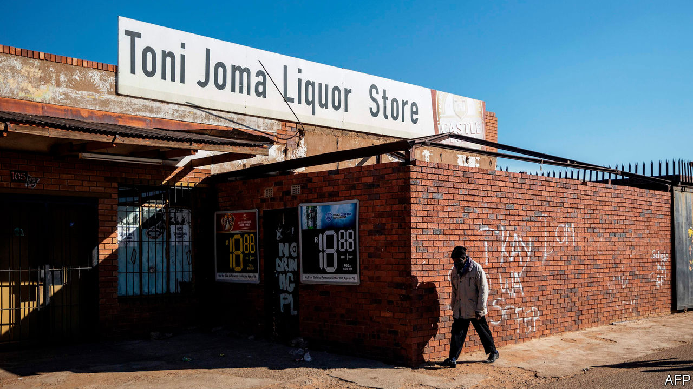

## Dry, the beloved country

# South Africa bans alcohol sales

> But it can’t stop the home-brewers

> Jul 18th 2020JOHANNESBURG

CHARLES DE BRUIN’S phone has barely stopped ringing since 9pm on July 12th, after Cyril Ramaphosa, South Africa’s president, announced an immediate ban on the sale of alcohol. The prohibition is a boon for pineapple growers such as Mr De Bruin. The fruit is good for home-brewing, he explains; pineapple beer requires little sugar or yeast and is ready quickly. “Prices have shot through the roof.”

The ban is the second of the year. Zweli Mkhize, the health minister, says that admissions to trauma wards fell by 60-70% in April and May, when alcohol was prohibited during an initial, stringent lockdown. When restrictions were eased in June, admissions rose. The Medical Research Council reckons that an eight-week ban could allow for nearly 13,000 covid-19 patients to be treated in intensive-care units.

These data reflect what Dr Mkhize calls South Africa’s “unhealthy relationship” with alcohol. Less than a third of South African adults drink the stuff, but those who do quaff about twice as much each as the average boozer elsewhere.

History partly explains these patterns. Under apartheid black miners and factory workers lived in single-sex hostels away from their families. Drinking passed the time. In the winelands mixed-race workers were given “dops” (alcohol) by farmers. Yet history also shows how illicit trades thrive under prohibition. Between 1928 and 1961 black people were not allowed to buy European wine or spirits. This, says Paul Nugent of the University of Edinburgh, encouraged the rise of home-brewing and shebeens, the drinking dens that thrive in townships.

The new ban has supporters. As in the 1920s these include women who fear drunken male violence. But it would be better received if the state were not so arbitrary. Cigarette sales are also illegal. Casinos are open but most schoolchildren are at home. South Africans cannot meet family members but they can attend church.

Hundreds of thousands of jobs depend on the alcohol supply chain. The first ban put 350 wine producers out of business. Tax collectors reckon they lost out on 1.3bn rand ($78m) in alcohol levies in April alone. Restricting sales takes away a source of pleasure, especially for those who cannot afford to bulk-buy pinotage. And though a short ban may help doctors for a time, history—and pineapple prices—suggest that in the long run prohibition fails. ■

## URL

https://www.economist.com/middle-east-and-africa/2020/07/18/south-africa-bans-alcohol-sales
