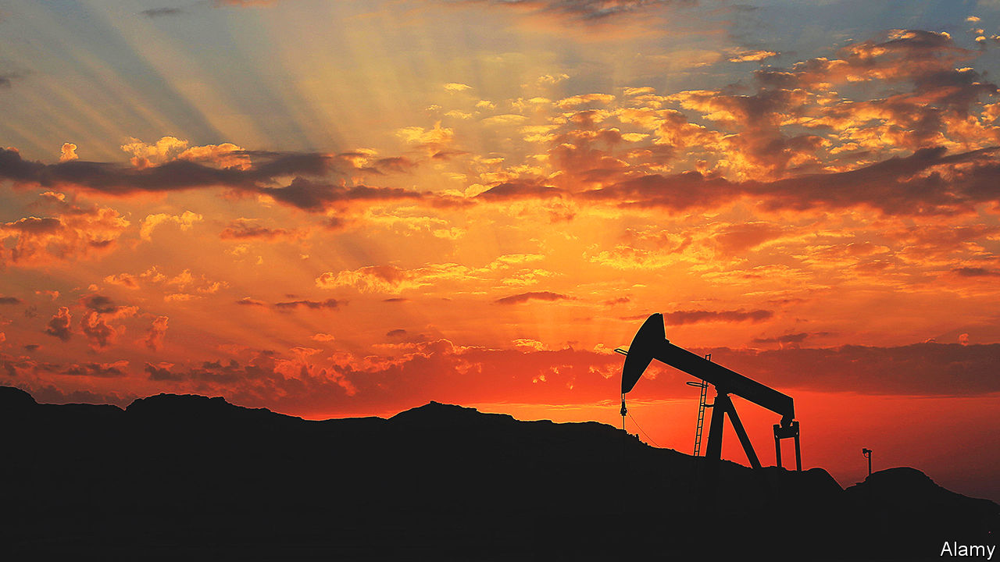
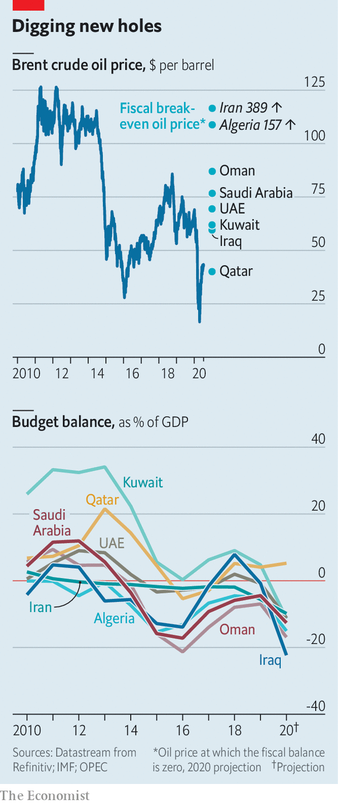
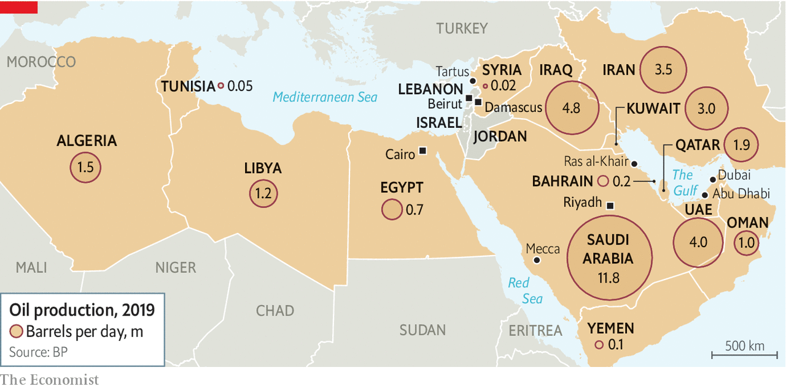
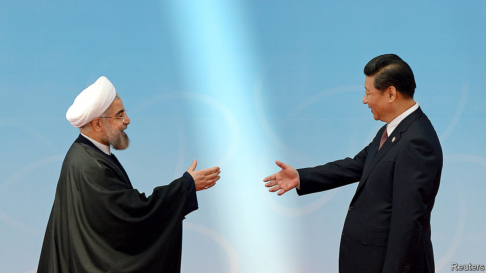

## Twilight of an era

# The end of the Arab world’s oil age is nigh

> Pain will be felt across the region

> Jul 18th 2020BEIRUT

THEIR BUDGETS don’t add up anymore. Algeria needs the price of Brent crude, an international benchmark for oil, to rise to $157 dollars a barrel. Oman needs it to hit $87. No Arab oil producer, save tiny Qatar, can balance its books at the current price, around $40 (see chart).

So some are taking drastic steps. In May the Algerian government said it would slice spending in half. The new prime minister of Iraq, one of the world’s largest oil producers, wants to take an axe to government salaries. Oman is struggling to borrow after credit-rating agencies listed its debt as junk. Kuwait’s deficit could hit 40% of GDP, the highest level in the world.

Covid-19 sent the price of oil plummeting to all-time lows as people stopped moving around in order to limit the spread of the virus. With commerce resuming, the price has ticked back up, though a peak in demand may be years away.

But don’t be fooled. The world’s economies are moving away from fossil fuels. Oversupply and the increasing competitiveness of cleaner energy sources mean that oil may stay cheap for the foreseeable future. The recent turmoil in oil markets is not an aberration; it is a glimpse of the future. The world has entered an era of low prices—and no region will be more affected than the Middle East and north Africa.

Arab leaders knew that sky-high oil prices would not last for ever. Four years ago Muhammad bin Salman, the de facto ruler of Saudi Arabia, produced a plan called “Vision 2030” that aimed to wean his economy off oil. Many of his neighbours have their own versions. But “2030 has become 2020,” says a consultant to Prince Muhammad. Oil revenues in the Middle East and north Africa, which produces more of the black stuff than any other region, fell from over $1trn in 2012 to $575bn in 2019, says the IMF. This year Arab countries are expected to earn about $300bn selling oil, not nearly enough to cover their spending. Since March they have cut, taxed and borrowed. Many are burning through cash reserves meant to fund reform.

Pain will be felt in non-oil producers, too. They have long relied on their oily neighbours to put their citizens to work. Remittances are worth over 10% of GDP in some countries. Trade, tourism and investment have spread the riches around to some degree. Still, compared with other regions, the Middle East has one of the highest proportions of unemployed young people in the world. Oil has bankrolled unproductive economies, propped up unsavoury regimes and invited unwelcome foreign interference. So the end of this era need not be disastrous if it prompts reforms that create more dynamic economies and representative governments.

There is sure to be resistance along the way. Start with the region’s wealthiest oil producers, which can cope with low prices in the short run. Qatar and the United Arab Emirates (UAE) have huge sovereign-wealth funds. Saudi Arabia, the region’s largest economy, has foreign reserves worth $444bn, enough to cover two years of spending at the current rate.

But they have all been hit hard by the pandemic, as well as low oil prices. And they have long overspent. In February, before the coronavirus broke out in the Gulf, the IMF predicted that the countries of the Gulf Co-operation Council (GCC)—Bahrain, Kuwait, Oman, Qatar, Saudi Arabia and the UAE—would exhaust their $2trn of reserves by 2034. Since then Saudi Arabia has spent at least $45bn of its cash. If it continues at that pace for another six months it would strain the Saudi rial’s peg to the dollar. Devaluation would hit real incomes hard in a country which imports almost everything. Officials are worried. “We are facing a crisis the world has never seen the likes of in modern history,” says Muhammad al-Jadaan, the finance minister.

In an attempt to balance the books, Saudi Arabia has suspended a cost-of-living allowance for state workers, raised petrol prices and tripled its sales tax. Even so, the budget deficit could exceed $110bn this year (16% of GDP). More taxes—perhaps on businesses, income and land—could follow. But raising taxes risks further depressing commerce, which has been hobbled in order to contain the coronavirus.

The kingdom had hoped an increase in religious and leisure tourism would at least partially compensate for the decline in oil revenue. That now seems a fantasy. The holy city of Mecca has been closed to foreigners since February. Last year the annual haj drew 2.6m pilgrims; this year it has been capped at around 1,000. “The kingdom is stuck in the oil dependency it needs to climb out of to survive,” says Farouk Soussa of Goldman Sachs, a bank.

Still, some see an upside to the upheaval in oil-producing states. The countries of the Gulf produce the world’s cheapest oil, so they stand to gain market share if prices remain low. As expats flee, locals could take their jobs. And the region’s struggles may convince some countries to speed up reforms. Credit-rating agencies praise Saudi Arabia’s tax rises as a step towards turning a rentier economy into a productive one. To drum up fresh revenue, Arab leaders speak of a wave of privatisations. The kingdom recently announced the sale of the world’s largest desalination plant at Ras al-Khair. But at the moment investors seem more inclined to pull their money out of the region altogether.

Meanwhile, public anger is growing. Saudis mutter about the new taxes, which fall most heavily on the poor. “Why is MBS not taxing the rich?” gripe the jobless on social media, referring to Prince Muhammad by his initials. “Why doesn’t he sell his yacht and live like us?” asks a mother of four from the north, where the prince is building more palaces. In Iraq officials enraged by pay cuts have thrown their support behind a protest movement that is seeking to topple the entire political system. In Algeria, where income per person has fallen from $5,600 in 2012 to under $4,000 today, protesters are drifting back to the streets. The region’s rulers can no longer afford to buy the public’s loyalty.

Protests have already resumed in Lebanon, where the pandemic temporarily halted months of demonstrations over corruption and a collapsing economy. Lebanon is not an oil producer (though it hopes to become one). Its crisis, which could see GDP shrink more than 13% this year, comes from the unravelling of a post-civil-war economic order too reliant on services and a bloated financial sector. But the slump in the Gulf has made it worse. A long-term drop in oil prices will bring more pain even for Arab countries that do not pump the stuff.

Remittances from energy-rich states are a lifeline for the entire region. More than 2.5m Egyptians, equal to almost 3% of that country’s population, work in Arab countries that export a lot of oil. Numbers are larger still for other countries: 5% from Lebanon and Jordan, 9% from the Palestinian territories. The money they send back makes up a sizeable chunk of the economies of their homelands. As oil revenue falls, so too will remittances. There will be fewer jobs for foreigners and smaller pay packets for those who do find work.

This will upend the social contract in states that have relied on emigration to soak up jobless citizens. About 35,000 Lebanese graduate from university each year; the Lebanese economy only employs 5,000 of them. Most look abroad for work. The exodus has speeded up the brain drain. Egypt used to supply unskilled labour to the Gulf. In the 1980s more than one-fifth of its migrants toiling in Saudi Arabia were illiterate. Today most have a secondary education; the share of university graduates has doubled. Egypt is now struggling with covid-19 in part because it lacks enough doctors: more than 10,000 have emigrated since 2016, many to the Gulf.

With fewer opportunities in the oil-producing states, many graduates may no longer emigrate. But their home countries cannot provide a good life. Doctors in Egypt earn as little as 3,000 pounds ($185) a month, a fraction of what they make in Saudi Arabia or Kuwait. A glut of unemployed graduates is a recipe for social unrest. Add to that, perhaps, an influx of compatriots forced to come home when their contracts run out. Many do not wish to, since emirates like Dubai and Qatar offer not just well-paying jobs but first-class services and relatively honest governance. A Gallup poll published in January found that just 10% of Egyptian migrants in the rich parts of the Gulf want to return.

Businesses will be hurt as well. Oil producers are big markets for other Arab countries. In 2018 they took 21% of exports from Egypt, 32% from Jordan and 38% from Lebanon. Firms can pursue other trading partners, of course. Egypt already exports more to both Italy and Turkey than it does to any Arab country. But the stuff it sells there—petroleum products, metals and chemicals—tends to create few jobs for Egyptians. Countries in the region buy more labour-intensive goods, such as crops, textiles and consumer products. More than half of the televisions exported from Egypt wind up in the GCC. Jordan’s pharmaceutical industry, which generates more than 10% of its total exports and supports tens of thousands of jobs, sends almost three-quarters of its exports to Arab oil producers. Smaller, poorer Gulf states will make for more impecunious customers.

They will also send out fewer wealthy tourists. In Lebanon visitors from just three countries—Kuwait, Saudi Arabia and the UAE—account for about one-third of total tourist spending. Most visitors to Egypt are from Europe, but Gulf tourists stay longer and spend more money at restaurants, cafés and malls. These countries can look elsewhere for revenue, but it will be hard to replace the wealthy tourists in their backyards. Saudis spend the summer in Cairo or Beirut because those cities are close, culturally familiar and speak the same language. Slovenians or Singaporeans are unlikely to do the same.

It is something of a historical accident that the Gulf states rose to become hubs of power and influence in the Middle East. For centuries they were backwaters sustained by pilgrimage and the pearl trade. The rulers of the region were in the great old Arab capitals: Cairo and Damascus fought wars against Israel and led the cry for Arab nationalism. Beirut was the financial and cultural hub.

These old powers, now well into decline, have an uneasy relationship with the newcomers. In a recording leaked in 2015 Abdel-Fattah al-Sisi, the Egyptian president, mocked the Gulf’s wealth. He told an adviser to ask the Saudis for $10bn in financial aid, a request that was met with laughter. “So what? They have money like rice,” Mr Sisi quipped in response.

They have been generous with it, if selectively so. Kuwait, Saudi Arabia and the UAE gave Egypt about $30bn in aid after 2013, when Mr Sisi overthrew an elected Islamist government. The Sunni leadership in Lebanon has long been a client of the Gulf states. Rafik Hariri, who led the country after its civil war, made his fortune as a contractor in Saudi Arabia. His son Saad, who also served as prime minister, holds Saudi citizenship. The GCC has bailed out Jordan twice in the past decade.

In recent years, though, funding has started to dry up. Partly this is due to political disputes. Seen from Riyadh or Abu Dhabi, many Arab states they once subsidised now look like bad investments. The Saudis are frustrated that Mr Sisi did not send troops to support their ill-fated invasion of Yemen, and that the younger Mr Hariri was too tolerant of Hizbullah, the Shia militia and political party backed by Iran. Their diminishing largesse also reflects their diminishing fortunes. Egypt has not received any money in years. No one from the Gulf looks willing to bail out Lebanon. Jordan had to plead to receive a five-year, $2.5bn aid package from the Gulf in 2018, half of what it got in 2011. None of this is necessarily bad: many Arabs would appreciate less foreign influence in their countries. But it will add to the financial pressure on their own indebted governments.

It may also presage a broader change in the region’s politics. For four decades America has followed the “Carter Doctrine”, which held that it would use military force to maintain the free flow of oil through the Persian Gulf. Under President Donald Trump, though, the doctrine has started to fray. When Iranian-made cruise missiles and drones slammed into Saudi oil facilities in September, America barely blinked. The Patriot missile-defence batteries it deployed to the kingdom weeks later have already been withdrawn. Outside the Gulf Mr Trump has been even less engaged, all but ignoring the chaos in Libya, where Russia, Turkey and the UAE (to name but a few) are vying for control.

A Middle East less central to the world’s energy supplies will be a Middle East less important to America. Russia may fill the void in places, but its regional interests are narrow, such as its determination to preserve its Mediterranean port at Tartus in Syria. It does not wish to—and probably cannot—extend a security umbrella across the Arabian peninsula. China has tried to stay out of the region’s politics, pursuing only economic benefits: construction contracts in Algeria, port concessions in Egypt, a wide range of deals in the Gulf.

As Arab states become poorer, though, the nature of their relationship with China may change. This is already happening in Iran, where American sanctions have choked off oil revenue. Officials are discussing a long-term investment deal that could see Chinese firms develop everything from ports to telecoms. It is framed as a “strategic partnership”, but critics worry it could leave China in control of the infrastructure it builds, as it has in some indebted Asian and African countries. Falling oil revenue could force this model on Arab states—and perhaps complicate what remains of their relations with America.

Ask young Arabs where they would like to live, and there is a good chance they will choose Dubai. A survey in 2019 found that 44% viewed the UAE as the ideal country to emigrate to. They often frame their admiration in contrast to their home countries. For all its faults, Dubai (and its neighbours) offers something unusual in the region: the police are honest, the roads well paved, the electricity uninterrupted.

As Lebanon’s economy crashes, everyone is talking of emigration. Yet there are few jobs in the Gulf. “Dubai was always the escape,” says one woman. “Now it’s like we’re trapped, with no backup plan.” Young people across the region have the same fears. Egypt can feel like a country crumbling under its own weight; Jordan is perennially in crisis. Almost ten years after a Tunisian fruit-seller lit the spark of the Arab spring, the frustrations that caused it persist. The end of the oil age could bring change. But it will bring pain first. ■

Dig deeper[Leader: With oil cheap, Arab states cannot balance their books](https://www.economist.com//leaders/2020/07/18/with-oil-cheap-arab-states-cannot-balance-their-books) (July 2020)

## URL

https://www.economist.com/middle-east-and-africa/2020/07/18/the-end-of-the-arab-worlds-oil-age-is-nigh
