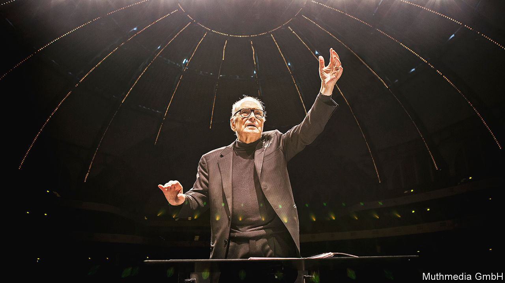

## Writing music

# Ennio Morricone died on July 6th

> The Italian composer, who made his name writing music for the cinema, was 91

> Jul 18th 2020

THE THEME may have been written well over half a century ago, but in less than three minutes you hear everything that came to matter most to him in a lifetime of composing. There is the two-note howl at the Moon—once heard, never forgotten. Musically, it is that rare fusion of heart and mind and as recognisable, in its way, as the opening notes of Beethoven’s 5th Symphony. Then there are the classic musical motifs, like those Richard Wagner scattered through the “Ring” cycle, that mark out the good man, the bad and the ugly. And then there is the freewheeling range of sounds with which he chose to make that music: the whistling, the yodelling, the gunfire and the squeaky ocarina, an ancient Italian wind instrument that looks like a sweet potato and is better known to a younger generation as the soundtrack of a Nintendo video game.

The range and audacity of his music surprised those who might have assumed that a working-class Catholic upbringing, not a mile from the Vatican, would have produced someone conventional rather than creative. But the Roman enclave of Trastevere, where he was born just after Benito Mussolini came to power, was an unusual place. A historical outsider-land on the far side of the Tiber, it has tall spindly houses that, for centuries, have been home to artisanal guilds, small businesses, ancient synagogues and enterprising Jewish and Catholic families. Above the winding cobbled streets, with their medieval shopfronts and wooden shutters, the Roman light shines through the pine trees in the hills with cinematic luminosity. His friend, Sergio Leone, who directed “The Good, the Bad and the Ugly” and many of the other films that made him famous, lived just a few minutes away. Both boys attended a private Catholic school nearby, and for a while were even in the same year.

His father, a professional musician, and his mother, who ran a small textile business, brought up four siblings: Ennio, Franco, Adriana and Maria. A fifth child, Aldo, the youngest, died at three when he was fed cherries by a nanny who did not know he was allergic to them. For a while, understandably perhaps, the ten-year-old would-be composer thought he might become a doctor.

But two other passions also exerted their pull. He took up chess after finding a small chess manual in a secondhand shop, and for a while played it obsessively with three friends who lived in the same block of flats in Via delle Fratte. At the same time he was drawn to music and wrote his first composition at six, having watched his father practise the trumpet at home every day and heard him perform with his light-music orchestra on the radio.

Chess was silent music, he liked to say, and playing it was a bit like composing. But whereas he was a conventional chess player, leading always with a queen and pursuing the logic of calculation rather than playing by instinct, music set him free. He composed for the stage and the radio, but quit the national radio broadcaster, RAI, when they wouldn’t let him freelance on the side.

Branching out on his own, he refused to let himself be distracted, one reason why he continued living in Trastevere, travelled little and never bothered to learn to speak English. Hollywood, when it decided it wanted him, had to come to Rome. When his music came to him, it was fully formed. He would rise before dawn to write, composing at his desk on 12-staff paper with a pencil rather than experimentally at the piano. His wife, Maria Travia, occasionally wrote the lyrics to his songs. He would play her his work, and only if she approved did he then show it to anyone else.

A daily routine allowed him to experiment, first with Il Gruppo, an avant-garde free-improvisation collective in Rome for which he played the trumpet and the flute. But it was the soaring landscape of the cinema that allowed his composing to take flight. He liked using all the orchestra’s resources in his arrangements; his musicians would often find themselves playing instruments that they had never played before—the military snare drum, the jaw harp and, increasingly, the Fender Rhodes electronic piano. He wasn’t showing off; every note had a job to do. Changing one thing changed everything.

In time he came to realise that his approach to composing was like his favourite grandmaster, Bobby Fischer’s approach to playing chess: a series of sudden and surprising moves. Cinema-goers sensed how he melded thinking and feeling, that he played with sounds that spoke to his romantic nature and was able to conjure up, in music, heroic figures who resonated with audiences around the world, however different they might be.

It was the music he wrote for “A Fistful of Dollars” that turned the unknown Clint Eastwood from a faux-western cowboy into a hero worthy of Homer—honourable, fearless and with a kind hidden heart—and the opening chords of Johann Sebastian Bach’s first song of St Matthew’s Passion, “Come, ye daughters, share my mourning” just before the rat-a-tat-tat drumbeat of French soldiers pouring out of their trucks, that helped transform Gillo Pontecorvo’s “Battle of Algiers” from a story about a nasty colonial spat into a tragic historical epic. As with the ghostly harmonica in “Once Upon a Time in the West” and the soaring theme the Jesuit Father Gabriel plays on the oboe as he tries to bring God to the Amazon in Roland Joffé’s “The Mission”, many of his compositions outlived the films they were written for.

Visiting journalists sometimes failed to realise he was having them on when he gently insisted that people go to the cinema to watch films, not to hear them. Deep down he knew that music could make a film unforgettable. That was why Sergio Leone so often had him compose the music before shooting started, rather than the reverse, which is the way films are usually made, or even insisted the actors listen to the soundtrack to get them into character. He had just one piece of advice when approached by John Zorn, then a budding cinema composer: “Forget the film. Think of the record.” Millions would agree.■