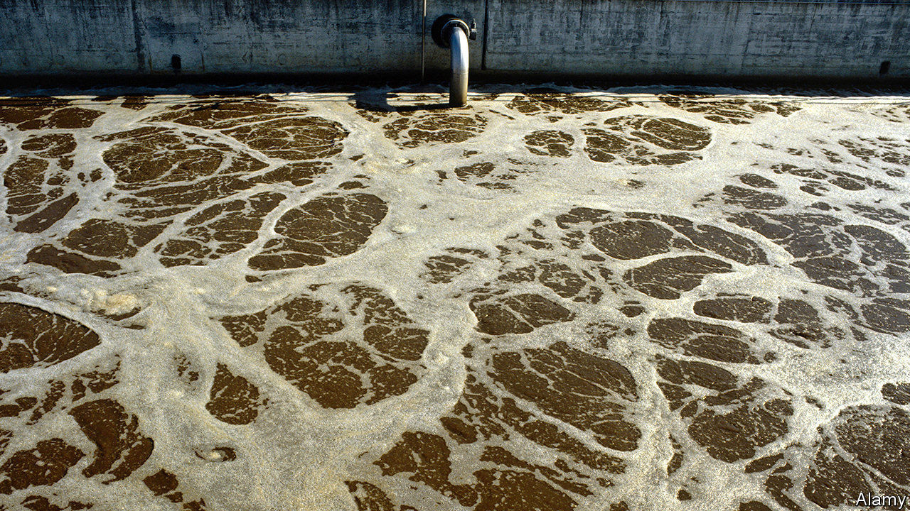

## The socioeconomics of sewage

# Analysing waste water may assist census takers

> Chemistry and demography are intertwined

> Jul 18th 2020

YOU ARE what you eat, the saying goes. It therefore follows that what you excrete gives away a lot about you. Writ large, that information might yield useful demographic clues about particular neighbourhoods. This, at least, is the thinking behind a study by Saer Samanipour of the University of Amsterdam, in the Netherlands. Dr Samanipour has been analysing sewage, and has shown that it gives a pretty good profile of an area’s population.

To make sure that his analysis reflected the most up to date demographic information Dr Samanipour timed it to coincide with a census. The one he chose was that conducted in Australia, in 2016, so he called on the assistance of a group of colleagues from the University of Queensland.

As they describe in a paper in Environmental Science and Technology Letters, team members collected samples from more than 100 sewage-treatment plants for five to seven consecutive days around the time of the census. They analysed these for 40 chemicals that past research has suggested have socioeconomic significance. Nicotine, for example, is associated more with rural populations than urban ones, because people living in the countryside are more likely to smoke. Caffeine consumption correlates with education levels. Amphetamine use tracks levels of crime.

In total, the team looked at the concentrations of six legal recreational drugs, caffeine and nicotine among them, two illegal recreational drugs (amphetamine and methamphetamine), seven opioids (the legality of which depends on the circumstances), eight antidepressants and antipsychotics, nine other pharmaceuticals, two artificial sweeteners and six markers of diet, such as enterolactone, a substance that shows how much fibre people are consuming. All of the chemical information collected from each treatment plant was paired with data from the census to create a model of what the wastewater chemistry of populations with particular socioeconomic characteristics looks like. Among many correlations detected, the researchers found that high levels of B vitamins (abundant in red meat, whole grains and dark leafy greens), alcohol and caffeine were associated with high-rent districts, generally in the middle of cities, while opioids and antidepressants went hand in hand with an abundance of people with low-skilled occupations.

These general correlations are not, perhaps, that surprising (though another, between a lack of internet connection and an antihypertensive medication called atenolol, is intriguing—possibly being mediated through people’s age). But Dr Samanipour found that in combination they could predict quite accurately the demographic make-up of a sewage plant’s catchment area. He did this by taking the model he and his colleagues had devised, based on their 100 initial plants, and applying it to nine others. For each of these they forecasted the socioeconomics of the surrounding area and then tested those forecasts against reality, as revealed by the census.

These forecasts were quite specific: how many people in an area had finished secondary school; how many had cars; how many were single parents; and so on. Of the 37 questions asked by the census about education, occupation, income, social life and housing, the model was able to predict the pattern of answers to 30 of them with 25% or less deviation from the values calculated by the census.

Based on these results the researchers argue that, considering the relative ease, low cost and high frequency with which wastewater samples can be collected and analysed, their model could profitably be used, if not as a replacement for censuses, then at least as a way of keeping track of changes in the characteristics of populations more or less continuously, as they happen, rather than in a punctuated manner every five or ten years.■

## URL

https://www.economist.com/science-and-technology/2020/07/18/analysing-waste-water-may-assist-census-takers
