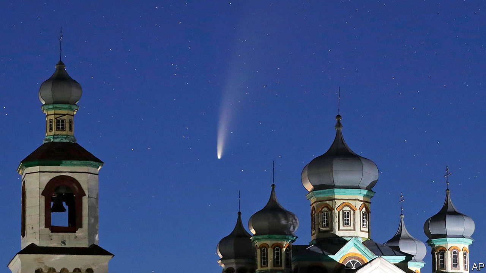

## A new comet

# Comet NEOWISE lights up northern skies

> It was discovered by a satellite that monitors threats to Earth

> Jul 18th 2020

A  VISITOR IS hanging in the night skies of the northern hemisphere. Comet neowise was discovered on March 27th by the eponymous Near-Earth Object Wide-field Infrared Survey Explorer, an orbiting telescope belonging to nasa, America’s space agency. neowise was originally just “wise”, an instrument launched in 2009 to map the entire sky at infrared frequencies. It was repurposed and renamed in 2013, and now searches for asteroids and comets. Comet neowise rounded the Sun on July 3rd and will make its closest approach to Earth (103.5m kilometres, about two-thirds of the distance between Earth and the Sun) on July 22nd. It is unlikely to outshine Hale-Bopp, the last bright northern-hemisphere comet, which appeared in 1997. But it is still well worth a look.

## URL

https://www.economist.com/science-and-technology/2020/07/18/comet-neowise-lights-up-northern-skies
