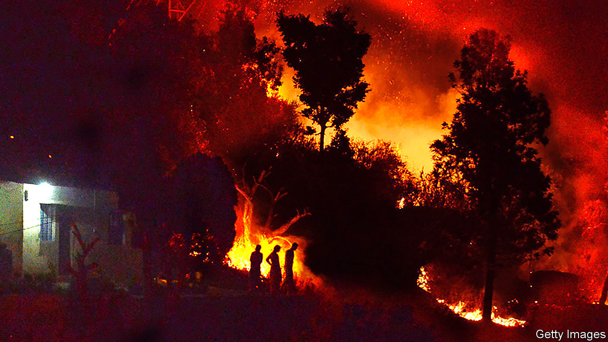

## Environmental science

# Stopping pollution with pine needles

> A pair of problems may be made to cancel each other out

> Jul 18th 2020

KILLING TWO birds with one stone is a desirable objective, but rarely an achievable one. However, Dinesh Mohan of Nehru University, in Delhi, thinks he may have worked out how to do it in the case of a pair of local environmental problems. One is the risk of fire in the pine forests cloaking the foothills of the Himalaya. The other is pollution by heavy metals, particularly lead, of some of the country’s water supply.

The fire risk comes from pines’ needle-like leaves. These decay only slowly once shed, and thus build up on the ground into thick, inflammable layers. Nor are they just a fire hazard. They also slow down the replenishment of groundwater and make the soil more acidic than it otherwise would be, discouraging the growth of grass and other non-arboreal plants.

The pollution risk comes from lead derived from fuels, old water pipes and paint. Heavy-metal pollution is by no means the only water-quality problem facing India, but it is one of the most pernicious. Like many other countries, India has adopted the maximum level in drinking water for lead set by the World Health Organisation (WHO). This is ten micrograms per litre. In 2014 (the most recent year for which data are available) the country’s Central Water Commission reported concentrations above this threshold at 47 of its 387 river-water-quality monitoring stations.

The simultaneous solution of the two problems, proposed by Dr Mohan in a paper in ACS Omega, is simple and elegant. It is to use the needles to clean up the water.

One way to extract heavy metals like lead from polluted water is to pass that water through charcoal filters. Charcoal, or “biochar” as it is now fashionably known in environmental circles, is a porous, amorphous material, which thereby folds a large surface area into a small volume. It is composed partly of elemental carbon, but this is accompanied by lots of organic molecules such as fatty acids, phenols and quinones, and also by salts of potassium, magnesium and calcium, all left behind from its previous existence as plant matter.

Many heavy-metal ions react enthusiastically with certain oxygen-containing groups of atoms that form parts of the organic molecules, and thus stick to them. They also, through a process called ion exchange, swap places with potassium, magnesium and calcium ions. The upshot is that biochar is good at pulling pollutants like lead out of water. And once a filter was saturated with the stuff, it would be a simple matter to replace it, strip out the accumulated lead using nitric acid, and then burn or dump the exhausted biochar.

Dr Mohan already knew, from previous work, that pine-wood biochar is an effective agent for stripping lead from water. But pine wood is a valuable commodity, so he wondered if he could pull off a similar trick using another forest product—one that currently has no value, namely pine needles. To test this idea he and his colleagues went foraging for needles in the forests of Uttarakhand state, north-east of Delhi. They returned their spoils to the laboratory, divided the needles into batches, and charred the batches in an electric furnace at temperatures ranging from 350-750°C.

Experiments suggested that material charred at 550°C extracted lead most efficiently, and examination showed that this material had the largest internal surface area per gram (determined by a technique that measures a substance’s ability to adsorb gases), and the optimal level of carbonisation needed to preserve the metal-capturing organic compounds. The best temperature for the process, they discovered, was 35°C—just under body heat, and also ambient, at least in the summer, in the wide plain south of the Himalaya through which the Ganges, one of the most polluted rivers on the planet, flows.

Whether these laboratory observations can be turned into a practical process is hard to say. Special filtration-beds would have to be built in water-treatment plants—facilities of which India is in any case woefully short. But it is not short of material to make the biochar.

An average hectare of Himalayan conifer forest produces over six tonnes of needles a year. The process of charring would reduce this to two tonnes, but that is still a fair yield. How much of this fallen foliage would need to be removed to reduce the fire risk and gain the other potential benefits, and what further effects this might have on the local ecology, remain to be determined. But Dr Mohan’s work does show how the cost of this removal might be turned into a benefit enjoyed by all.■