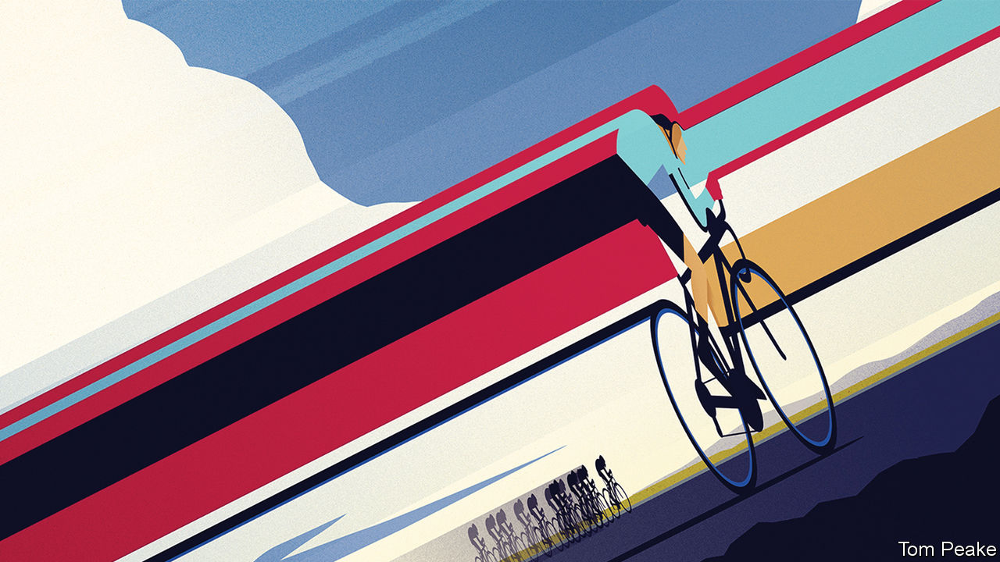

## The theory of relativity

# What if the speed of light were that of a cyclist?

> A new paper revives a hero from physics’s past

> Jul 18th 2020

ALBERT EINSTEIN was well known for his Gedankenexperimente, or “thought experiments”, conducted in imaginary versions of the real world. He used them to test ideas that observation could not confirm. But it is also possible to do imaginary experiments in worlds which are themselves imaginary, and thus to illuminate reality in a novel way. This was a particular skill of another 20th-century physicist, George Gamow, who explained his subject to the laity via a Mr Tompkins and his adventures in alternative wonderlands.

In the first of these tales Mr Tompkins dreams of a place where the speed of light is about that of a bicycle. How would a cyclist in such a world look to a watching pedestrian? Gamow’s answer was that the cyclist would shrink from back to front, and the faster he travelled the more slowly his pedalling feet would revolve. Gamow’s cyclist is compressed by an effect called the Lorentz contraction and his pedalling is affected by a slowing of the clock known as time dilation. These things are both consequences of the speed of light being constant no matter how rapidly its source is approaching or receding—an observation that was the starting point for Einstein’s own Gedankenexperimente.

This, though, turns out to be only part of the story. A paper published in the Proceedings of the Royal Society by Evan Cryer-Jenkins and Paul Stevenson, of the University of Surrey, in Britain, suggests that the full answer is even weirder than Gamow’s imaginings.

The first modification to Mr Tompkin’s dream came in 1959, two decades after his debut. A British mathematician called Roger Penrose calculated that he would actually have seen approaching cyclists as being elongated along their direction of motion, contracting only as they receded. Yet more peculiarly, as they drew abreast of him they would appear rotated, as if somehow cycling sideways with their backs turned to him. Mr Cryer-Jenkins and Dr Stevenson observe that, in addition to all this, the light from Gamow’s cyclists would, from Mr Tompkins’s point of view, be Doppler shifted. They also take on board a fact which Gamow and Sir Roger (as he now is) did not. Mr Tompkins, because he is a human being, has binocular vision.

The Doppler effect is a velocity-dependent change in frequency which makes light from an approaching object appear bluer than it would were its source stationary, and that from a receding object redder. So, not only will a cyclist approaching our hero be unfeasibly elongated, he will also be blueshifted so far as to be invisibly ultraviolet. He will thus appear as a black silhouette looming out of the landscape. His apparent distance, however, will fluctuate because, at these near-light speeds, the elongated images seen by each eye will warp at slightly different moments. Cycling abreast of Mr Tompkins when passing him, the rider will suddenly erupt into a pulsating, psychedelic rainbow of colour as he moves from blueshift to redshift. Amid this light show he will seem to rotate and contract, before vanishing into the profound blackness of the infrared—a strange, squashed shadow receding into the distance.

## URL

https://www.economist.com/science-and-technology/2020/07/18/what-if-the-speed-of-light-were-that-of-a-cyclist
