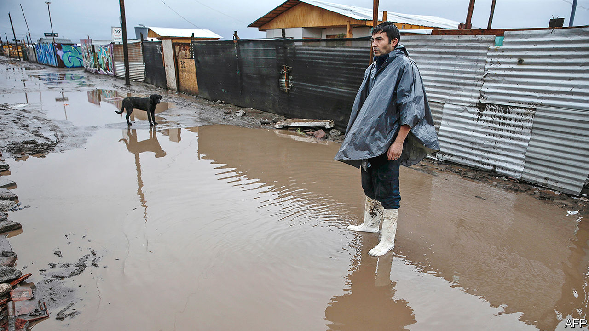

## Gimme shelter

# Covid-19 hastens changes to Chile’s market-led economic model

> Under the pressure of the health crisis, the country may become more social democratic

> Jul 18th 2020SANTIAGO

Editor’s note: Some of our covid-19 coverage is free for readers of The Economist Today, our daily [newsletter](https://www.economist.com/https://my.economist.com/user#newsletter). For more stories and our pandemic tracker, see our [hub](https://www.economist.com//news/2020/03/11/the-economists-coverage-of-the-coronavirus)

ON A STREET corner in El Bosque, a poor district of Santiago, Dixa Contreras serves porotos con riendas (“beans with reins”: ie, bean-and-spaghetti soup) from a large pot. One lad takes enough for a family of four, sick at home with covid-19. Ms Contreras and six helpers provide 250 free meals a day, and fresh bread every second day for evening once (tea). Neighbours, shops, stands at the weekly produce market and EPES, a charity, provide the food.

Soup kitchens like this have appeared across Chile since the pandemic struck in March. They were last seen during a recession in the early 1980s, when Augusto Pinochet, a dictator, ruled the country. Helped by pro-market policies that Pinochet introduced, the economy grew rapidly in the years after his departure in 1990, though lately the pace has slowed. They gave the private sector a large role in providing pensions, education and health care. Chile’s poverty rate dropped from 45% in the mid-1980s to 8.6% in 2017, according to the government’s two-yearly socioeconomic survey. In the post-Pinochet years Chile won a reputation for sound economic management, relatively low levels of corruption and stable institutions.

Even before covid-19 its reputation took a knock. Pensions, which Chileans save up for themselves, were lower than many had expected when the scheme was introduced in 1980. Well-off Chileans got better health care and education than the poor. Massive and sometimes violent demonstrations against inequality began last October and dissipated only with the pandemic’s onset. They forced Sebastián Piñera, the centre-right president, to promise more social spending and a referendum, due to be held in October, on whether to rewrite the constitution, which is based on the one that Pinochet left the country. “There is consensus the state needs to give more and better-quality public services,” says Rodrigo Vergara, a former president of the Central Bank. The pandemic, and the government intervention it has provoked, may hasten an evolution towards social democracy that was already under way.

The government’s record in handling the pandemic has been mixed. As a share of its population, Chile’s 321,205 confirmed cases and 7,186 deaths are among the world’s highest. Rather than locking down the whole country, the government just sealed off covid-19 hotspots. It started talking of a return to a “new normal” in mid-April, before the disease had peaked. The government imposed a total lockdown of the capital, where a third of the population lives, only on May 15th. “It is a story of hubris,” says Eduardo Engel, a director of Espacio Público, a think-tank.

The government mitigated those failures by testing a lot (one reason its caseload looks so big). It has boosted the number of ventilators and intensive-care beds. The capital’s lockdown, followed by a tightening of restrictions in quarantined areas, have at last led to a decline in the number of new cases nationally.

The government expects GDP to contract by 6.5% this year. That is the biggest decline since the recession in 1982-83 (though it is smaller than the expected regional average). The average jobless rate from March to May hit 11.2%, its highest since the current way of reckoning began in 2010. The poverty rate is likely to reach 15% this year, says Dante Contreras, an economist at the University of Chile.

 Dense neighbourhoods, cramped houses and the need to take public transport encourage covid-19’s spread among the poor. The health minister, Jaime Mañalich, admitted in May that he had not known how much poverty and overcrowding there is in parts of Santiago, making the government look clueless. He resigned.

The government has been as maladroit in shielding Chileans from covid-19’s economic ravages. It has acted slowly. Its measures, though large, have not met the need. Its under-reaction could cause a backlash that errs in the opposite direction.

The first package to protect employment, small businesses and poor households, introduced in March, is worth $17bn, nearly 7% of GDP. (Some is in the form of loans, and so is not counted as budgetary spending.) It includes a furlough scheme, which lets workers draw unemployment insurance while formally keeping their jobs, plus cash and food boxes for the poorest. But the support they provided families was less than the official poverty line. Protests broke out in poor neighbourhoods. Activists projected the word hambre (hunger) on the Telefónica tower in Santiago. Under pressure, the government reached agreement with opposition parties on June 14th to spend an extra $12bn over two years.

It followed up with a $1.5bn package for the middle class, which includes deferrals of mortgage payments and zero-interest loans. Middle-class Chileans were angry that much of the help took the form of loans. To assuage them, on July 14th the government again offered a belated booster: a one-off $632 handout to formal workers whose incomes have dropped.

Post-Pinochet governments have mostly kept budget deficits low. This year the government expects the deficit to reach 9.6% of GDP, the highest level in nearly 50 years. Its spending is to jump from 24% of GDP in 2019 to around 30% this year.

 If Mr Piñera had his way, spending might recede. But his term is up in early 2022. The protests and the pandemic have weakened him. The government’s role will be determined by his successor and, if Chileans endorse it, by a constitutional assembly. It is likely to change. Calls for a more active state by the left are now echoed by politicians on the right, such as Joaquín Lavín, the mayor of a prosperous district of Santiago, who may become the next president. In their support for social benefits, like low-income housing, they sound more like European Christian Democrats than laissez-faire liberals.

There is broad agreement that tax revenue needs to rise from 20% of GDP. Already, in response to last year’s protests, the government raised the tax rate for the highest incomes. The new health minister, Enrique Paris, a technocrat, favours a cap on the profits of private health insurers, though this is not government policy.

Popular anger inspires more radical ideas. The rebellion against the first version of the middle-class aid package led to a proposal in Congress to allow Chileans to withdraw 10% of their pension savings to help them through the pandemic. That would reduce future benefits, which Chileans already deem too low, or, more likely, force the government to plug the hole, at a cost of at least $16.5bn. Either way, if passed the bill would weaken a central institution of the Chilean model. Some members of Mr Piñera’s coalition joined the opposition in backing it. The extra cash for formal workers was a way to win them back. So was Mr Piñera’s promise of “major surgery” for the pension system. It is not working. On July 15th Congress’s lower house passed the bill, sending it to the Senate.

Such radicalism poses a risk. Most Chileans agree that the state should act to reduce inequality and uplift the needy. But their anger could create support for populist policies that would make the country poorer. The success of Chile’s reinvention “will depend on whether the political system is capable of setting limits,” says Mr Vergara. The next lot of leaders will have to do better than the current ones.■