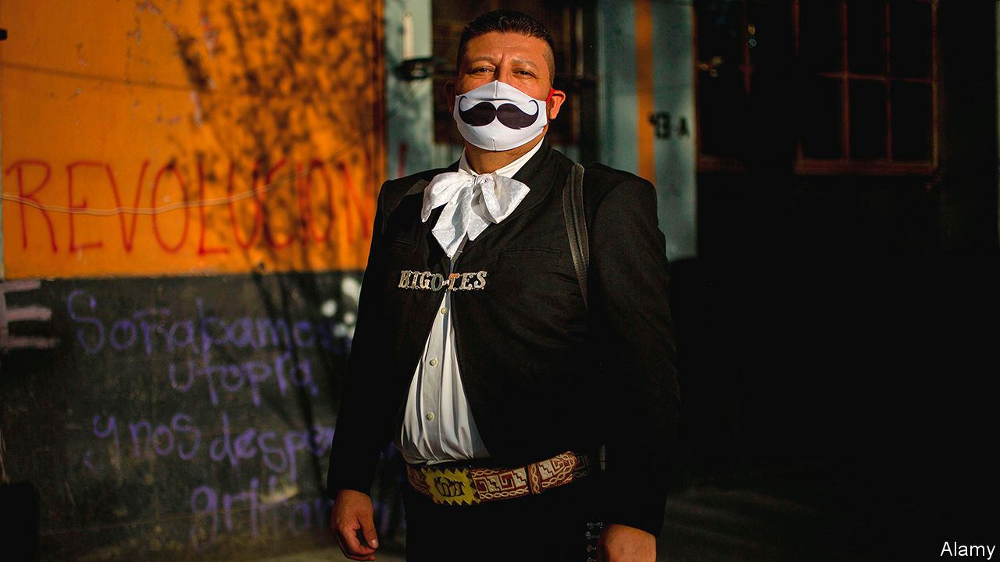

## Banda does not play on

# Tough times for Mexico’s street musicians

> To keep playing in a pandemic requires risk-taking and ingenuity

> Jul 18th 2020MEXICO CITY

THE TUBA is the toughest of instruments to play, says Armando Ortiz, who has oompahed for half of his 30 years. It weighs 14kg (30 pounds), a lot to lug about if you’re a strolling street musician. Providers of rhythm, tuberos seldom rest mid-song. However, as the pandemic is teaching Mr Ortiz, whose parents sold a cow to buy his first instrument, not playing the tuba is even tougher.

Skilled performers of such Mexican genres as banda (Mr Ortiz’s speciality), mariachi and norteño can earn above-average incomes by playing at weddings, birthday parties, politicians’ events and on the streets. But when covid-19 arrived in March, bookings dried up. Restaurants and cafés closed, silencing buskers. Some regions banned street music because it attracts crowds and encourages non-distanced dancing. When police last month shut down an illegal party in Nuevo León, a state in the north, the musicians were among the 150 people they nabbed.

“We are dying of hunger,” says Luis Ramírez, a trumpeter for Banda La Crazy, only half-jokingly. He slaps the belly of a chunky clarinettist: “He was even fatter before the pandemic began.” The group, which is based in Jerez de García Salinas, in the central state of Zacatecas, has slimmed down from 15 members to seven, to give each one a bigger share of smaller takings.

In Mexico City musicians who have lost their audience play for apartment-dwellers, who throw money from their balconies. (Some shut their windows.) Mariachis serenade drivers stopped at traffic lights. Some musicians have moved to villages, where police do not break up clandestine performances.

Musicians were not at first eligible for the government’s modest aid offer to informal workers: a 25,000-peso ($1,100) loan, with a 90-day grace period. The government now says musicians will qualify. On July 10th they marched in Mexico City, demanding more.

But they now hope not to need it. An easing of lockdowns, despite rising numbers of new covid-19 cases, may bring back audiences. Mr Ortiz, who spent six weeks rising at 5.30 in the morning to make burritos with his wife for sale on the streets, reckons he is not cut out for such early shifts. He will not stop playing again, no matter how deep the slump, he says. “I will sell my car for money before I sell my tuba.”

Editor’s note: Some of our covid-19 coverage is free for readers of The Economist Today, our daily [newsletter](https://www.economist.com/https://my.economist.com/user#newsletter). For more stories and our pandemic tracker, see our [hub](https://www.economist.com//news/2020/03/11/the-economists-coverage-of-the-coronavirus)

## URL

https://www.economist.com/the-americas/2020/07/18/tough-times-for-mexicos-street-musicians
