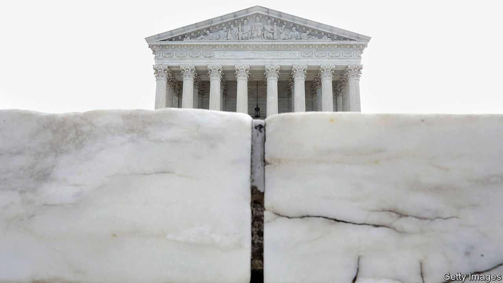

## The centre holds

# An end-of-term report for SCOTUS

> The 2019-20 Supreme Court term defied simple ideological division

> Jul 18th 2020NEW YORK

THE SUPREME COURTS first full term with Donald Trump’s two appointees in robes could have been a bloodbath. In the midst of a pandemic and the most fraught political landscape since the 1960s, though, the feast of cases did not bring total victory for the five-member conservative majority. Instead, John Roberts, in his 15th year as chief justice, presided over a court that broke left and right about equally in cases involving religion, abortion, civil rights and presidential power. He also managed to keep the proportion of 5-to-4 decisions down to around one-in-five—matching his tenure’s average.

The chief teamed up with the four more liberal justices to record three significant wins on the liberal side of the ledger. He wrote the decision rejecting Mr Trump’s attempt to rescind DACA, Barack Obama’s programme protecting young immigrants from deportation. He blocked a restrictive abortion law in Louisiana. And he signed a landmark ruling that extended protection against employment discrimination to gay, lesbian, bisexual and trans workers. Chief Justice Roberts also assembled wider 7-2 coalitions to reject Mr Trump’s claim to absolute immunity from criminal investigation while in office—opening the way for a New York grand jury to scrutinise his financial records—and to give House Democrats another chance to show why they, too, need to see Mr Trump’s finances.

These moves to the left are remarkable but come with caveats. Mr Trump could try to kill DACA again with a less obtuse justification. The abortion ruling may invite new regulations. LGBT workers might have little recourse against religiously inspired bias. And Mr Trump will probably stand for re-election before Americans get to see his finances (if they ever see them at all).

There were overt victories on the right, too. The chief justice joined his fellow conservatives in three cases expanding the law’s deference to religious folk and organisations while chipping away at the wall between church and state. He handed presidents the power to fire the head of the Consumer Financial Protection Bureau without cause. He said rogue border agents cannot be sued for shooting Mexican children standing on the other side of the US-Mexico line. His was the decisive vote to block Wisconsin and Alabama from facilitating absentee voting during the pandemic and to allow the federal death penalty to resume on July 14th.

The path towards the centre may have been forged by Chief Justice Roberts, but it would have met a dead end without the co-operation of colleagues. The farthest-right justices, Clarence Thomas and Samuel Alito, found themselves in the majority in only 72% and 73% of cases—in contrast to Mr Trump’s two nominees, Neil Gorsuch and Brett Kavanaugh, who were on the winning side 89% and 93% of the time. Those most recent additions to the court joined the chief and the liberals in rejecting their appointing president’s outlandish arguments against congressional and prosecutorial subpoenas of his personal information. Justice Gorsuch also joined the liberals in a 5-4 decision vindicating the territorial rights of the Creek Nation in Oklahoma, one of only two decisions from which the chief dissented this term. Among the unanimously decided cases (37% of the total) was a landmark decision averting possible chaos in November by allowing states to bind presidential electors to their pledged candidates.

A division in the four-member liberal minority became sharper this term. On most issues, Justices Stephen Breyer and Elena Kagan tack towards the centre while their colleagues, Ruth Bader Ginsburg and Sonia Sotomayor, lean farther left. Supreme Court justices are “the consummate repeat players”, Justice Kagan said to a Brooklyn audience in 2018. They are always thinking through how their votes today will affect “the next case and the next case and the next case”. In 2017, for example, Justices Breyer and Kagan joined the conservatives in siding with a church school that had been excluded from a playground-sprucing programme but seemed to be responsible for a footnote limiting the ruling to playgrounds. This year, both balked when the court used that precedent to require states, whenever they offer tuition support for secular private schools, to give money for religious schools as well.

This month the centre-left pair again crossed the aisle for relatively narrow 7-2 decisions insulating religious schools from some lawsuits brought by teachers, and permitting organisations with religious or moral objections to opt out of providing their workers with free contraceptive coverage under the Affordable Care Act. The rulings may have been more sweeping without the liberal justices’ influence, but such attempts to hold the line by joining and constraining conservative decisions may not ultimately “bear fruit down the road”, says Leah Litman, a law professor at the University of Michigan. For now, though, they are playing their part in the chief justice’s balancing act.■

## URL

https://www.economist.com/united-states/2020/07/18/an-end-of-term-report-for-scotus
