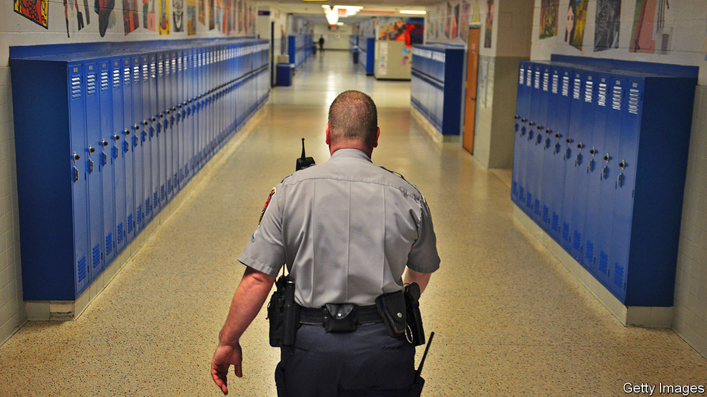

## Classroom cops

# Do police officers in schools help or hinder teachers?

> Surveys suggest teachers like “school resource officers”. But evidence for their efficacy is thin

> Jul 18th 2020SAN FRANCISCO

THE RE-EXAMINATION of policing in America that followed the killing of George Floyd has moved from the street into the classroom. In California two large school districts (San Francisco Unified and Oakland Unified) have severed relationships with police departments, while Los Angeles Unified cut the school police budget by $25m, a 35% reduction. Other school districts across the country have ended contracts with local police departments, including Minneapolis, Minnesota, Portland, Oregon, and Denver, Colorado. This movement is gaining momentum. But is it the right move for schools?

After originating in the 1950s in Flint, Michigan, school police officers proliferated in the 1990s in response to mass shootings. In 1994 the Community Oriented Policing Services (COPS) grant, a federal grant supporting the hiring of police officers, was established as part of a crime bill. The COPS grant funded “school resource officers” (SROs) in schools for three years, after which the money would need to come from a variety of state, county, local or private sources including school districts. In June William Barr, the attorney-general, announced that the Department of Justice would allocate $400m for the grant’s continuation, with the intention that some of the funds would support police in schools.

According to the Urban Institute, a think-tank, 67% of high-school students attend a school that has a police officer. The ACLU reports that, overall, 14m students are in schools with police but no counsellor, nurse, psychologist or social worker. In school districts where budgets are tight, funding a police presence often takes precedence over other personnel.

Whereas some schools are considering diminishing the role of police, others are continuing and even expanding their programmes. In June the Chicago Board of Education voted to keep their school police contract. New York’s mayor rejected calls to move the school-safety scheme from the NYPD to the Department of Education. Earlier this year the governor of Kentucky signed a bill requiring an armed police officer in every school.

Opponents of SROs argue that, among other things, school policing disproportionately targets non-white students. Blanca Hernandez, a high-school teacher in San Francisco, attended a rural California school district with an SRo programme. She recounted random drug searches where a drug-sniffing dog would be led into the classroom to check students’ backpacks. “It was a constant looming—you never knew when the dogs and the police were going to show up.”

According to a study by Jason Nance of the University of Florida Levin College of Law, black and Hispanic students are more likely than white students to attend schools with sworn police officers and other security measures, such as metal detectors and security cameras, even after controlling for school and neighbourhood characteristics such as how urban a school is, school size and reports of crime at school. This has led many activists, including the ACLU and Black Lives Matter, to advocate the elimination of such programmes and, with it, the “school-to-prison pipeline”.

Police officers were initially placed in schools with the purpose of improving school safety and academic results. However, with few exceptions, the evidence demonstrates that they miss the mark. Some research is supportive of SRO programmes, finding that they enhance school safety, help with drug-related arrests, and deter students from committing assaults and violent crime on campus. But more studies have found that SROs do not increase school safety. The Brookings Institution, a think-tank, determined that schools in North Carolina with SRO funding reported a similar amount of rule-breaking as schools without.

Police presence affects more than just arrests and discipline. It also has an impact on academic results. Emily Weisburst of the University of California, Los Angeles, found that Texas school districts with a COPS grant (to support the hiring of an SRO) experienced a 2.5% decrease in high-school graduation rates and a 4% decrease in college enrolment compared with years without the funding.

Proponents of SRO programmes worry that schools will be more violent if officers are removed. However, a case study in Canada suggests that these initiatives can be scrapped safely. Toronto’s school district recently removed its SRO programme after conducting a district-wide study on the impact of these schemes on students. Three years later, with cops replaced by unarmed school-safety monitors, Torontonians seem pleased with the outcome.

Despite this evidence, many teachers are calling for reform rather than removal. In a survey of 1,150 teachers, administrators and principals conducted by Education Week, only 23% of them favoured the removal of armed police officers from schools. Thirty percent of teachers responded that armed police were necessary on campus because students are “out of control”. Leton Hall, a teacher at a New York City Department of Education middle school, says that some incidents, such as large fights, require SRO presence. However, he encourages reformers to focus less on removing police officers, and more on why teachers and administrators call SROs into the classroom.

Mr Hall, an African-American raised in the Bronx, thinks that some teachers rely on police officers because they do not relate to the students. “I do think that there are some teachers who are more willing to work with and deal with certain behaviours and certain characteristics of students, and there are others who are not willing. I’ve had kids curse me out and say all types of stuff, and I’m like ‘OK, that’s nice. Now sit down and do your work. You’re not getting out of the class that easy.’ While other teachers, the second you do that, they are calling security. It depends on the tolerance level of the teacher, and how the students are viewed by the teacher.”

Mr Hall cites the racial make-up of the New York City teaching force as a problem: 80% of students are non-white, whereas 42% of teachers are. Still, rather than fully remove the programme, Mr Hall recommends that schools take a deeper look into how teachers use SROs within schools.

Others are also calling for reform rather than complete elimination. California’s superintendent of public instruction, Tony Thurmond, favours a redefinition of SRO roles, such as ending SRO involvement in student discipline. Philadelphia’s superintendent, William Hite junior, wants something similar. Yet with limited proof of their effectiveness and much evidence of their deleterious effects, SRO programmes are on shaky ground. ■