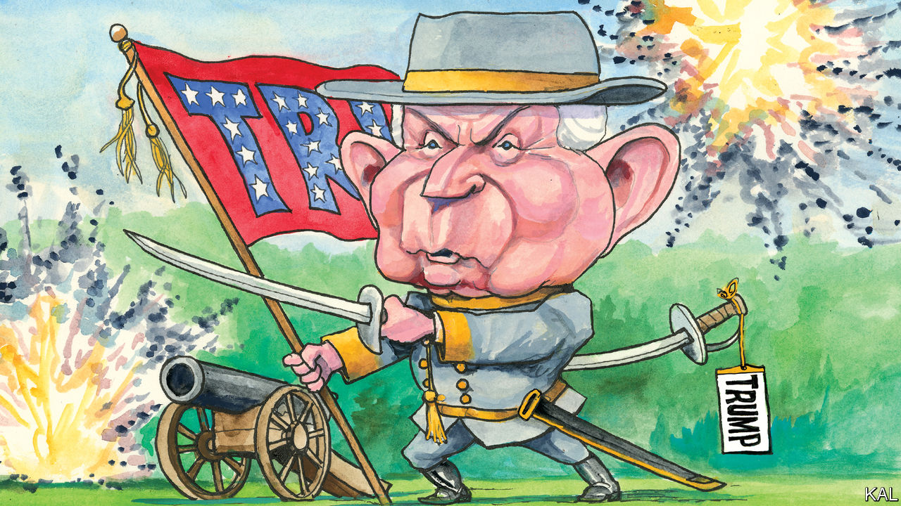

## Lexington

# Donald Trump ends the career of his former chief ideologue, Jeff Sessions

> The president, a fan of Confederate monuments, topples one

> Jul 18th 2020

THOUGH A FAN of Confederate monuments, Donald Trump could not have taken down Jefferson Beauregard Sessions III, a living memorial to the rebel South and the president’s first attorney-general, more ruthlessly. This week the Republican veteran named after two Confederate heroes (Jefferson Davis and General P.G.T. Beauregard) suffered his first electoral defeat, in a primary for the Alabama Senate seat he occupied for 20 years. When he last defended it, in 2014, Mr Sessions won an uncontested race with 97% of the vote. But against a Trump-backed rival—a former college-football coach and political debutant, Tommy Tuberville, who seemed unsure of most issues—he was trounced.

Even after so many illustrations of the president’s grip on Republican voters, it was astonishing to see Mr Sessions’s career-long claim on Alabaman affections blown away in this fashion. It was equally remarkable, even after so many displays of Mr Trump’s vindictiveness, to see him end his former aide’s career so cruelly. No Republican played a bigger part in Mr Trump’s rise than Mr Sessions. No one did more to try to make Trumpism meaningful.

He was not only the first congressman to endorse Mr Trump (apart from two Republican House members, who have since been jailed for unrelated crimes). He was also the first to take him seriously—as he signalled by donning a “MAGA” cap and appearing with Mr Trump at a rally in Mobile in August 2015. Though Mr Trump had recently supplanted Jeb Bush to lead the primary field, most elected Republicans still considered his presidential bid absurd. Mr Sessions’s decision to stand with him, before 30,000 roaring Alabamans, and praise him “for the work you’ve put in on the immigration issue” was a striking corrective. No one could accuse Mr Sessions of being unconservative, the charge Mr Bush was levelling at Mr Trump. Indeed, his racially accented populism had latterly moved from the margins of his party to the mainstream.

He saw America not as an idea, as most Republican leaders professed to, but as a place of communities and traditions besieged by immigrants, criminals and a liberal elite unleashed by the first black president. He demanded tough border restrictions and policing, deregulation and religious-liberty guarantees. The Tea Party movement, a nativist campaign masquerading as an anti-government one, had embraced this agenda and Mr Sessions personally. A like-minded nationalist, Steve Bannon, even urged him to run for president—notwithstanding his low stature, thick accent and air of twinkling eccentricity. By identifying Mr Trump as a more charismatic populist, whose professed beliefs were close enough to his own, Mr Sessions made him seem not only more acceptable to his Republican colleagues, but comprehensible.

He played a similar role as attorney-general. In a cabinet of competent technocrats, such as John Kelly, and populist nincompoops like Ryan Zinke, Mr Sessions was a rare competent populist. Even more than Mr Bannon or Stephen Miller—who had gone from Mr Sessions’s office to the president’s—he drove the administration’s strict border policies. (On the trail in Alabama, he derisively mimicked those who had objected to his separating migrant children from their parents: “Noooo, this is a poor child!”) He also dismantled an effort to make the police more accountable. He launched a “religious liberty task force”. And as he did so the president tried to destroy him by a thousand cuts.

Mr Trump dealt the first (because he has no respect for eccentric ideologues) in Mobile, where he joshed that Mr Sessions was “like 20 years old”. But it was after Mr Sessions recused himself from his department’s investigation into Russia’s effort to get Mr Trump elected that he let loose. That was 22 days after Mr Sessions was confirmed by the Senate. For his remaining 20 months in the job, Mr Trump mocked and insulted him, on Twitter and in private, including allegedly as a “dumb southerner” and “mentally retarded”. No matter how often he was assured that Mr Sessions had had no choice but to recuse himself (because of his own Russia ties), Mr Trump considered his failure to fix the Russia investigation a sign of weakness and disloyalty. And the fact that Mr Sessions not only put up with this onslaught but continued beavering away at the president’s agenda only seemed to make him angrier. A similar dynamic was apparent in the closing stage of this week’s primary contest: the more Mr Sessions claimed to have delivered Trumpist policies, the more the president denounced him.

If Mr Sessions were a slightly more sympathetic figure, his downfall would be tragic. Instead it mainly points to Mr Trump’s abandonment of much of the populist platform he was ostensibly elected on. While he persists with protectionism—an important exception—he has not restored manufacturing jobs, built infrastructure including a border wall, or changed America’s immigration regime in any way that a Democratic administration could not change back. He has no heavy-hitters working on those issues. Mr Miller, a writer of dystopian speeches, is the last Bannonite standing. Mr Sessions’s latest successor, William Barr, though not opposed to tough policing and border policies, spends more of his time protecting the president and his criminal cronies, in precisely the way Mr Sessions refused to.

A few prominent conservative populists are still struggling to make Trumpism mean something more than presidential whim—led by the Fox News presenter Tucker Carlson and a handful of senators, including Josh Hawley and Marco Rubio. But none, for obvious reasons, is eager to enter the administration, which makes them much less influential than Mr Sessions and Mr Bannon were. The result, less than four months from the election, is that Mr Trump appears to have no policy agenda of any kind for a second term. Trumpism, as Mr Sessions must now suspect, as he slopes back to his church and grandchildren, appears to mean little more than Mr Trump. Actually, he must have suspected that all along.■

Dig deeper:Sign up and listen to Checks and Balance, our [weekly newsletter](https://www.economist.com//checksandbalance/) and [podcast](https://www.economist.com//podcasts/2020/07/17/checks-and-balance-our-weekly-podcast-on-american-politics) on American politics, and explore our [presidential election forecast](https://www.economist.com/https://projects.economist.com/us-2020-forecast/president)