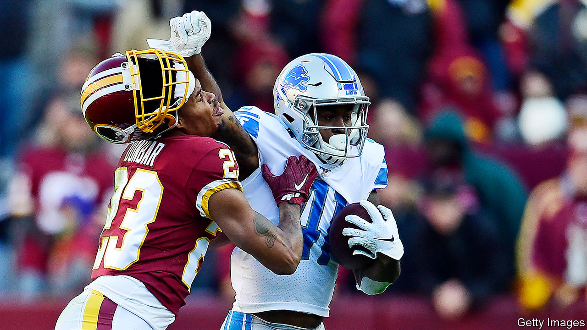

## Skin in the name

# Renaming the Washington Redskins

> An American football team finally sheds its moniker

> Jul 18th 2020WASHINGTON, DC

SINCE HE BOUGHT the Redskins in 1999, Daniel Snyder’s position on his team’s long-controversial name has been clear. “We’ll never change the name,” he told a reporter seven years ago. “It’s that simple. NEVER—you can use caps.” He and other defenders claimed the name honoured Native Americans—a view not shared by many Native Americans themselves.

Mr Snyder stuck to his guns through demonstrations outside his games, political pressure, even losing federal trademark protections because the team’s name and images were deemed “disparaging to Native Americans” (a ruling later reversed on First Amendment grounds). But on July 13th, after coming under pressure from sponsors including FedEx, which pays the team $8m per year for naming rights to its stadium, Mr Snyder announced the name and logo (a Native American in profile, with feathers in his hair) would be retired.

Its new name remains unclear, but the jokes all but wrote themselves: the Washington Pundits, Kickbacks, Internal Polls (which would, of course, always show them ahead). More serious possibilities include the dreary, hackneyed Warriors; the Redtails, honouring the black Tuskegee Airmen, who fought in the second world war; and the Red Wolves, which like the Redtails would let the team keep its burgundy-and-gold colours. Mr Snyder reportedly has chosen a name currently bogged down in a trademark fight—and indeed, an enterprising actuary from the Washington suburbs has registered trademarks for around a dozen possible team names.

The Redskins are not the only team wrestling with nomenclature. The Cleveland Indians and Atlanta Braves, both baseball teams, also face pressure to change their names, as have the Kansas City Chiefs, a football team. The Indians seem to be considering a change, but the Braves and Chiefs are so far holding firm.

The Indians retired Chief Wahoo, their grinning, hook-nosed Native American logo, two years ago. For a name that strikes fear into opponents’ hearts, the Indians probably do not want to look back; the team was formerly known as the Naps and the Spiders (though the Napping Spiders has outstanding logo possibilities).

Donald Trump mocked the Redskins and Indians for “changing their names in order to be politically correct”. After the Redskins’ announcement, Kayleigh McEnany, the White House press secretary, said he “believes that the Native American community would be very angry” at the change. Polling suggests that Native American elites do in fact dislike the name but that the majority are not overly bothered.

Mr Trump is also embroiled in a naming controversy of his own: he has vowed to veto the $740bn Defence Authorisation Bill, which funds the Department of Defence, if it includes an amendment to rename the ten military bases named after Confederate generals. Elizabeth Warren introduced the Senate’s amendment. Both the House and Senate versions of the bill have such language in them, and Republican senators believe they have enough votes to override a presidential veto.■