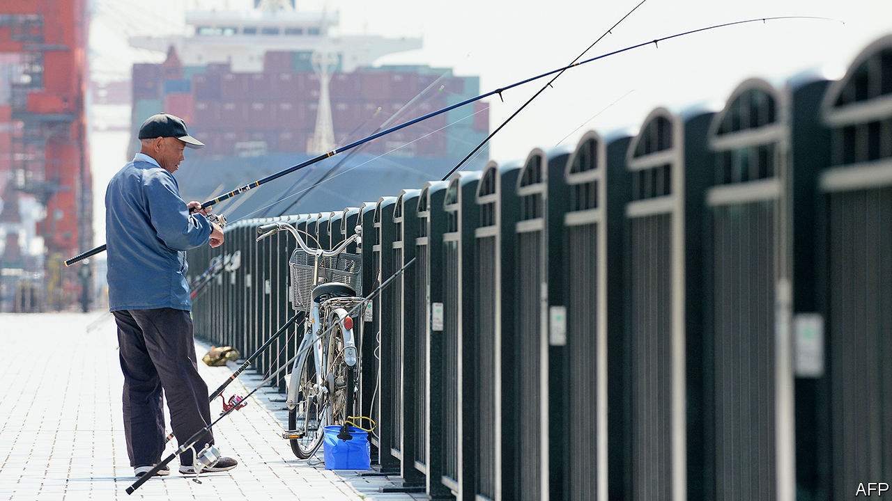

## Sailing without sailors

# As crews grow old, Japanese shipping firms try to do without them

> But robots have a lot to learn about the ways of the sea

> Jul 23rd 2020TOKYO

CAPTAIN KUWAHARA SATORU’S tanker is manoeuvring through Yokohama harbour. Dolphins leap in the distance; a cruise ship slides under a glittering bridge. He issues an instruction via the radio, and suddenly the ship is navigating congested waters off Singapore. Offered a turn at the helm, your correspondent accidentally sets the tanker on a collision course. Mr Kuwahara quickly steers away from danger. Then he flips a switch and all the windows go dark. He walks out of the simulator into the 24th-floor offices of Japan Marine Science (JMS), a shipping consultancy.

JMS is using the simulator to develop algorithms to help ships steer themselves. It is one of the many Japanese firms that is experimenting with the maritime equivalent of self-driving cars. The Nippon Foundation, a philanthropic group, has put ¥3.4bn ($31m) into a consortium trying to develop the necessary technology. Giant Japanese shipping firms like Mitsui OSK Lines (MOL) and Nippon Yusen Kaisha (NYK) have been working on autonomous ships since 2016. (Similar efforts are under way in China, South Korea and Europe.)

For Japan, demography and geography make automation essential. The country has more than 400 inhabited islands, many inaccessible by road, and “fewer and fewer transport options to reach them”, says Unno Mitsuyuki of the Nippon Foundation. More than half of the 21,000 mariners in the coastal shipping industry are over 50; more than a quarter are over 60. Their work is physically demanding and often requires spending long stretches away from home. “Plus there’s no internet at sea,” notes Nishimura Haruka, a 33-year-old captain and researcher at JMS. For many of her peers, that makes seafaring a non-starter, although Ms Nishimura herself makes do with “the beauty of the horizon”.

The technology is still in its infancy. Some firms have set their sites on partial automation to reduce the crew needed for long-haul voyages; others want to do away with crew altogether, or to have them steer ships from offices thousands of miles away from the vessel in question. The Nippon Foundation reckons half the coastal fleet could be autonomous by 2040.

Rolls-Royce, a British engineering firm, demonstrated an autonomous ferry off the coast of Finland in 2018. Last year NYK, which is the parent company of JMS, successfully tested an autonomous navigation system on a container ship with 71,000 tons of cargo during a four-day voyage from China to Japan. Earlier this year it deployed a remotely-navigated tugboat in Tokyo Bay. Aboard some of MOL’s ships the helmsmen gaze at horizons with augmented reality overlays that show the depths of the surrounding seas and the position of ships imperceptible to the naked eye. Algorithms flag potential collisions. As well as relieving labour shortages, the industry sees self-steering ships as a way to reduce accidents at sea, some 70% of which are caused by human error. “A computer doesn’t become tired and make mistakes,” says Koyama Tomoyuki of NYK.

Driverless ships, however, pose particular challenges. As Mr Koyama puts it, “We don’t have roads at sea. You can go any direction.” The oceans are filled with ships of varying sizes, from one-man sailboats to hulking tankers. The elements can discombobulate. During its containership trial, NYK found that its computer programme was too sensitive to the fluctuations of rough seas. Oceans also come with unexpected obstacles far more troublesome than a pothole. “Whales, for example,” says Kawagoe Yoshikazu of MOL.

Communications and security present further difficulties. The speed of data transfer to and from ships lags about 15 years behind those on land, reckons Mr Kawagoe. Fully crewless ships would also present opportunities for cyber-pirates (and the ordinary sort, too, presumably). NYK believes it will be cheaper to keep some crew members aboard than to build up ships’ digital defences. Human psychology may also be a barrier to fully autonomous vessels: if driverless cars seem spooky, Mr Kuwahara notes, imagine being at sea aboard a captain-less cruise ship. ■

## URL

https://www.economist.com/asia/2020/07/23/as-crews-grow-old-japanese-shipping-firms-try-to-do-without-them
