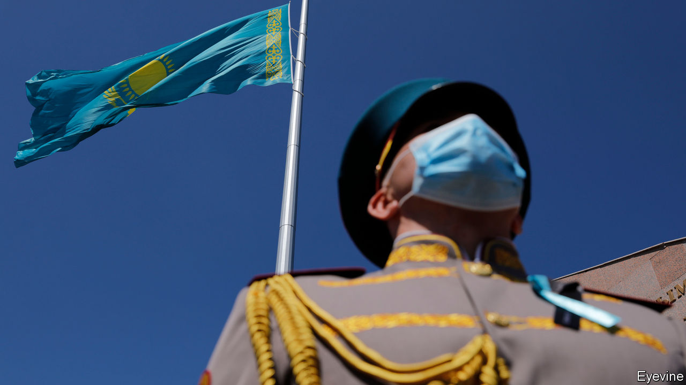

## Dust-busters

# Central Asian governments admit they have a problem with covid-19

> Or, in Turkmenistan’s case, with dust

> Jul 23rd 2020ALMATY

Editor’s note: Some of our covid-19 coverage is free for readers of The Economist Today, our daily [newsletter](https://www.economist.com/https://my.economist.com/user#newsletter). For more stories and our pandemic tracker, see our [hub](https://www.economist.com//news/2020/03/11/the-economists-coverage-of-the-coronavirus)

WHEN TURKMENISTAN’S president did a spot of fishing recently, he brought a snazzy accessory with him: a camouflage face mask. The isolationist Central Asian state is one of the last countries still claiming to be coronavirus-free, along with North Korea and some remote Pacific islands. But something has changed in Turkmenistan, which is suddenly adopting a plethora of precautions. Out are the patriotic festivals, football matches and horse races that stood out as the rest of the world shut down earlier this year. Suddenly, the government wants citizens to wear face masks—to protect against dust, rather than germs, it insists. (No, it has not been an especially dusty summer.) The authorities even admitted a team from the World Health Organisation, which tactfully advised them to behave “as if covid-19 were already circulating”, neatly sidestepping the government’s dismissal of reports that a covid-like ailment was indeed circulating in Turkmenistan as “fake news”.

Elsewhere in Central Asia, the disease is well into a second wave and restrictions are being reimposed. In Kazakhstan officially diagnosed cases have rocketed by around 1,400% since the easing of a stringent lockdown in May. Rules requiring people to keep their distance and wear masks have been flouted. The authorities are now trying to enforce them, painting carefully spaced circles in parks popular with picnickers and plastering cities with posters promoting masks. In early July shopping malls and gyms were closed, though bars and restaurants may still serve customers outdoors. Groups of more than three people are banned, but Kazakhstan, like other countries in Central Asia, has struggled to discourage toi¸ gatherings of the extended family that are an ingrained custom but that have helped spread the pandemic.

The government has admitted that a spike in pneumonia probably reflects undiagnosed cases of covid-19. Given that 163,000 more pneumonia cases were registered in recent months than in the same period last year, the official tally of around 80,000 covid-19 infections is clearly a wild understatement. The health-care system is creaking under the strain, with hospitals in big cities running short of beds. Public anger at the government’s handling of the pandemic is running high, exacerbated by a thunderous but tone-deaf fireworks display in Nur-Sultan, the capital, to celebrate a public holiday that fell on the 80th birthday of Nursultan Nazarbayev, the ex-president in whose honour the city is named. Mr Nazarbayev, who stepped down last year but is still feted as the father of the nation, has recently recovered from the coronavirus himself.

Kyrgyzstan recently adjusted its statistics to include probable covid-19 cases previously classified as pneumonia, causing the number of infections to double overnight and fatalities to jump almost fivefold. Uzbekistan has reimposed a lockdown it began easing in May, although its government is still attempting to lure tourists with a promise to pay them $3,000 should they catch the coronavirus during their visit. Many in the region are anxious enough to resort to spurious folk remedies, from ginger and horseradish to horse milk and dog fat. A cartoon circulating in Uzbekistan captures the grim mood: angry viral blobs have a doctor on the ropes in a boxing ring, while an official looks away.

Gurbanguly Berdymukhamedov, Turkmenistan’s president, could not be accused of being uncaring, however. After his fishing trip, he magnanimously donated his catch to an orphanage. The children duly trooped out on state television to express their awe and gratitude, all safely protected from dust by spotless face masks. ■

Editor’s note: Some of our covid-19 coverage is free for readers of The Economist Today, our daily [newsletter](https://www.economist.com/https://my.economist.com/user#newsletter). For more stories and our pandemic tracker, see our [hub](https://www.economist.com//news/2020/03/11/the-economists-coverage-of-the-coronavirus)