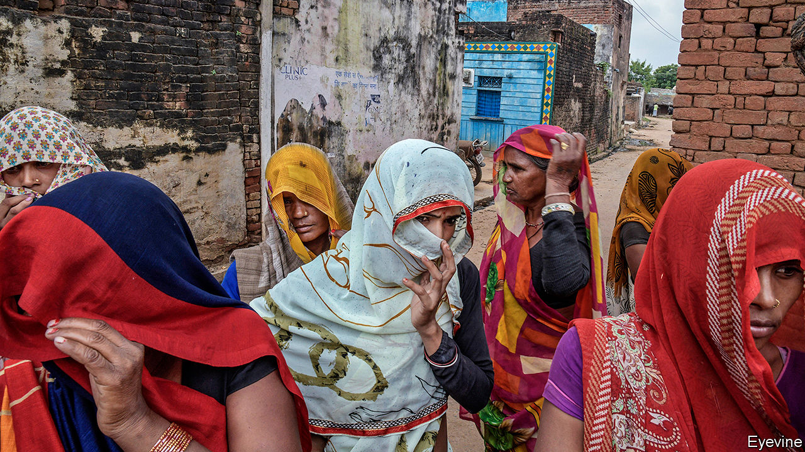

## No escape

# Even as India urbanises, caste discrimination remains rife

> Cities are segregated, and inter-caste marriages are vanishingly rare

> Jul 23rd 2020DELHI

ANKIT PAL and Tushar Singh have a few things in common. They are 19 and 18 years old respectively and live within a couple of hours’ drive of Delhi, albeit in opposite directions. They both happen to be Dalits, from the bottom ranks of India’s voluminous caste register. And they have also both been in the news lately, though for very different reasons.

In mid-July the smiling, bespectacled Mr Singh won brief fame by scoring a flawless 100 out of 100 in each of five subjects in school-leaving exams—the best marks in the country. He wants to study history, he told interviewers, and enter the Indian Administrative Service, the top echelon of the bureaucracy. Mr Pal, in contrast, appeared wearing a pink shirt and grey trousers in a viral video last year in which two young men from the landowning Jat caste force him to pull down his trousers and then beat him with a heavy stick. His tormentors were angry because Mr Pal, having found a job in a factory making smartphone screens, refused to work their land or look after their cows, as Dalits in the Jat-dominated village have done for generations.

Seventy years ago, India’s constitution, largely written by B.R. Ambedkar, a Dalit intellectual, declared all citizens equal before the law. It abolished untouchability, making the Hindu practice a punishable offence, and enjoined the state to improve the lot of the “weaker sections” of society.

Dalits’ circumstances have indeed improved. The rigid, ritual shunning of them has largely faded. Three generations of quotas in legislative bodies, in state schools and in government service have created a lower-caste bourgeoisie, such that mid-ranked castes began lobbying for, and eventually won their own “reservations”. Caste-based parties have sprung up to agitate for more government help, and won power in many states.

Given all this, the stellar success of Mr Singh ought to be unremarkable, just as the casual violence and ritual humiliation inflicted on Mr Pal ought to be unthinkable. Yet Mr Singh’s caste, revealed by the proud portrait of Ambedkar in the young scholar’s living room, was widely remarked upon. Mr Singh is also unusual in that he attended a top private school. His parents are college teachers.

Mr Pal’s luck is of a different kind. It is lucky that he, like many Dalits who have found ways to escape the only jobs previously open to them, such as share-cropping, waste removal and tanning, no longer needs higher-caste patrons. He is also lucky to be alive. Few Hindus any longer observe strict ritual purity or consider Dalits literally “untouchable”. Even so, with dismal regularity news stories tell of higher-caste people maiming, raping or murdering Dalits for such slights as daring to sport a moustache, ride a horse or, worst of all, woo someone above their station.

The persistence of discrimination is not limited to Hindus. An estimated 65% of India’s 20m Catholics are former Dalits whose forebears converted in part to escape caste oppression. Yet according to the Indian church’s most recent published record, out of 27,000 priests only 5% were of Dalit origin, and not a single one of its six cardinals and 30 archbishops. Among India’s 14% Muslim minority a similar unspoken distinction persists, separating families that converted in the distant past, or were associated with ruling Muslim dynasties, from the larger mass imputed to have converted as a way of erasing their previous, presumably lowly, caste status.

And although reservations have secured plum posts for some, lower-caste uplift has been limited. Accelerated economic growth from 1990 to 2010 pulled tens of millions out of poverty, including many of lower caste, but overall inequality between rich and poor, including within caste groups, has grown. Moreover, in the government as in the private sector, the highest positions remain a near-monopoly for the three top tiers or varnas of the broader caste pyramid: the brahmins or priestly class, the kshatriyas or warrior class and the vaishyas or merchant class, who between them account for perhaps 20% of India’s 1.3bn people. It is not just the 220m Dalits, or the 190m Muslims, or the 110m from “scheduled tribes” who are under-represented, but also the 40-50% of Hindus who come from the widest tier of the pyramid, the shudras or labouring castes, known as Other Backwards Classes (OBCs).

Out of the 89 highest-ranked civil servants in the central government, according to a recent survey, just four are not upper-caste Hindus, and not one is an OBC. Two-thirds of the Supreme Court’s 31 judges and more than half of all state governors are high-caste Hindus. When the home ministry recently formed a panel to revise the criminal code, its five experts were all men, all from north India and all from upper castes. The trend is just as stark outside of government. A study published last year of the mainstream Hindi and English press revealed that out of 121 people in senior jobs, such as editors, all but 15 were upper caste. Not a single one was a Dalit.

Just as positive discrimination was supposed to equalise workplaces, it was hoped that demographic change, such as migration from villages to cities, would break down caste rigidities. Optimists pointed to greater mixing as people of multiple castes were often obliged by circumstance to share the same city wards. Stubbornly, however, statistics have shown that intermarriage between castes remains rare: just 6% of all couples at the most recent count.

An analysis of housing by a team led by Naveen Bharathi of Harvard University has revealed a striking persistence and, in some cases, an intensification of caste segregation. Using census data for 147 cities at the level of blocks rather than wards, and accounting not just for broad caste categories but for jati, which is to say the 5,000-odd subcaste “communities” that tend to marry among themselves, Mr Bharathi’s team found that segregation by caste in Indian cities is comparable to that by race in American ones. Whereas 60% of blocks in Ahmedabad, the biggest city in Gujarat, housed not a single Dalit, some 80% of Dalits lived in just 10% of the city. Inequality in Ahmedabad as measured by the Gini coefficient was more extreme than in Johannesburg, the most unequal city in South Africa, the world’s most unequal country.

Yet amid seeming stasis, Mr Bharathi also found a great deal of churn. “Barriers are breaking in cities, but it’s not the big barriers between castes,” he says. “It is the subcastes that are dissolving.” As the association of family names with traditional professions, which evoked some memories in villages, makes ever less sense in cities, there is less of a taboo around marrying into adjacent jatis within the same broader caste. At the same time, says Mr Bharathi, class differences are growing stronger. “If you zoom in on a Dalit slum, you will find that poorer Dalits don’t intermix with Dalits of slightly higher status living right next door.” Ambedkar, who assumed that the positive discrimination he prescribed in the constitution would end millennia of caste oppression, would be perplexed. ■