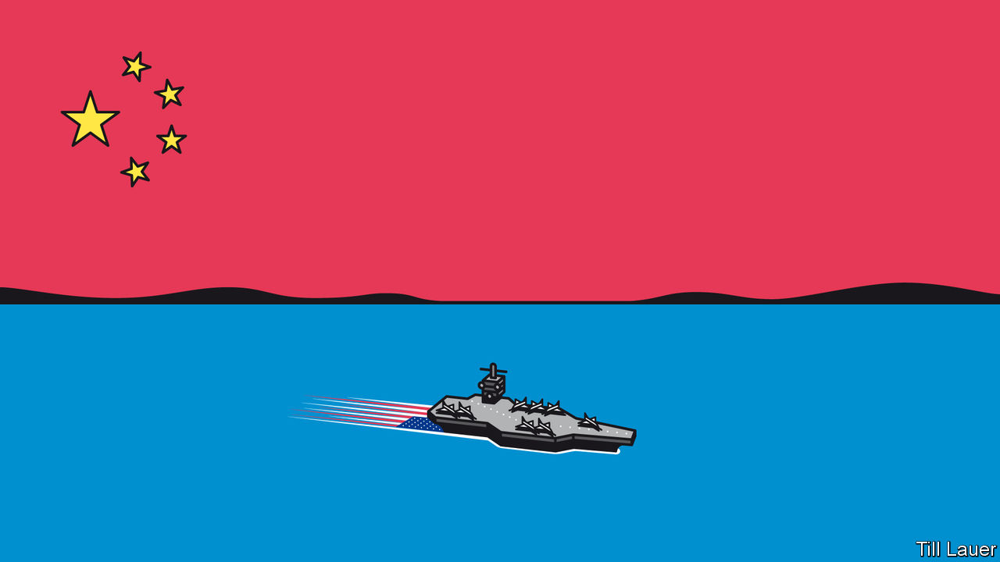

## Banyan

# In the South China Sea, America is churning waters claimed by China

> It is decrying Chinese expansionism in the South China Sea much more emphatically

> Jul 23rd 2020

CHINA HAS been trying to turn the South China Sea, which is bigger than the Mediterranean, into a Chinese lake for the better part of a decade. In the Spratly archipelago, which is claimed wholly or in part by Brunei, China, Malaysia, the Philippines, Taiwan and Vietnam, it has built 13 square kilometres of artificial islands atop specks of reef and rock. The constructions bristle with missiles and bomber-sized bunkers. Coastguard vessels and even a “maritime militia” of fishing boats also help project power far from China’s shores.

Their business is intimidation, asserting the right to fisheries and oil- and gasfields within waters claimed by other countries. Since late last year, their activities have multiplied. Chinese boats protected by the coastguard have been fishing in Indonesian waters. Chinese vessels have rammed and sunk Philippine and Vietnamese fishing boats and harassed a rig drilling in Malaysian waters. In April China further formalised its territorial claims by establishing two administrative districts to govern them.

Earlier this month America pushed back in a new way. Its secretary of state, Mike Pompeo, declared that China’s claims to offshore resources in the South China Sea were “completely unlawful, as is its campaign of bullying.” Much like the abrupt demand this week that China immediately close its consulate in Houston, the statement constituted a new salvo in America’s ever-expanding hostilities with China.

Mr Pompeo’s harangue came on the fourth anniversary of a ruling by an international tribunal at The Hague in a case brought against China by the Philippines. That ruling demolished China’s claims to maritime resources within the sea as going far beyond rights granted by the UN Convention on the Law of the Sea (UNCLOS). China is a signatory of UNCLOS (America is not), but it angrily dismissed the ruling as “a piece of paper”. Yet the Philippines also set it aside: President Rodrigo Duterte had just come to power and was eager for Chinese investment.

America has always rejected China’s expansive claims in the sea, but Mr Pompeo is far more emphatic than the administration of Barack Obama was at the time of the ruling. Not one of the specks China occupies in the Spratlys, he reiterated, counts as a proper island, which would come with a 200-nautical-mile (370km) “exclusive economic zone”. Nor does China have rights around Scarborough Shoal, where its activity, the tribunal ruled, infringed on Philippine rights. Mr Pompeo dismissed China’s claims around Vanguard Bank off Vietnam, Luconia Shoals off Borneo and Natuna Besar, which is part of Indonesia. And he rubbished its claim to James Shoal, off the Malaysian coast. China cites it as its “southernmost territory”—though over 1,500km from China proper and 20m below the surface.

Until now, America’s priority in the South China Sea has been to ensure free passage for shipping. The Trump administration has sharply increased “freedom of navigation” operations, in which American warships sail close to Chinese outposts without asking for permission. It recently deployed two aircraft carriers to the sea at the same time. Now it is backing other claimants resisting what its assistant secretary of state for the region, David Stilwell, calls China’s “gangster tactics”.

The other claimants welcome the American move, which has bipartisan support in Washington. Mr Duterte’s love-in with China appears over, and hawks alarmed at Chinese behaviour are running Philippine foreign policy again. Vietnam may take its own case against China to The Hague. As for a promised code of conduct in the South China Sea between China and the Association of South-East Asian Nations (ASEAN), of which the other claimants bar Taiwan are all members, agreeing on a text looks daunting, say Hoang Thi Ha and Ian Storey of the ISEAS-Yusof Ishak Institute in Singapore. China will never accept a code that affirms UNCLOS provisions, as ASEAN members want; nor will ASEAN members give in to China’s demands, in effect, to be able to veto military exercises with outside parties.

But having America at your back is a mixed blessing. It could help establish what Bill Hayton of Chatham House, a think-tank in London, calls a “picket line” emboldening ASEAN members to work together to uphold UNCLOS. Yet, Ms Ha and Mr Storey point out, China is more likely to double down than retreat. And the last place the minnows want to be is in the middle of a clash between the South China Sea’s two big fish.

## URL

https://www.economist.com/asia/2020/07/23/in-the-south-china-sea-america-is-churning-waters-claimed-by-china
