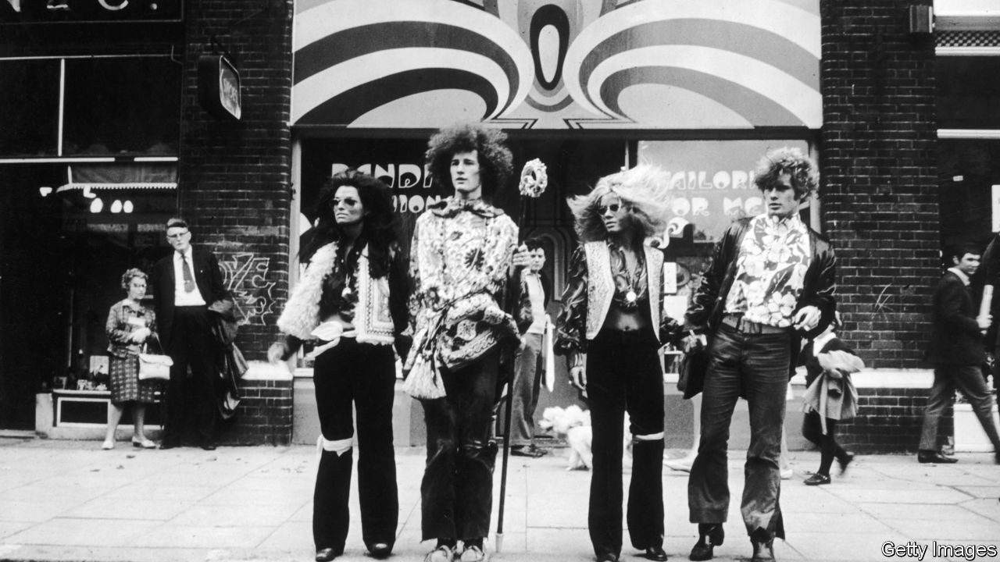

## Rock’n’roll fiction

# David Mitchell’s new novel is the story of a rock band

> In “Utopia Avenue” he turns down the high jinks and puts the emphasis on characterisation

> Jul 25th 2020

Utopia Avenue. By David Mitchell. Random House; 592 pages; $30. Sceptre; £20.

USING DIVERSE voices and styles, and telling several stories together, David Mitchell’s finest novels conjure up multiple worlds, both real and fantastical. Each of their chapters transports readers to a different time or place and revolves around a new theme or idea. These sections are discrete enough to resemble stand-alone stories, but recurring motifs or reappearing characters provide unity. For all the singular events and far-reaching chaos they encompass, these are books about interconnected lives and shared fates.

His kaleidoscopic and polyphonic novels showcase their author’s capacious imagination. The globe-spanning miniature dramas that make up his debut, “Ghostwritten” (published in 1999), chart the wayward progress of, among others, a pair of jazz aficionados, a nuclear physicist, a member of a doomsday cult and a disembodied, transmigrating soul. Bigger and bolder, “The Bone Clocks” (2014) follows a character from 1984 to a post-apocalyptic future, by way of a cosmic conflict between immortal beings. Mr Mitchell’s most ambitious work, “Cloud Atlas” (2004), is also his best. Intricately structured and deftly plotted, its contrasting ingredients—thriller, history, farce, dystopia, science fiction—make a potent blend.

His ninth novel is, for the most part, a more conventional affair. “Utopia Avenue” tells the story of a fictitious British rock band of that name which experiences fame, triumph and tragedy in the late 1960s. The book lacks the formal daring and dizzying inventiveness of its predecessors. This time, though, Mr Mitchell places a stronger emphasis on characterisation. By rotating the narrative between the players’ perspectives, he ensures that each emerges as a fleshed-out human being as well as a member of the collective.

The group forms in Soho (“The saucy twinkle in Mother London’s eye”) in 1967. It consists of Dean Moss, a blues bassist, folk singer and keyboardist Elf Holloway, virtuoso guitarist Jasper de Zoet and Peter “Griff” Griffin, a jazz drummer. They harness their influences and pool their talents to create a winningly eclectic sound. Aided by their enterprising manager, Levon Frankland, they secure a record deal, play gigs, appear on television and gradually make a name for themselves in “the autumn of the Summer of Love”.

But their journey to the top has downs as well as ups. They encounter shady promoters and snarky critics. They weather erratic sales and dented self-confidence. Jasper goes AWOL in New York; in Rome, Dean faces imprisonment. Eventually the band wins critical acclaim and commercial success on both sides of the Atlantic. Can anything derail this rollercoaster career?

“Utopia Avenue” itself is not a fast ride. Some scenes go on too long, others take unnecessary tangents. Nevertheless it is a consistently absorbing book, which skilfully conveys the excitement and mayhem of the era, and the hopes and dreams of those swept up in it. Elf’s sections sketch a voyage of self-discovery, during which she recognises her abilities, moves on from a sponger boyfriend and embraces her true sexuality. Dean’s story is a cautionary tale rich with lurid scandals, comic misadventures and family feuds. Jasper develops into the novel’s most complex character. A former patient of a Dutch psychiatric clinic, he wrestles with “emotional dyslexia” and a fear of mirrors. But when he is plagued by persistent knocking from “the squatter in his skull”, both his sanity and the band’s future are threatened.

The later sections told from Jasper’s perspective are filled with what one figure in “The Bone Clocks” termed “magickery-pokery”. Mr Mitchell overdid his mind-bending flights of fancy in that book; in this one there is method in his madness. There are entertaining cameos from famous faces, notably David Bowie, Francis Bacon and Janis Joplin. As ever, characters from the author’s earlier stories pop up and pass through this one, often in intriguing new guises. A lot of fun is had along the way, by both Mr Mitchell and the reader. ■

## URL

https://www.economist.com/books-and-arts/2020/07/25/david-mitchells-new-novel-is-the-story-of-a-rock-band
