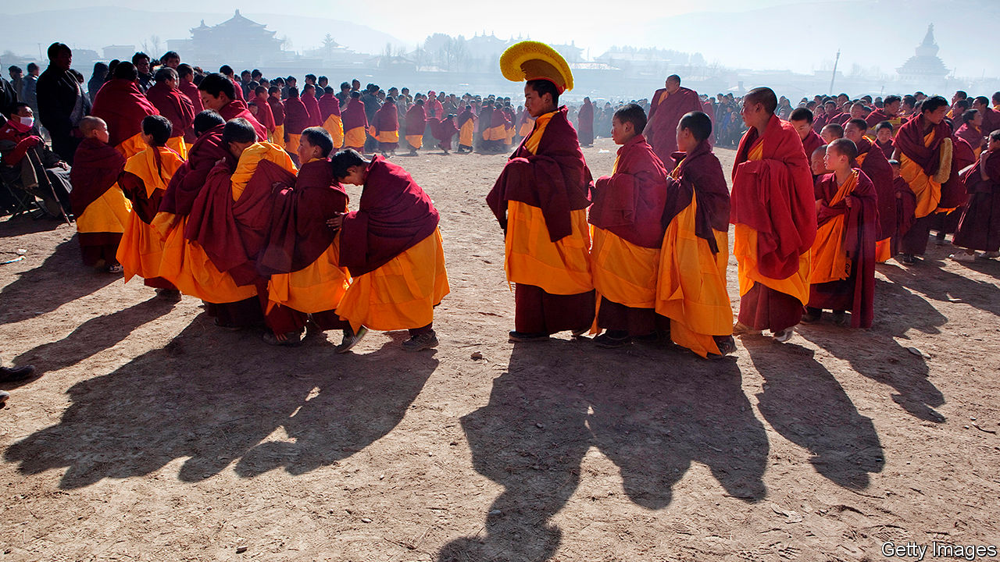

## Inside Tibet

# Two books penetrate the mystery and evoke the tragedy of Tibet

> Barbara Demick and Benno Weiner lift the veil on China’s remote, turbulent fringe

> Jul 25th 2020

Eat the Buddha: Life and Death in a Tibetan Town. By Barbara Demick. Random House; 352 pages; $28. Granta; £18.99.

The Chinese Revolution on the Tibetan Frontier. By Benno Weiner. Cornell University Press; 312 pages; $45 and £37.

IF ALL CHINA’S Tibetan-inhabited territory were combined into a single country, it would be among the dozen or so largest in the world by land area, albeit with a population about the size of tiny Hong Kong’s. So vast is the Tibetan plateau that a plane flying directly from Lhasa, its cultural capital, to Beijing about 2,500km away completes nearly half of its journey before leaving the airspace above the Tibetan-populated zone.

This scale matters. It is challenging enough to understand the lives of Tibetans, given that more than half of the area they inhabit forms the Tibet Autonomous Region (TAR), to which China rarely admits foreign journalists. Then there is the tyranny of distance—the difficulty of reaching scattered Tibetan communities across the plateau’s high-altitude grasslands. The parts outside the TAR are administered by four other provinces, which do admit journalists. But a long journey can reach a fruitless end at police roadblocks erected near trouble spots. That hypothetical Tibetan country would be by far the least accessible of the world’s giants.

Barbara Demick, a former Beijing correspondent of the Los Angeles Times, has therefore achieved something remarkable with her portrait of a small Tibetan town, Ngaba (also called Aba), in Sichuan province. It is close to the edge of the plateau, near that halfway point along the plane’s flight path. Yet its proximity to China’s ethnic-Han interior does not make it any easier to visit than Lhasa.

The authorities see to that—because, ever since an explosion of unrest across the plateau in 2008, Ngaba has been a centre of Tibetan discontent. It was the scene of some of the most violent action by Chinese security forces that year. In “Eat the Buddha”, Ms Demick says dozens of protesters in Ngaba were shot dead. Of more than 150 Tibetans who have since set themselves on fire in protest against Chinese rule, about one-third have come from Ngaba or its surroundings.

Ms Demick managed to make three visits to Ngaba, using a floppy hat and face mask to obscure her features (this was before covid-19, when masks were worn to protect against pollution). Her investigations of the lives of selected residents were aided by interviews in less-restricted parts of the plateau and among Tibetan exiles. The resulting account is gripping.

Ngaba (pictured) is a little-known town that got its first traffic light in 2013. Ms Demick illuminates it as no other writer has. Through her subjects’ eyes, she describes its turbulent development from the early days of the Communist Party’s control of the plateau in the 1950s to the unrest of 2008 and its horrific aftermath as Chinese forces tried to crush all opposition.

For weeks after that upheaval, the authorities blockaded Kirti monastery, the town’s religious centre, in what appeared to be an attempt to starve the 3,000 monks inside into submission. Eventually they moved in, arrested 600 of them and locked them into spaces so crowded that nobody could sit or lie down. The monks had to urinate and defecate where they stood, Ms Demick recounts. They were forced to make statements, sometimes on camera, disavowing support for the Dalai Lama, Tibet’s exiled spiritual leader. Even now, Ms Demick says, “The level of fear among Tibetans is comparable to what I’ve seen in North Korea.” (An earlier book of hers explored horrors there.)

It is striking that an area of Tibet so close to the relatively prosperous ethnic-Han hinterland should be so seething with resentment of Chinese rule. If there has been any spillover effect of that wealth, it clearly has not helped win over Tibetans there. A Tibetan construction worker in Ngaba tells Ms Demick that most of the businesses and shops are these days owned by Han Chinese.

In “The Chinese Revolution on the Tibetan Frontier”, Benno Weiner, an academic, focuses on the early phase of the party’s efforts to integrate another bit of the Tibetan fringe into the Communist state. His work draws on official archives from Zeku, a county in Qinghai province. It is a drier account than Ms Demick’s, but provides valuable detail on how the party tackled the problem of establishing control in an area culturally, linguistically, economically and politically so different from the interior.

Again, proximity to the Han hinterland did not appear to help. In the 1950s that part of the plateau was in revolt before an uprising in distant Lhasa that resulted in the Dalai Lama’s flight to India. Many thousands of Tibetans in Qinghai were killed during the suppression of the rebellion there in 1958. That violence “has not been forgotten” in the region, Mr Weiner writes.

The confrontations of the late 1950s followed a period during which Tibetans had been allowed to maintain their pre-Communist way of life, with the old elites largely still in place. It was when the party lost patience and began to treat those elites as class enemies and collectivise agriculture that widespread unrest erupted. Readers of Mr Weiner’s book might reflect on how aspects of his story are now being repeated in Hong Kong. Another place on China’s fringe is discovering what happens when the party loses patience with a pre-Communist order that it once tolerated.

At least in Hong Kong the world is watching. By contrast, seldom is the veil lifted from Tibet—which makes Ms Demick’s and Mr Weiner’s chronicles all the more worth reading. ■

## URL

https://www.economist.com/books-and-arts/2020/07/25/two-books-penetrate-the-mystery-and-evoke-the-tragedy-of-tibet
