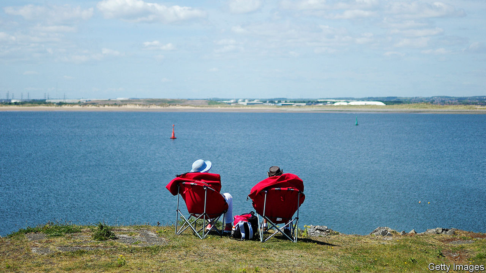

## Covid-19 and work

# Anxiety levels rise among furloughed Britons

> As the government’s scheme tapers off, many worry about redundancy

> Jul 23rd 2020

Editor’s note: Some of our covid-19 coverage is free for readers of The Economist Today, our daily [newsletter](https://www.economist.com/https://my.economist.com/user#newsletter). For more stories and our pandemic tracker, see our [hub](https://www.economist.com//news/2020/03/11/the-economists-coverage-of-the-coronavirus)

TOMMY ROWLANDS has spent the past few months flitting between London, Paris, Beirut and Los Angeles. In his head, that is. He has been stuck at home since March, on furlough from his job as a maitre d’ in a London restaurant. That means he has finally had time to devote to the globetrotting novel he had been chipping away at in spare moments for four years. He finished it in seven weeks. After the obligatory acknowledgment of others’ suffering during the pandemic, he confesses: “On the whole, I’ve enjoyed this period.”

When Britons who have worked throughout the covid-19 crisis think of their 9.4m furloughed compatriots, they might picture someone like Mr Rowlands, or perhaps the 25-year-old Yorkshireman who admits it has been “like a three-month garden party”. “I can’t actually believe I’m being paid sometimes,” he says, in a brief pause in his hectic schedule.

But the furlough scheme, under which the Treasury initially paid 80% of workers’ wages up to a £2,500 monthly cap, has drawbacks. First, when an employer furloughs some staff but keeps the rest on their usual hours, some in the former group begin to doubt their worth. “It’s very hard not to feel judged,” says a Londoner who works in marketing and was furloughed before most of his colleagues.

Worse is the prolonged threat of being laid off. The British scheme contrasts to the approach in America, which has increased out-of-work benefits but not paid companies to furlough people. America’s unemployment rose to 15% before falling back to 11%; in Britain, the headline rate is 4%. Unions praised the government for averting mass lay-offs in March, but there are concerns that furloughing is keeping zombie companies alive and paying people whose current positions will not be needed again. As the scheme tapers off before ending in October, redundancy is back on the cards.

For those who expect redundancy, the scheme may be a financial help but a psychological burden. A poll by YouGov in May found that nearly two-thirds of furloughed workers are worried about redundancy, compared with about a quarter of those still at work. Ian Martin, a consultant psychiatrist, reports a spike in anxiety and depression among the furloughed. “It sounds such a gentle, benign arrangement,” he says. “But if you think of it as being suspended from work pending dismissal, it’s a no man’s land of uncertainty.”

Several of Dr Martin’s patients were initially happy to be paid not to work. But, as it became clearer their jobs could be at risk, it began to feel more like “waiting for a verdict”—which, he thinks, may be “scarier than a single-event trauma of redundancy. This lingering uncertainty is incredibly stressful.” Nor have workers likely to be laid off been given incentives to spend this time productively. Government hints of training or reskilling schemes came to nothing, says Mike Hawking of the Joseph Rowntree Foundation, a think-tank.

Millions are waiting to discover their fate, unsure whether to put their feet up or spend their days scrolling through job sites. “Some days I think it’s sunny, I don’t have to work, I can go to the park and read,” says a furloughed Londoner in the music industry. “Other days I think I won’t have a job in the future. How do I keep my career going when my industry might not exist in the same way?” ■

Editor’s note: Some of our covid-19 coverage is free for readers of The Economist Today, our daily [newsletter](https://www.economist.com/https://my.economist.com/user#newsletter). For more stories and our pandemic tracker, see our [hub](https://www.economist.com//news/2020/03/11/the-economists-coverage-of-the-coronavirus)

## URL

https://www.economist.com/britain/2020/07/23/anxiety-levels-rise-among-furloughed-britons
