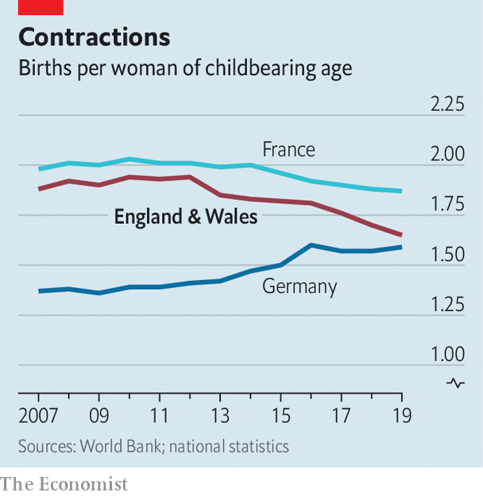

## Demography

# Britain’s baby bust

> England and Wales join the low-fertility club

> Jul 23rd 2020

IN 1945 A sociologist, J. G. Ferraby, tried to explain why women were having so few babies. He mulled various possibilities, such as cramped housing, women’s fear of childbirth and the cost of educating children. In the end, though, Ferraby blamed the baby bust on a lack of “zest” and confidence in the future. “It is possible”, he wrote, “that the majority of people in England—and perhaps all over the Western world—are now just drifting.”

They didn’t drift for long. As soon as the war was over, a two-decade-long baby boom began. But on July 22nd the Office for National Statistics revealed that just 640,000 babies were born in England and Wales in 2019—even fewer than when Ferraby fretted. The fertility rate, which measures births per woman, stands at 1.65. English and Welsh women are now notably less fecund than French women and are approaching the German level (see chart).

A fall in the fertility rate does not always mean children are going out of fashion. If women postpone pregnancy, the fertility rate will fall and then rise, even though women end up having the same number of children in the end. That happened in the early 2000s. English and Welsh mothers continue to grow older—the mean age of childbirth is now almost 31. Birte Harlev-Lam of the Royal College of Midwives says that is the main reason why, over the past ten years, the proportion of births that begin with an induction or a caesarian section has risen from 31% to 50%.

But it increasingly seems that families are becoming smaller, not just more stretched-out. If women were merely postponing babies, you would expect to see a sharp decline in births to women in their 20s and a slight rise among women in their 30s. Instead, for the past four years the birth rate among women aged 30-39 has fallen. A few more babies are being born to women 40 and over, but these are still rare, accounting for less than 5% of births. Before covid-19 hit, unemployment in Britain was low; online dating has made it easier to find a partner. Why the reticence?

A lack of what Ferraby called “zest” could be part of it. Although the minimum wage rose by 6% in April, it may be that working-class couples in particular have lost a little confidence in the future because jobs have become less stable. Last year two poor regions, north-east England and Wales, had lower fertility rates than anywhere else. Tomas Sobotka of the Vienna Institute of Demography says that in several rich countries, birth rates have fallen sharply among women who do not go to university—who normally have children earlier in life.

You could also blame immigrants, who supplied 29% of the new babies in England and Wales last year. As a rule, immigrants have higher birth rates than natives. But the gap is closing: since 2004 the immigrant fertility rate in England and Wales has fallen from 2.46 to 1.97. Germany’s fertility rate has held up partly because the country has taken in lots of people from Syria, where big families are normal. Britain has seen big increases in migration from low-fertility countries like Italy, Lithuania and Romania.

Few places have changed as much as the East End of London. In the early 2000s, immigrant-heavy boroughs like Hackney and Tower Hamlets were Britain’s nurseries, with fertility rates above the national average. Both boroughs now have below-average fertility, and the proportion of births to immigrant mothers is falling. What starts in the East End tends to spread.■