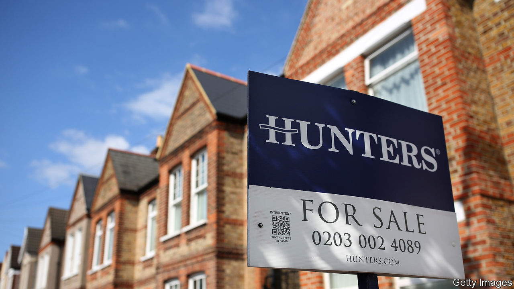
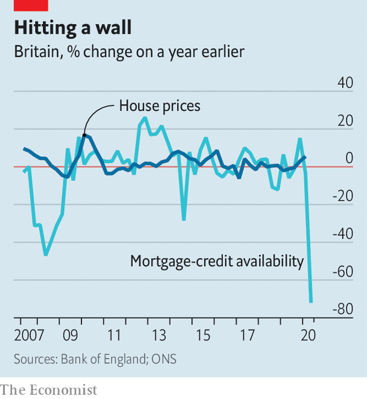

## Housing

# Britain’s fragile property boom

> Activity has bounced back but borrowing is getting harder

> Jul 23rd 2020

IT TAKES MORE than a global pandemic and the biggest collapse in GDP since the 18th century to slow the British housing market—or at least that is what the latest data from online estate agents suggest. According to Rightmove, the average asking price is now 2.4% above where it was when the lockdown began and buyer inquiries are up by 75% year on year.

What Rightmove dubs “a mini-boom” has taken analysts by surprise. The Office for Budget Responsibility, a fiscal watchdog, expects an 8% fall in prices and a collapse in transactions this year in their latest central scenario, while the big mortgage lenders have been privately bracing for falls of up to 15%. Much of the recent apparent surge in buyer interest may simply be pent-up demand from the market’s eight-week shutdown that ended in mid-May. Transactions in June were still down by around a third on 2019—and that was a tough year for the market, with Brexit uncertainty weighing on activity.

The government is keen for the mini-boom to continue. In his summer statement on July 8th Rishi Sunak, the chancellor, raised the threshold for paying stamp duty, a tax on property transactions, from £125,000 ($159,000) to £500,000 until March 2021. The stamp-duty holiday introduced in 2008 saw a small bounce in sales immediately followed by a second peak just before it expired. Housing moves, which encourage people to buy new fridges and hire builders, can be a useful prop to wider economic activity.

But lenders may prove a drag on the market. Bracing themselves for falling house prices and rising unemployment, banks have tightened mortgage criteria at a record pace (see chart). They expect conditions to ease somewhat in the third quarter of this year but still to be as tight as they were in 2008, at the height of the banking crisis. Moneyfacts, a consumer-finance website, reports that the number of mortgages available with a high loan-to-value (LTV) ratio has collapsed since March.

Consider a couple hoping to buy a house for £220,000, the average price paid by first-time buyers according to Zoopla, a property-price website. The stamp-duty holiday will offer them no benefit as first-time buyers already faced no tax on properties sold for up to £300,000. But the need for deposit of 15-20% compared with 10% before the crisis will mean a higher level of savings are required.

Nationwide, one the country’s largest lenders, announced the return of 90% LTV-ratio loans on July 16th but said they would be subject to “enhanced lending criteria”. In plainer English, higher incomes and better credit ratings will be required. Housing-market analysts do not expect such loans to be widely available. Neal Hudson of BuiltPlace, a consultancy, reckons that although low borrowing costs and forbearance from lenders will support prices in the near term, constrained mortgage availablilty will slow the market overall. He warns that 2021 looks set to be a tougher year for the market than 2020.

Much will depend on what happens to the job market as the government’s furlough scheme tapers off. Rising unemployment, a possible no-deal Brexit and the end of the stamp-duty cut all suggest there will be a difficult start to the new year. The housing market’s immunity to covid-19 is unlikely to be permanent. ■

## URL

https://www.economist.com/britain/2020/07/23/britains-fragile-property-boom
