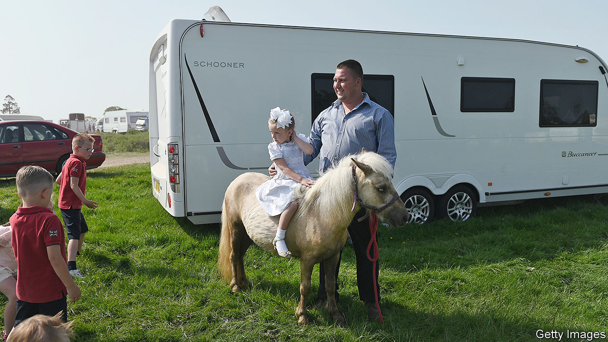

## Gypsy lives matter too

# Britain’s Gypsies and travellers demand justice

> They have long been on the wrong end of the law

> Jul 23rd 2020NEWBRIDGE, SOMERSET

“WE ARE THE white blacks,” declares Joseph Jones, a Romany gypsy who is vice-chair of the Gypsy Council, a civil-rights group, and has been campaigning for the rights of gypsies and travellers since the 1970s. The recent success of the Black Lives Matter (BLM) movement has influenced the way the council is approaching new threats of government action.

Outsiders are common targets for populists, and nomadic people are the ultimate outsiders. The Tory manifesto promised to make it a criminal offence to set up an illegal campsite and give the police greater powers to seize travellers’ vehicles. The announcement in July by Priti Patel, the home secretary, that the government would take new measures in the autumn was therefore not a surprise.

Britain has around 60,000 gypsies and travellers, most of whom settle for periods, then move on again. Around 10,000 will be on the road in England at any one time. Councils are required to provide permanent stopping sites for them, but these are not always to travellers’ liking. “They always build them deep in the woods,” says Patrick McDonagh, an Irish traveller living with his family on a Park and Ride car park in Newbridge, on the outskirts of Bath. “It’s like they think we are murderers.” As sports fields went quiet and car parks emptied, covid-19 provided opportunities for travellers to occupy new spaces—hence the exclusion of trespassers from a Ministry of Justice directive to delay evictions.

Travellers and gypsies argue that, since the law recognises them as an ethnic group, the proposed new measures are racist. Their ethnicity is complex. Travellers tend to be people originally from Ireland who have been travelling since the middle ages or itinerant labourers who came over after the famine, while British gypsies include Roma, descended from nomadic Indians who migrated to Europe. Recent inflows from eastern Europe have swelled numbers, and intermarriage has blurred the lines between these groups.

Drawing parallels with black history, gypsies say that from the 17th to the 19th centuries their forebears were often abducted and sold as slaves in the Caribbean. They are planning protests in Westminster similar to those of BLM, and hope to secure a place for gypsy history on the school curriculum. “London was built around gypsies and travellers,” says Mr Jones. “The barrow boys were gypsies and travellers, they contributed in commerce.”

Some have drawn comparisons between George Floyd, whose murder by police sparked global protests, and Johnny Delaney, a 15-year-old traveller who was kicked to death on a playing field in 2003. The prosecution claimed that the youths made a racist remark before the attack, but the judge rejected racism as a motivation. Campaigners have also taken to filming confrontations, are suing several pubs for discrimination and have emulated BLM’s use of celebrities to make an impact. Tyson Fury, a boxer from a traveller family who dubs himself the Gypsy King, has been promoting the anti-racism campaign.

Campaigners point to the flying of the Romany flag by Kent police last month as a success, but they have yet to shift opinion among settled people, who tend to consider hostility to travellers as the consequence not of prejudice but of criminal behaviour. In June, a traveller was charged with the murder of a man at a camp in Oxford, and in July a man was hospitalised after travellers attacked him on a camp at a business park in Clevedon, Somerset. In 2017, 11 members of a traveller family were imprisoned for human trafficking. Mr Jones argues that such cases are not representative of the community as a whole, and are used as an excuse to “keep them moving”.

Even if the government does make life harder for travellers, it is unlikely to persuade them to settle. The number of caravans has risen by 13% over the past five years. “You could give a Gypsy a house, and in five years it’ll be empty,” laughs Mr McDonagh, as he surveys his family’s campsite proudly. “It sounds silly, but I’ve got everything I need in my caravan.”■

## URL

https://www.economist.com/britain/2020/07/23/britains-gypsies-and-travellers-demand-justice
